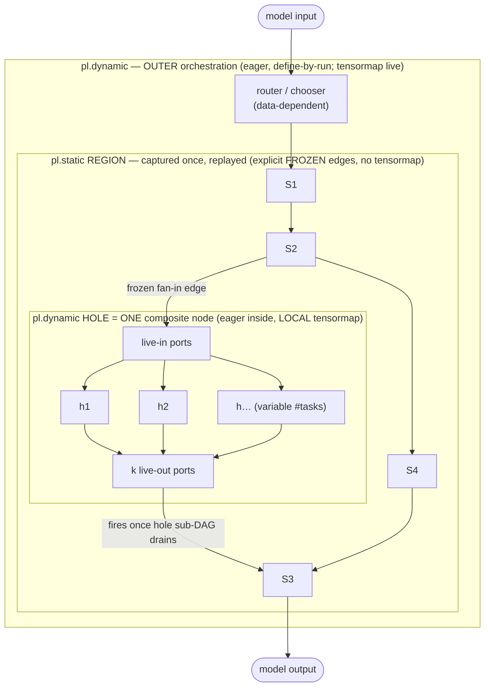

# PyPTO Training: Architecture Design Enhancement

This document describes the architecture design enhancements required to add **training capability** (forward + backward + gradient computation) to the PyPTO language and framework. Today PyPTO supports **inference only** — the *forward* computation of an AI model, decomposed into InCore functions that are submitted by orchestrator functions and whose intermediate memory is managed by the `simpler` runtime (allocated at InCore submission, released when the tensor's life cycle completes).

The design is presented **step by step**. Each part is self-contained and builds on the previous one.

| Part | Topic | Status |
|------|-------|--------|
| **Part 1** | **DSL enhancement: differentiable functions, saved context, backward declaration, dynamic backward graph** | this document |
| **Part 2** | **Memory management for training: saved-context lifetime, forward/backward ring schemes, heap separation** | **this document (current step)** |
| **Part 3** | **Backward runtime/scheduler, gradient accumulation, persistent region, optimizer step** | **this document (current step)** |
| **Part 4** | **Distributed training (data / tensor / pipeline / expert parallel), ZeRO, recompute at scale** | **this document (current step)** |

Reference background on the PyTorch autograd mechanism that motivates this design is in [`PyTorch_Forward Tensor Retention and Memory.md`](PyTorch_Forward%20Tensor%20Retention%20and%20Memory.md). Framework background is in [`machine_hierarchy_and_function_hierarchy.md`](machine_hierarchy_and_function_hierarchy.md) and [`multi_level_runtime_ring_and_pypto_free_api.md`](multi_level_runtime_ring_and_pypto_free_api.md).

---

# Part 1 — Domain Specific Language Enhancement

## 1. Background and the Core Question

### 1.1 What PyPTO has today (inference / forward only)

- A model is divided into **InCore functions** (Linqu Level 0, a single core / core-group). Each InCore function is a **tile-sized chunk** of compute that fits AI core resource constraints (notably **SRAM / on-chip buffer size**).
- InCore functions are produced by the compiler from orchestrator-level tile algebra, either explicitly (`@pl.function(type=InCore)`) or by automatic outlining (`with pl.at(level=pl.Level.CORE_GROUP, optimizations=[pl.auto_chunk])`), which performs chunked-loop splitting + interchange + `OutlineIncoreScopes`.
- An **orchestrator** function (Chip / Host level) runs a sequential program that **submits** InCore invocations. Dependencies are inferred automatically from a **tensormap** (producer/consumer), not from an explicit DAG.
- **Memory** for forward intermediates is managed by `simpler` as a **multi-layer ring stack** indexed by scope depth: a buffer is allocated at InCore submission and reclaimed when its life cycle ends — i.e. when the scope token has been applied (`scope.exit()` or `pl.free`) **and** `ref_count == fanout_count`. See `multi_level_runtime_ring_and_pypto_free_api.md`.

The essential property: **forward intermediates are short-lived.** Once all consumers in the current scope have run, the buffer is reclaimed and the ring head advances.

### 1.2 What training breaks

Training breaks the "short-lived" assumption in exactly the way described for PyTorch: **some forward data must survive the forward pass to be consumed later by the backward pass.** A buffer that the forward ring would normally reclaim at scope exit may be a *saved activation* that backward needs much later (potentially after the entire forward of all layers completes).

This forces four DSL-level questions, which this part answers:

1. **Saved context** — do we follow PyTorch's `ctx.save_for_backward()` model, and what new grammar describes *what* is saved for backward (§5)?
2. **Backward declaration** — how does a programmer describe the backward computation, and must every forward InCore function have a matching backward InCore function (§6, §7)?
3. **Dynamic backward graph** — do we build the backward graph dynamically as the forward executes, à la PyTorch define-by-run (§8)?
4. **Saved-context lifetime** — how does declaring "save for backward" change tensor lifetime, and how does that interact with the ring memory manager (§9, full scheme deferred to Part 2)?

---

## 2. Design Philosophy: Where Autograd Lives in the PyPTO Hierarchy

PyTorch's autograd records nodes at the granularity of **individual tensor operators** (`mul`, `relu`, `matmul`). PyPTO has a *different* natural granularity, and getting this right is the central design decision.

PyPTO has (at least) three candidate granularities for differentiation:

| Granularity | What it is | Suitability as autograd unit |
|-------------|------------|------------------------------|
| **Tile op** (`pl.matmul`, `pl.add`, `pl.row_sum`) inside an InCore | finest; the per-tile primitive | too fine: a tile op is one chunk of a chunked loop, not a logical math op |
| **InCore function** | one outlined kernel that fits SRAM | wrong unit: it is a *tiling artifact*, not a logical operation; its boundary is chosen for hardware fit, not for differentiation |
| **Differentiable function** (orchestrator-level logical op, e.g. one `matmul`, one `rms_norm`, one attention block) | the logical operation the programmer wrote, *before* chunking/outlining | **correct unit** — this is the PyPTO analog of `torch.autograd.Function` |

**Decision: autograd is defined at the *differentiable function* level — the logical operation written in orchestrator-level tile algebra — NOT at the InCore kernel level.**

The reason is that the InCore boundary is *not* a fused mega-kernel and is *not* a logical operation. It is the result of `auto_chunk` splitting a loop so each chunk fits SRAM. Differentiating at that boundary would (a) force the programmer to reason about tiling when writing gradients, and (b) wrongly couple the forward tiling to the backward tiling. We avoid both by differentiating one level up, where the math is expressed, and letting the **same compiler machinery** (`pl.at` + `auto_chunk` + `OutlineIncoreScopes`) independently outline the backward into its own InCore functions.

This is the single most important answer to the user's question — and it directly determines that **forward and backward InCore functions are not 1:1** (see §7).

---

## 3. The Unit of Differentiation: the Differentiable Function

A **differentiable function** is a logical operation with:

- a **forward** body, written in the existing orchestrator-level tile algebra (`pl.slice`, `pl.matmul`, `pl.assemble`, `pl.parallel`, …) inside a `with pl.at(...)` region;
- an optional **backward** body, written in the *same* tile algebra, that consumes upstream gradients and saved context and produces input gradients;
- a **context** object that carries tensors/metadata from forward to backward.

There are two ways a differentiable function gets its backward, mirroring PyTorch:

1. **Composite (auto-derived):** if the function is built only from other differentiable functions / differentiable primitives, the programmer writes **no** backward — the framework derives it by reversing the recorded tape (§8). This is the common case (a whole layer, an MLP, etc.).
2. **Custom (programmer-supplied):** for a leaf primitive, or to override the auto-derived gradient for performance (e.g. a fused, recompute-friendly backward), the programmer supplies an explicit backward (§6.2).

This is exactly the PyTorch split between "Python composition needs no backward" and "`torch.autograd.Function` must define backward" — see reference doc §"pytorch是否要求每一个forward算子都有与之匹配的backward算子".

---

## 4. DSL: Gradient-Tracked Tensors and Parameters

Training introduces **two orthogonal axes** on a tensor, which must not be conflated:

- **`requires_grad` — the *autograd* axis.** "Should the framework track this tensor in the backward graph and compute a gradient for it?" This is a property of *any* tensor (a weight, a tracked input, a propagated intermediate).
- **`pl.parameter` — the *storage / optimization* axis.** "Is this a persistent, learnable leaf that the optimizer updates?" This places the tensor in the persistent region and registers it with the optimizer.

```python
# (a) requires_grad: a tensor that participates in gradient computation
w = pl.Tensor[[k, n], pl.FP32](requires_grad=True)

# (b) pl.parameter: a persistent learnable weight declared at program level
@pl.program
class MyModel:
    @pl.parameter                      # persistent learnable leaf; see semantics below
    def w_qkv(self) -> pl.Tensor[[d, 3 * d], pl.BF16]:
        return pl.init.normal(std=0.02)        # initializer runs once, at allocation

    @pl.parameter(requires_grad=False)  # a FROZEN parameter (persistent, but not trained)
    def rotary_cache(self) -> pl.Tensor[[S, d], pl.FP32]:
        return pl.init.rope_table(...)
```

### 4.1 Semantics of `requires_grad` (autograd axis)

Mirrors PyTorch, adapted to PyPTO's define-by-run orchestration:

- A tensor produced by a differentiable function is gradient-tracked iff **any** input is gradient-tracked (the `requires_grad` propagation rule). This is how intermediate activations *become* tracked without being declared.
- Under an inference region — `with pl.no_grad():` — no context is saved and no tape is recorded; this is the training/inference switch and is the analog of `torch.no_grad()`. The existing forward-only pipeline is exactly the `pl.no_grad()` behavior, so **inference is unchanged and is the zero-cost default for non-training programs**.
- Each gradient-tracked tensor `t` has an associated gradient buffer `t.grad` with the **same shape/dtype**. For non-parameter (activation) tensors this buffer is **transient** and lazily allocated by the backward pass (§25.1); for parameters it is **persistent** (§25.2, §4.2).

### 4.2 Semantics of `pl.parameter` (storage / optimization axis)

`@pl.parameter` is a **new** DSL construct (PyPTO's analog of `torch.nn.Parameter`). It declares a tensor whose role is "a learnable weight of the model," and that role implies a bundle of guarantees the plain `requires_grad` flag does **not**:

1. **Persistent residency (Part 3 §26).** The tensor lives in the **persistent region** for the entire training run — allocated once by the `PersistentAllocator`, never ring/stack-managed. (A plain `requires_grad=True` activation lives in the transient arena and is reclaimed every micro-batch.)
2. **Optimizer registration.** It is enrolled in `model.parameters()`, so the optimizer (§27) sees it and updates it in place at `opt.step()`. A `requires_grad=True` tensor that is *not* a parameter is differentiated but **not** optimized.
3. **Companion-buffer allocation.** The runtime allocates its **persistent gradient** `w.grad` (the `atomic_add` accumulation target, §25.2) and its **optimizer state** (e.g. AdamW `m, v`, §26) — hence the ≈4×-parameter-bytes persistent footprint.
4. **Autograd leaf.** It is always a **leaf** of the backward graph (a gradient *sink* / `AccumulateGrad`-style node), never an intermediate produced by a differentiable function.
5. **Default `requires_grad=True`, but toggleable.** A parameter is trained by default; `@pl.parameter(requires_grad=False)` declares a **frozen** parameter — still persistent and part of the model, but no gradient is computed and the optimizer skips it (LoRA base weights, frozen embeddings, RoPE caches, etc.).
6. **One-time initialization.** The body provides an initializer that runs once at allocation, not per step.

### 4.3 Is `requires_grad=True` redundant with `pl.parameter`? — No

They are **not** the same thing and **not** redundant; they answer different questions and intersect rather than coincide:

| Tensor kind | `pl.parameter`? | `requires_grad`? | Storage | Optimized? | Gradient computed? |
|-------------|-----------------|------------------|---------|------------|--------------------|
| Trainable weight | ✅ | ✅ (default) | persistent | ✅ | ✅ → `w.grad` (persistent) |
| **Frozen** weight | ✅ | ❌ (`requires_grad=False`) | persistent | ❌ | ❌ |
| Tracked **input** (e.g. for input-grad / adversarial) | ❌ | ✅ | transient/external | ❌ | ✅ → `x.grad` (transient) |
| **Activation** (propagated) | ❌ | ✅ (inherited) | transient | ❌ | ✅ (consumed, then reclaimed) |
| Plain inference tensor | ❌ | ❌ | transient | ❌ | ❌ |

So the precise relationship is **containment, not equality**:

> `pl.parameter` **implies** `requires_grad=True` *by default* (a parameter is normally trained), but it adds **persistence + optimizer registration + companion grad/state allocation** on top. Conversely, many `requires_grad=True` tensors are **not** parameters (tracked inputs, propagated activations). And the two axes genuinely separate in the **frozen-parameter** case: `pl.parameter(requires_grad=False)` — a parameter (persistent, part of the model) that is *not* gradient-tracked.

In one line: **`requires_grad` decides *whether a gradient flows*; `pl.parameter` decides *whether the tensor is a persistent, optimizer-owned weight*.** A parameter sets `requires_grad`'s default, but the flag remains an independent, meaningful toggle on it (train vs freeze).

---

## 5. DSL: Saved Context (`pl.save_for_backward`)

We **do** follow the PyTorch `ctx.save_for_backward()` model, because it gives the framework the one thing the ring allocator needs: an explicit, programmer-declared set of tensors whose lifetime must extend past forward scope exit into the backward pass. Without such a declaration the runtime cannot tell a normal (reclaimable) activation from a saved (must-survive) activation.

### 5.1 Grammar

A context object `ctx` is available inside a custom differentiable function. Two declaration channels, matching PyTorch's tensor vs non-tensor split:

```python
@pl.autograd_function
class FusedMatMul:
    @staticmethod
    def forward(ctx, a, b):                 # tile-algebra, like today's forward
        c = pl.matmul(a, b)
        ctx.save_for_backward(a, b)         # TENSORS that backward needs
        ctx.meta(transpose_b=False)         # non-tensor metadata (shape, flags, axes)
        return c

    @staticmethod
    def backward(ctx, grad_c):              # tile-algebra, like a forward body
        a, b = ctx.saved_tensors
        grad_a = pl.matmul(grad_c, pl.transpose(b))
        grad_b = pl.matmul(pl.transpose(a), grad_c)
        return grad_a, grad_b
```

- `ctx.save_for_backward(*tensors)` — declares tensors that must survive into backward. This is the **only** way to keep a forward tensor alive for backward; it is *not* allowed to capture a forward tensor via a Python closure (same rule and same reasoning as PyTorch — see reference doc §3 "为什么要区分").
- `ctx.meta(**kwargs)` — non-tensor metadata (shapes, scalars, axis ids, flags). Carries no buffer cost.

### 5.2 The saved-for-backward attribute is the lifetime hook

`save_for_backward(t)` is **copy-free at the DSL level** — it does not *logically* duplicate `t`. What it does is promote `t` to a distinct **lifetime class — `SAVED`** — telling the memory manager that this datum (a) **must not be reclaimed at forward scope exit** like an ordinary activation, and (b) is reclaimed **only after its backward consumer runs**.

Because a `SAVED` tensor outlives its forward scope, it **cannot occupy a slot in the forward ring** (the ring requires contiguous allocate/free with a monotone head; an un-reclaimable buffer in the middle would stall head advance and inflate peak memory). Therefore a `SAVED` tensor lives in a **separate region** — a dedicated **LIFO stack**, *not* the ring. The runtime realizes "copy-free" by **allocating the producer's output directly in that SAVED stack** at submission time (no ring slot, no copy); a physical copy is only a **fallback** for views / retroactive saves, and persistent inputs are merely referenced. This is the DSL-visible seam into the memory design; the full scheme — separate region, why a stack (not a heap), allocate-in-place vs copy-fallback, and ring isolation — is specified in **Part 2 §13 and §15.3**.

### 5.3 Save *output*, not *input*, when cheaper (programmer's choice)

As in PyTorch, the programmer chooses *what* to save to minimize memory. Examples that should be encoded as guidance / lints:

- `relu`/activation: save a **mask** (or the output), not the input.
- `sigmoid`/`tanh`: save the **output** (derivative is a function of output).
- `add`: save **nothing** (gradient passes through).
- reductions (`sum`/`mean`/`row_sum`): save only **shape** via `ctx.meta`, no tensor.

This is the principal lever on activation memory, identical in spirit to PyTorch's `derivatives.yaml` selectivity.

---

## 6. DSL: Declaring Backward

### 6.1 Composite functions — no backward written

A function composed of differentiable sub-functions needs no backward. The tape (§8) records the sub-calls and reverses them automatically.

```python
@pl.function(type=pl.FunctionType.Opaque, differentiable=True)
def mlp(self, x, w1, w2):
    with pl.at(level=pl.Level.CORE_GROUP, optimizations=[pl.auto_chunk]):
        h = relu(matmul(x, w1))    # relu, matmul are differentiable functions
        y = matmul(h, w2)
    return y
# No backward: framework reverses matmul→relu→matmul automatically.
```

### 6.2 Custom functions — backward written in tile algebra

For primitives or performance overrides, supply `backward` as in §5.1. The crucial point:

> The backward body is written at the **same abstraction level as forward** — orchestrator-level tile algebra inside `pl.at(...)`. The programmer does **not** write an "InCore backward kernel." The compiler outlines the backward body into backward InCore functions using the **same** `auto_chunk` machinery, tiled to backward's *own* SRAM constraints.

### 6.3 Recompute / checkpoint as a first-class option (`pl.checkpoint`)

Because backward is just another tile-algebra body, gradient checkpointing is expressible directly: a region can save *nothing internal* and **recompute** its forward during backward (trading compute for memory). We expose this declaratively:

```python
with pl.checkpoint():        # save no INTERNAL activations; recompute them in backward
    h = expensive_block(x)
```

This is the PyPTO analog of `torch.utils.checkpoint` and of the min-cut rematerialization partitioner (reference doc Part 1 §4).

#### 6.3.1 What `pl.checkpoint()` does

`pl.checkpoint()` turns its wrapped region into **one checkpointed differentiable function** with a special save/backward contract:

1. **Save only the boundary inputs, not the internals.** Normally each differentiable function inside the region would `save_for_backward` its own activations (Linear saves its input, FlashAttention saves `q,k,v,o,lse`, …), and all of those would enter the `SAVED` region. Under `pl.checkpoint()`, those internal saves are **suppressed**: the region saves only the tensors needed to *re-derive* everything — its **inputs** (here `x`) plus enough metadata (e.g. RNG state, §6.3.4) — and nothing else.
2. **Single outer tape node.** The region becomes **one** `GradNode` on the outer tape (§8), whose `saved_ctx = {region inputs, rng_state}` and whose `backward_fn` is "**recompute the region forward, then backward through it**."
3. **Recompute-then-backward in `backward`.** When `loss.backward()` reaches this node, it (a) **re-runs the region's forward** from the saved inputs, under grad tracking, rebuilding all internal activations and a *nested* tape; (b) walks that nested tape in reverse to produce the input gradients (and accumulate parameter grads); (c) frees the recomputed internals immediately.

#### 6.3.2 A more complete example

Take one transformer block (attention + SwiGLU MLP). **Without** checkpointing, every internal activation that some backward needs is promoted to `SAVED`:

```python
@pl.function(differentiable=True)
def block(self, x, w):
    h1 = RMSNorm.apply(x, w.norm1)        # saves x, rstd1
    a  = attention(h1, w)                 # FlashAttention saves q',k',v,o,lse (§10.2)
    x1 = Add.apply(x, a)
    h2 = RMSNorm.apply(x1, w.norm2)       # saves x1, rstd2
    s  = swiglu_mlp(h2, w)                # SwiGLU saves g,u ; Linears save h2, s
    return Add.apply(x1, s)
# SAVED footprint per block ≈ { x, rstd1, q',k',v,o,lse, x1, rstd2, h2, g, u, s }  ← large
```

**With** `pl.checkpoint()` the identical math runs, but the internal saves are dropped:

```python
@pl.function(differentiable=True)
def block_ckpt(self, x, w):
    with pl.checkpoint():
        h1 = RMSNorm.apply(x, w.norm1)
        a  = attention(h1, w)
        x1 = Add.apply(x, a)
        h2 = RMSNorm.apply(x1, w.norm2)
        s  = swiglu_mlp(h2, w)
        y  = Add.apply(x1, s)
    return y
# SAVED footprint per block ≈ { x, rng_state }   ← only the boundary input + meta
```

`w.*` are persistent parameters (referenced, never saved, §13.3), so the only `SAVED` cost of the checkpointed block is its input `x` (and a few bytes of RNG state).

**The backward is implicit.** `pl.checkpoint()` does *not* write any backward into the source, and it does *not* run the backward at the end of the `with` block. At scope exit it only **registers one outer-tape `GradNode`**; the generated backward (`_ckpt_backward`) **executes later**, when `loss.backward()` walks the tape in reverse and reaches this node (§8). The listing below shows, **as comments**, the implicit work the compiler/runtime inserts at each point — what happens at `with` enter/exit during forward, and the backward body that runs at `backward()` time:

```python
@pl.function(differentiable=True)
def block_ckpt(self, x, w):
    # ── pl.checkpoint() ENTER (forward) ──────────────────────────────────────
    #   implicit: ckpt_inputs = {x}                  # boundary tensors to re-derive from
    #   implicit: ckpt_rng    = capture_rng_state()  # for deterministic recompute (§6.3.4)
    #   implicit: enter NO-SAVE mode → suppress every save_for_backward in this region
    with pl.checkpoint():
        h1 = RMSNorm.apply(x, w.norm1)   # runs; its internal save_for_backward is SUPPRESSED
        a  = attention(h1, w)            # FlashAttention's save of q',k',v,o,lse is SUPPRESSED
        x1 = Add.apply(x, a)
        h2 = RMSNorm.apply(x1, w.norm2)
        s  = swiglu_mlp(h2, w)
        y  = Add.apply(x1, s)
    # ── pl.checkpoint() EXIT (forward) ───────────────────────────────────────
    #   implicit: internals (h1,a,x1,h2,s, q',k',v,o,lse,g,u,…) are TRANSIENT_FWD →
    #             RECLAIMED by the ring HERE at scope exit, NOT saved   (Part 2 §14)
    #   implicit: push ONLY {x} to the SAVED stack; keep ckpt_rng as meta   (§6.3.1)
    #   implicit: append ONE outer-tape GradNode:
    #               GradNode(backward_fn = _ckpt_backward,
    #                        saved_ctx   = {x, ckpt_rng},
    #                        in_edges    = [grad_fn(x)],         # where dx is sent (§8.3.1)
    #                        out_edge cnt = #consumers of y)     # where dy arrives from
    return y


# ===========================================================================
# IMPLICIT backward generated by pl.checkpoint() for the region above.
# NOT in the source program; NOT run at the `with` end. It runs when
# loss.backward() reaches this region's GradNode (§8.5). Shown as pseudo-code:
# ===========================================================================
# def _ckpt_backward(saved_ctx, dy):              # dy = grad of y, from y's consumers
#     x, ckpt_rng = saved_ctx
#     restore_rng_state(ckpt_rng)                 # determinism (dropout, etc.) (§6.3.4)
#
#     # (1) RECOMPUTE the region forward from x, WITH grad tracking →
#     #     rebuilds internals as TRANSIENT_BWD + a NESTED tape + inner SAVED sub-stack
#     with pl.grad():                             # re-enable saving inside the recompute
#         h1 = RMSNorm.apply(x, w.norm1)
#         a  = attention(h1, w)
#         x1 = Add.apply(x, a)
#         h2 = RMSNorm.apply(x1, w.norm2)
#         s  = swiglu_mlp(h2, w)
#         y  = Add.apply(x1, s)
#
#     # (2) NESTED BACKWARD: walk the inner tape in reverse (§8.4); each .bwd
#     #     atomic_add's parameter grads into w.*.grad and threads activation grads.
#     dx1_b, ds = Add.backward(dy)                # residual 2
#     dh2       = swiglu_mlp.backward(ds)         #  → atomic_add(w.gate/up/down.grad)
#     dx1_a     = RMSNorm.backward(dh2)           #  → atomic_add(w.norm2.grad)
#     dx1       = dx1_a + dx1_b                    # residual fan-in accumulation (§25.1)
#     dx_a, da  = Add.backward(dx1)               # residual 1
#     dh1       = attention.backward(da)          #  → atomic_add(attention weight grads)
#     dx_b      = RMSNorm.backward(dh1)           #  → atomic_add(w.norm1.grad)
#     dx        = dx_a + dx_b                       # input fan-in accumulation
#
#     # (3) FREE recomputed internals + inner SAVED sub-stack; pop x from SAVED.
#     return dx                                    # routed along in_edges → grad_fn(x)
```

So the only thing the programmer writes is `with pl.checkpoint():`; everything commented above — the input/RNG capture and save-suppression at *enter*, the reclaim + single-`GradNode` registration at *exit*, and the entire recompute-then-backward `_ckpt_backward` at *backward time* — is inserted implicitly.

#### 6.3.3 Effect on forward and backward (step by step)

**Forward (`block_ckpt`):**
- Runs exactly the same kernels and produces the same `y`.
- The internal tensors (`h1, q',k',v,o,lse, x1, h2, g, u, s`) are **never promoted to `SAVED`**; they remain ordinary `TRANSIENT_FWD` activations and are **reclaimed at the checkpoint region's scope exit**, exactly as in inference (Part 2 §14). Only `x` (+ RNG state) is pushed to the `SAVED` stack.
- The outer tape gets **one** node for the whole region.

**Backward (reaching the checkpoint node):**
1. **Recompute forward** of the region from `x` (under grad tracking): this re-creates `h1 … y` as fresh `TRANSIENT_BWD` activations and builds a **nested tape** (and a short-lived inner `SAVED` sub-stack for that recompute).
2. **Nested backward**: walk the nested tape in reverse — the normal `RMSNorm.bwd`, `FlashAttention.bwd`, `SwiGLU.bwd`, `Linear.bwd`, `Add.bwd` — producing `dx` and `atomic_add`-ing the parameter grads (`w.*.grad`).
3. **Free** the recomputed internals and the inner sub-stack; pop `x` from the outer `SAVED` stack.

So the checkpoint node performs **one extra forward of the region** during backward, in exchange for not having stored any of its internals.

#### 6.3.4 Determinism requirement (RNG / dropout)

Recompute must reproduce the *same* activations, so any **nondeterministic** op in the region (e.g. dropout) must replay identically. `pl.checkpoint()` therefore **captures the RNG state** at forward entry into `ctx.meta` and **restores it** before recompute, so the dropout mask is regenerated bit-for-bit. (In-place ops that overwrite inputs needed for recompute are disallowed inside a checkpoint region — same constraint as PyTorch.)

#### 6.3.5 Memory vs compute tradeoff, and the arena effect

| | Without `pl.checkpoint` | With `pl.checkpoint` |
|---|---|---|
| `SAVED` per block | all internals (`q',k',v,o,lse,h1,x1,h2,g,u,s,…`) | just `{x, rng_state}` |
| Forward compute | 1× | 1× |
| Backward compute | 1× | **≈2×** (recompute + backward) |
| Transient (bwd) churn | one bwd node | recompute working set + bwd |

For an `N`-layer model the `SAVED` peak (the dominant training-memory term, Part 2 §19) drops from `N × (all internals)` to `N × (one input) + 1 × (one block's internals during its recompute)`. This is the single biggest activation-memory lever. In the double-ended arena (Part 2 §15, §18), converting a function to checkpointed simply shifts the arena balance from `SAVED` toward `TRANSIENT` (the recompute lives in the transient region as `SAVED` drains), with no re-partitioning.

#### 6.3.6 Granularity and automation

- **Selective checkpointing:** wrap only the expensive sub-regions (e.g. attention) and let cheaper ones save normally — `pl.checkpoint()` composes at any granularity, including nesting.
- **Manual now, automatic later:** for Part 1 the decision is programmer-controlled. The AOT path (§8.7) can make it automatic via a **min-cut rematerialization** partitioner that chooses the save-vs-recompute cut to minimize the `SAVED` peak under a compute budget — i.e. it decides the contents of the `SAVED` stack for you.

---

## 7. Forward InCore vs Backward InCore: NOT One-to-One

This section answers the user's question directly.

### 7.1 Recommendation

**Do not require a 1:1 match between forward and backward InCore functions.** Match at the **differentiable-function** level only. Let the compiler outline forward and backward **independently**, each tiled to its own resource constraints.

### 7.2 Why 1:1 at the InCore level is wrong

1. **Different math, different shapes, different tiling.** For `C = A @ B`, backward is two *different* matmuls: `dA = dC @ Bᵀ` and `dB = Aᵀ @ dC`. Their tile shapes, K-dimension, and SRAM footprints differ from the forward matmul. Forcing the same chunking would be suboptimal or infeasible.
2. **Fan-out asymmetry.** One forward function with N inputs may need up to N gradient outputs, each potentially its own InCore family. One forward InCore can map to *several* backward InCores.
3. **Fan-in asymmetry.** Conversely, several forward InCores (e.g. an accumulation loop) can share a single backward formulation.
4. **SRAM constraints are per-direction.** The whole reason InCore boundaries exist is on-chip buffer fit. Backward has its own working set (it additionally holds `grad`, may hold saved activations); its optimal chunk size is generally *not* the forward chunk size. Tying them defeats the purpose.
5. **Separation of concerns.** Differentiation is a logical/mathematical transform; tiling is a hardware-fit transform. Coupling them forces the programmer to think about SRAM while writing gradients.

### 7.3 The resulting compiler flow

```
Differentiable function (forward body, tile algebra)
        │  auto_chunk + OutlineIncoreScopes          → forward InCore functions  (1..N_f)
        │
        ├── backward body (written or tape-derived)
        │      auto_chunk + OutlineIncoreScopes       → backward InCore functions (1..N_b)
        │      (N_b independent of N_f)
        ▼
Forward InCore set   ⟂   Backward InCore set     (matched only at the function level)
```

So the contract the programmer sees is: *write the backward once, at the math level; the compiler produces whatever set of backward InCore kernels fits the AI core.* This is both the most convenient for the programmer and the most efficient for the hardware.

---

## 8. Backward Graph: Is a "Tape" Needed, or Just fan-in/fan-out?

This section answers a sharp design question: **do we actually need an autograd "tape", or is the backward simply a set of submitted backward task nodes already tracked by the existing tensormap fan-in/fan-out?** The answer hinges on a granularity observation the reader should hold onto:

> **Task submission and tensormap fan-in/fan-out operate at the InCore level. But backward is not defined per InCore — it is defined per *differentiable function*.** The InCore decomposition of a forward function is a tiling artifact with **no per-InCore backward**. Therefore the incore-level reverse graph is *not* the backward graph, and cannot be mechanically derived by reversing the incore tensormap.

### 8.1 Two distinct jobs — keep them separate

There are two completely different jobs, and conflating them is the source of the confusion:

| Job | What it does | Who does it |
|-----|--------------|-------------|
| **(A) Construction** | Decide *which* backward functions to run, *in what order*, bound to *which* saved context — i.e. build/derive the backward graph | needs **differentiable-function-level** information |
| **(B) Execution + reclaim** | Once backward tasks are submitted, schedule them when inputs are ready, run them, and reclaim their buffers | the existing **InCore-level tensormap fan-in/fan-out**, unchanged |

The existing fan-in/fan-out fully handles **(B)** and needs no tape. The "tape" exists **only for (A)**. So the precise answer to the question is:

- **Execution of backward needs no tape** — submitted backward InCore tasks are tracked by fan-in/fan-out exactly like forward tasks, and memory is reclaimed by the same ring rules. Backward is "just more orchestration."
- **Construction of backward needs a differentiable-function-level record** — and *that* record is what we loosely call the tape. It cannot be the incore tensormap, because of the granularity mismatch above.

### 8.2 Why fan-in/fan-out alone cannot derive backward (the granularity argument)

Suppose we tried to skip the tape and "just reverse the tensormap." Concretely, take the flash-attention forward in §10.2:

- Forward `auto_chunk` outlines, say, `N_f` InCore kernels (one per query-block × kv-block tile step), and the tensormap records incore-level producer/consumer edges among their tile buffers (`s`, `p`, `acc`, …).
- Reversing those edges gives you a reverse graph **over forward tiles** — but there is *no backward kernel attached to any of those incore edges*. The backward of flash attention is a **different loop nest** (kv-outer / q-inner, `atomic_add` on `dq`, transposed matmuls; §10.2) producing `N_b` backward InCore kernels with `N_b ≠ N_f` and different shapes (§7).
- So the reversed incore graph is structurally unrelated to the backward incore graph. You cannot get backward by reversing fan-in/fan-out; the reversal happens **one level up**, at the differentiable-function node, whose backward body is then *freshly outlined* into its own incore kernels.

This is the whole reason a separate, higher-granularity structure is required. It mirrors PyTorch: the backward graph is a graph of `grad_fn` **nodes** (logical ops), not a reversal of the kernels each op happened to launch (reference doc §"反向图执行时怎么对应保留数据").

### 8.3 What the tape actually is (and how thin it is)

The "tape" is the PyPTO analog of PyTorch's `grad_fn` graph, recorded at **differentiable-function granularity** — one node per logical op, **not** per InCore submission and **not** per tile:

```
GradNode {                       # one per differentiable-function INVOCATION
    backward_fn:  the function's backward body (custom) or its tape-derived reverse
    saved_ctx:    handles to SAVED buffers + meta (from ctx.save_for_backward / ctx.meta)
    in_edges:     gradient producers  -> input tensors' grad accumulators
    out_edges:    gradient consumers   <- output tensors' grad
}
```

Two equivalent representations of the same information:

1. **Linear tape** — an append-only list, one `GradNode` per differentiable-function call, in forward submission order.
2. **grad_fn DAG anchored on logical tensors** — each gradient-tracked *logical* tensor carries a `grad_fn` handle; nodes are linked by `in_edges`/`out_edges` (PyTorch style).

Both are tiny: their size is proportional to the number of **logical ops** (e.g. layers × ops-per-layer), not to the number of incore tasks or tiles. For a transformer this is hundreds of nodes, while the incore tensormap holds orders of magnitude more task slots. The tape overhead is therefore negligible.

### 8.3.1 Building `in_edges` and `out_edges`: when and how

The two edge sets have **opposite construction timings**, and both are built by reusing the producer/consumer lookup the orchestrator already performs for the tensormap — just one level up, on *logical tensors* instead of incore buffers. Define them precisely against forward data flow. For a differentiable-function invocation `F` with forward inputs `{a, b, …}` and outputs `{y, …}`:

| Edge | Direction | Meaning | Built when |
|------|-----------|---------|------------|
| `in_edges` | toward F's **inputs** (downstream in backward) | where `F.bwd` *sends* the input-gradients it computes (`grad_a, grad_b`) → the GradNodes that **produced** `a, b` | **eagerly, at F's creation** (producer lookup) |
| `out_edges` | toward F's **outputs** (upstream in backward) | where `F.bwd` *receives* its upstream gradient `grad_y` from → the GradNodes that **consume** `y` | **incrementally**, as consumers appear |

**`in_edges` — built immediately, by producer lookup.** When `F` is invoked in forward, each input tensor `a` *already exists* and carries a `grad_fn` handle pointing to the GradNode that produced it (a parameter/leaf points to its `AccumulateGrad` sink). So at the moment `F` is recorded, the runtime resolves `in_edges[F] = { grad_fn(a), grad_fn(b), … }` in O(#inputs). This is the **exact analog** of the tensormap's fan-in resolution at submit time ("for each input, find its producer"), performed on logical tensors. It is complete the instant `F` is created — nothing is back-patched.

**`out_edges` — accumulate over time, by consumer registration.** `F`'s outputs have **no consumers yet** when `F` is created (the orchestrator is sequential; future consumers are unknown — the same reason the forward `fanout_count` grows over a scope, §`pl.free` doc). So `out_edges[F]` cannot be finalized at creation. Instead, each *later* node `G` that consumes `y` registers itself: when `G` is created and does its producer lookup, it adds `G` to `producer(y).out_edges` (i.e. to `F.out_edges`). Thus `out_edges` **grows as consumers are submitted**, exactly mirroring how the tensormap accumulates `fanout`.

**The minimal implementation stores only `in_edges` (PyTorch does the same).** `out_edges` need not be stored explicitly — they are the reverse of other nodes' `in_edges`. What backward actually needs from the output side is a **count**: how many gradient contributions will arrive at `F`'s outputs, so it knows when `grad_y` is complete. That count is precisely `|out_edges[F]|` = the **forward fan-out of `F`'s outputs**, which the tensormap already maintains (§8.5). So:

```
on creating GradNode F (during forward):
    for each forward input a of F:
        p = grad_fn(a)                 # producer lookup (O(1) via tensor handle)
        in_edges[F].append(p)          # F.bwd will send grad_a to p
        p.pending_grad_count += 1      # == p's output fan-out; how many grads p must accumulate
    for each forward output y of F:
        grad_fn(y) = F                 # publish F as y's producer for later consumers
```

**Backward consumes the edges in the opposite order it built them:**

```
loss.backward():
    seed grad(loss) = 1
    for F in reverse(tape):                         # reverse submission order (§8.4)
        grad_y = gather/accumulate the contributions sent to F's outputs
        grad_inputs = submit F.backward_fn(saved_ctx[F], grad_y)
        for (p, grad_a) in zip(in_edges[F], grad_inputs):
            route grad_a to p          # atomic_add into the accumulator p will read
            p.pending_grad_count -= 1  # when it hits 0, p's grad_y is complete
```

So the timing is symmetric and requires **no separate graph-building pass**: `in_edges` are fixed at forward creation (producer lookup); the `out_edges`/`pending_grad_count` accumulate during forward (consumer registration); backward simply walks the tape in reverse, sending input-gradients along `in_edges` and accumulating per the count. This is the autograd-level mirror of the tensormap's submit-time fan-in + accumulating fan-out, which is why it adds no new scheduling concept (§8.5).

### 8.4 A useful property: reverse-of-submission-order is a valid backward order

Because the orchestrator is sequential, the forward submission order is a valid topological order of the differentiable-function DAG. Its **reverse is automatically a valid backward submission order**: any node's gradient inputs come from ops that were submitted *after* it in forward, hence submitted *before* it in the reversed walk. So a simple append-only list, walked backwards, yields correct backward submission **without an explicit topological sort** — even for non-chain DAGs. (Multi-consumer tensors still need gradient *accumulation*; see §8.5.)

### 8.5 How the two layers cooperate (and what the tensormap contributes)

`loss.backward()` walks the tape/grad_fn graph in reverse; for each `GradNode` it **submits** that node's backward body. From that point the existing machinery takes over:

- The submitted backward body is outlined into backward InCore tasks (§7) which enter the **same tensormap**; fan-in/fan-out schedules them when their inputs (upstream grads + saved ctx) are ready, and the ring reclaims their buffers — identical to forward.
- **Gradient accumulation reuses forward fan-out counts.** A forward tensor consumed by *k* differentiable functions receives *k* gradient contributions in backward. The forward **fan-out count** the tensormap already computed is exactly the number of contributions to accumulate into that tensor's `.grad` — so the existing counter informs backward's accumulation fan-in (via `atomic_add` into `.grad`, or an explicit accumulate node). This is the one place forward fan-in/fan-out data directly feeds backward construction.

So the relationship is **complementary, not either/or**:

| Concern | Mechanism |
|---------|-----------|
| Which backward fn, what order, which saved ctx | tape / grad_fn graph (differentiable-function level) |
| How many grad contributions to accumulate per tensor | reuse forward **fan-out count** from tensormap |
| Scheduling/parallelism of submitted backward InCore tasks | tensormap **fan-in/fan-out** (InCore level), unchanged |
| Reclaiming backward task & buffer memory | ring rules (`ref_count == fanout_count` + scope token), unchanged |

### 8.6 Decision

- **Yes, we need a tape — but a thin one, and only for backward *construction*.** It is a differentiable-function-level grad_fn graph, the minimal record that the incore tensormap structurally cannot provide.
- **No, we do not duplicate scheduling/memory logic.** Backward *execution and reclamation* are pure fan-in/fan-out on the existing tensormap; submitted backward InCore tasks are tracked exactly like forward tasks.
- The tape is built dynamically during forward (define-by-run, mirroring PyTorch eager; reference doc §"正向图和反向图是同时构建的吗"), which is natural because the orchestrator is already a sequential, define-by-run program.

### 8.7 Eager Tape vs `torch.compile`-style AOT: Comparison and Recommendation

Both approaches do the same **job (A)** — differentiable-function-level reverse construction — and both hand off **job (B)** (execution + reclaim) to the incore tensormap fan-in/fan-out. They differ only in **when** job (A) happens and whether a whole-program joint graph is materialized.

#### 8.7.1 The two approaches

- **Eager (define-by-run), §8.1–§8.6.** Build the tape/edges at runtime during forward (§8.3.1); `backward()` walks it in reverse and submits backward bodies. No global fwd+bwd graph; each step rebuilds the tape.
- **AOT (`torch.compile` / AOTAutograd-style).** At compile time, trace forward **and** backward together into one **joint graph**, run a **partitioner** to split it into forward and backward graphs, and emit an explicit backward orchestration program. No runtime tape; backward is precompiled code. (Reference doc Part 1 describes exactly this: Dynamo capture → AOTAutograd joint trace → min-cut partitioner → backend.)

#### 8.7.2 What the AOT approach buys (benefits / savings)

1. **No per-step construction overhead.** The tape and edges are built **once** at compile time, not every step. For a fixed training inner loop this removes all runtime graph-building cost.
2. **Whole-graph (fwd+bwd) optimization.** With the joint graph visible, the compiler can **fuse across the fwd/bwd boundary**, eliminate dead gradient computations, reorder for locality, and co-tile a forward incore and its backward — optimizations the eager path cannot see because it never holds both at once.
3. **Automatic save-vs-recompute (the big one for training memory).** A **min-cut rematerialization partitioner** decides, globally, *which activations to SAVE and which to RECOMPUTE in backward* to minimize a cost model. In our memory design (Part 2) this is precisely **automatic selection of the SAVED-stack contents** — i.e. automatic gradient checkpointing — replacing the programmer's manual `with pl.checkpoint()` (§6.3) with a compiler decision that minimizes the SAVED peak (Part 2 §12, §18).
4. **Static memory planning.** With shapes known, the **SAVED stack size, ring-layer capacities, and arena layout are computed at compile time** (feeds the capacity tuning of the ring profiler, §13.10). Allocation becomes deterministic — no runtime ring-full stalls, no surprises.
5. **Ahead-of-time backward incore outlining.** Backward bodies are outlined/tiled (§7) once at compile time and cached, rather than re-derived per step.

In short, AOT trades dynamism for **speed (no per-step build) + memory (automatic rematerialization + static planning) + global optimization**.

#### 8.7.3 Does AOT support dynamic control flow and dynamic shapes?

Only **partially**, and that is its central limitation (reference doc Part 2 covers this in depth):

| Capability | Eager tape | AOT (compiled) |
|------------|-----------|----------------|
| **Data-dependent control flow** (`if x.sum()>0`, variable-length loops) | **Native** — each step records the path actually taken; backward matches it exactly | **Graph break** (split into subgraphs, compile each, backward per-subgraph — correct but loses cross-break fusion), **or** structured higher-order ops (`cond` / `while_loop` / `scan`) that trace *all* branches into the graph |
| **Static-int / shape-driven loops** | Native | **Specialization**: compile one variant per concrete value, cache & reuse |
| **Dynamic shapes** (varying seq-len / batch) | Native — shapes are just runtime values | **Symbolic shapes (SymInt)** with possible **recompilation/specialization** per shape bucket; works but adds compile variants |
| **Data-dependent shapes** (`x[mask]`, output size depends on values) | Native | **Hardest** — unbacked symbolic shapes or graph break |

So: eager handles *all* dynamism for free; AOT handles static/symbolic cases well (with specialization/recompilation) and falls back to **graph breaks** for genuinely data-dependent control flow and shapes — each break costing a lost optimization window and an eager seam.

#### 8.7.4 Recommendation: eager baseline, AOT per-function later (hybrid)

**Recommended: start eager; add a compiled path at the differentiable-function granularity as an optimization. Adopt a hybrid in the long run.**

- **Eager is the right baseline for PyPTO.** The orchestrator is *already* a sequential define-by-run program, so the eager tape (§8.3.1) is a small, natural overlay; it supports full dynamism, is simplest to get correct, and matches the dynamic, shape-varying workloads PyPTO already targets in serving.
- **The differentiable function is the natural compile unit.** Each function's body is mostly **static tile algebra** (excellent to trace, partition, and rematerialize), while the **model-level orchestration** (how many layers, control flow, variable shapes) is where dynamism lives. So compile **inside** each differentiable function (joint fwd+bwd trace + min-cut rematerialization + static SAVED/arena planning **for that function**), and keep the **outer orchestration eager**. This is exactly `torch.compile`'s "compiled regions between graph breaks," but with a principled boundary: the graph break *is* the differentiable-function boundary, which we already treat as the tape granularity (§3, §7).
- **Why this captures most of the benefit:** the per-step overhead and the rematerialization/memory wins (§8.7.2 items 3–5) accrue mostly **within** functions (a transformer layer's attention/MLP), which are static; the outer loop's dynamism (layer count, seq-len buckets) is preserved eagerly. Functions are compiled once and **cached per shape bucket** (symbolic shapes / specialization), reused across steps and layers.
- **Already-present AOT in PyPTO:** note that incore outlining (`auto_chunk`, §7) is *already* compile-time. The eager-vs-AOT question is therefore narrowly about whether the **joint fwd+bwd graph, the save-vs-recompute decision, and cross-function memory planning** are done at runtime (eager tape) or compile time (AOT). The hybrid pushes those into the per-function compile while keeping model-level assembly dynamic.

| Aspect | Eager (baseline) | AOT (later) | Hybrid (recommended target) |
|--------|------------------|-------------|------------------------------|
| Per-step build cost | per step | none | none within functions |
| Auto rematerialization (§8.7.2-3) | manual `pl.checkpoint` | automatic, global | automatic per function |
| Static SAVED/arena planning | runtime | full-program | per function |
| Dynamic control flow / shapes | full | graph-break / specialize | **full at outer level**, compiled inside |
| Implementation complexity | low | high | medium |

**Bottom line:** ship **eager** first (correct, fully dynamic, minimal new machinery); evolve to a **per-differentiable-function compiled path** for the static inner loop to harvest automatic rematerialization and static memory planning, while the eager outer orchestration preserves dynamic control flow and dynamic shapes. Both paths reuse the same differentiable-function granularity and the same fan-in/fan-out execution core, so they coexist without a redesign.

---

## 9. Saved-Context Lifetime — Preview of the Memory Design (Part 2)

This part fixes only the **DSL-visible** lifetime semantics; the concrete ring/heap scheme is Part 2. The DSL commitments are:

1. A tensor passed to `ctx.save_for_backward` enters lifetime class **`SAVED`**. It is **not** reclaimed at forward scope exit (unlike a normal activation). It is reclaimed only after the backward function that consumes it has executed.
2. `save_for_backward` is **copy-free at the DSL level**: it does not logically duplicate data. The runtime realizes this by allocating the saved output **directly in a separate region** (not the ring), with a physical copy only as a fallback for views / retroactive saves (full scheme in Part 2 §13, §15.3).
3. Gradient buffers (`t.grad`) are allocated by the backward pass and follow backward's own lifetime, not forward's.

### 9.1 Questions explicitly deferred to Part 2 (raised by the user)

These are listed here so Part 1 stays scoped to the DSL, and answered next:

- **Copy vs pin:** must we allocate and keep a *separate copy* of saved forward context for backward, or can we pin the original forward buffer in place? (Pinning saved buffers inside a forward ring breaks the ring's monotone head advance — likely motivating a separate region.)
- **Backward ring/stack scheme:** backward should reuse a stack-/ring-style scheme analogous to forward, but it runs in roughly *reverse* order, which changes the allocation/free pattern (LIFO vs FIFO). Propose the adapted scheme that maximizes release/reuse once a datum's life cycle expires.
- **How many heaps?** The user's specific question: do we need **three** separate memory regions —
  1. forward stack/ring (transient forward activations),
  2. backward stack/ring (transient backward intermediates + gradients),
  3. saved-context region (the `SAVED` class that bridges forward → backward)?

  Part 1's lifetime classes (`TRANSIENT_FWD`, `SAVED`, `TRANSIENT_BWD`) already suggest the answer is **yes, three lifetime classes**, but whether they map to three physical heaps, or to layered rings within fewer heaps, is the Part 2 decision.

---

## 10. Worked Examples

### 10.1 A Simple Differentiable Primitive (`Linear`)

```python
# Custom differentiable primitive: linear layer y = x @ w  (+ saves x, w)
@pl.autograd_function
class Linear:
    @staticmethod
    def forward(ctx, x, w):
        with pl.at(level=pl.Level.CORE_GROUP, optimizations=[pl.auto_chunk]):
            y = pl.matmul(x, w)
        ctx.save_for_backward(x, w)          # x, w → lifetime class SAVED
        return y

    @staticmethod
    def backward(ctx, dy):
        x, w = ctx.saved_tensors
        with pl.at(level=pl.Level.CORE_GROUP, optimizations=[pl.auto_chunk]):
            dx = pl.matmul(dy, pl.transpose(w))     # tiled independently of forward
            dw = pl.matmul(pl.transpose(x), dy)
        return dx, dw

# Composite model: no backward written; reversed from the tape
@pl.function(type=pl.FunctionType.Opaque, differentiable=True)
def tiny_mlp(self, x, w1, w2, target):
    h = relu(Linear.apply(x, w1))      # differentiable function call -> tape entry
    y = Linear.apply(h, w2)            # tape entry
    loss = mse(y, target)              # tape entry
    return loss

# Training step (orchestrator-level, define-by-run)
loss = tiny_mlp(x, w1, w2, target)     # forward: builds tensormap DAG + autograd tape
loss.backward()                        # walks tape in reverse, submits backward funcs
# w1.grad, w2.grad now populated; optimizer step is Part 3
```

What happens:

- Forward submits forward InCore kernels (today's path) **plus** records 3 tape entries and promotes `x, w1, w2, h` (as declared) to `SAVED`.
- `backward()` walks `[mse, Linear(h,w2), Linear(x,w1)]` in reverse, each submitting backward InCore kernels — **a different number and shape** than the forward kernels (§7).
- Saved buffers are released as their backward consumers finish (Part 2 scheme).

### 10.2 Flash Attention (realistic): forward and backward

This is the example that best exercises every Part 1 decision at once. It is written for one attention head with sequence length `S` and head dim `d`; batch and heads are parallelised by the caller (or by an outer `pl.parallel` loop). It uses the same tile-algebra primitives as the production attention kernels in `pypto-lib` (`pl.matmul`, `pl.transpose`, `pl.row_max`, `pl.row_sum`, `pl.exp`, `pl.row_expand_sub`, `pl.row_expand_mul`, `pl.row_expand_div`, `pl.atomic_add`, …).

The key training-specific moves are flagged inline.

```python
import pypto.language as pl

Q_BLK = 128     # query-block tile (forward outer loop)
K_BLK = 128     # key/value-block tile (forward inner loop)
NEG_INF = -3.0e38

@pl.autograd_function
class FlashAttention:
    # ---- FORWARD : online-softmax flash attention ------------------------
    @staticmethod
    def forward(ctx, q, k, v, scale, causal):
        # q, k, v : [S, d]  (FP32 / BF16);  scale = 1/sqrt(d)
        with pl.at(level=pl.Level.CORE_GROUP, optimizations=[pl.auto_chunk]):
            o   = pl.create_tensor([S, d], dtype=pl.FP32)   # attention output
            lse = pl.create_tensor([S, 1], dtype=pl.FP32)   # log-sum-exp row stat
            # Forward loop nest: OUTER over query blocks, INNER over KV blocks.
            for qi in pl.parallel(0, S, Q_BLK, chunk=1):
                q_blk = pl.slice(q, [Q_BLK, d], [qi, 0])
                m   = pl.full([Q_BLK, 1], dtype=pl.FP32, value=NEG_INF)  # running max
                l   = pl.full([Q_BLK, 1], dtype=pl.FP32, value=0.0)      # running denom
                acc = pl.full([Q_BLK, d], dtype=pl.FP32, value=0.0)      # running output
                for kj in pl.range(0, S, K_BLK):
                    k_blk = pl.slice(k, [K_BLK, d], [kj, 0])
                    v_blk = pl.slice(v, [K_BLK, d], [kj, 0])
                    s = pl.mul(pl.matmul(q_blk, pl.transpose(k_blk)), scale)  # [Q_BLK,K_BLK]
                    # (optional causal mask on s when `causal` and kj > qi)
                    m_new = pl.max(m, pl.row_max(s))                 # [Q_BLK,1]
                    p     = pl.exp(pl.row_expand_sub(s, m_new))      # [Q_BLK,K_BLK]
                    alpha = pl.exp(pl.sub(m, m_new))                 # rescale [Q_BLK,1]
                    l     = pl.add(pl.mul(l, alpha), pl.row_sum(p))
                    acc   = pl.add(pl.row_expand_mul(acc, alpha),
                                   pl.matmul(p, v_blk))              # [Q_BLK,d]
                    m     = m_new
                o_blk   = pl.row_expand_div(acc, l)                  # normalise
                lse_blk = pl.add(m, pl.log(l))                       # logsumexp = m + log(l)
                o   = pl.assemble(o,   o_blk,   [qi, 0])
                lse = pl.assemble(lse, lse_blk, [qi, 0])

        # SAVE-FOR-BACKWARD: save q,k,v,o and the TINY [S,1] lse — NOT the [S,S]
        # score/probability matrix. Recomputing p from lse in backward is the
        # flash-attention memory trick (cf. §5.3: save the cheap stat, recompute).
        ctx.save_for_backward(q, k, v, o, lse)   # -> lifetime class SAVED
        ctx.meta(scale=scale, causal=causal)      # non-tensor metadata, no buffer cost
        return o

    # ---- BACKWARD : recompute-from-lse flash attention -------------------
    @staticmethod
    def backward(ctx, do):
        # do : [S, d] upstream gradient of the output o
        q, k, v, o, lse = ctx.saved_tensors
        scale  = ctx.scale
        causal = ctx.causal
        with pl.at(level=pl.Level.CORE_GROUP, optimizations=[pl.auto_chunk]):
            dq = pl.full([S, d], dtype=pl.FP32, value=0.0)
            dk = pl.create_tensor([S, d], dtype=pl.FP32)
            dv = pl.create_tensor([S, d], dtype=pl.FP32)
            # Backward loop nest is TRANSPOSED vs forward: OUTER over KV blocks,
            # INNER over query blocks. dk/dv accumulate within a KV block;
            # dq accumulates ACROSS KV blocks (hence atomic_add). This different
            # loop structure is exactly why backward InCore != forward InCore (§7).
            for kj in pl.parallel(0, S, K_BLK, chunk=1):
                k_blk = pl.slice(k, [K_BLK, d], [kj, 0])
                v_blk = pl.slice(v, [K_BLK, d], [kj, 0])
                dk_blk = pl.full([K_BLK, d], dtype=pl.FP32, value=0.0)
                dv_blk = pl.full([K_BLK, d], dtype=pl.FP32, value=0.0)
                for qi in pl.range(0, S, Q_BLK):
                    q_blk   = pl.slice(q,   [Q_BLK, d], [qi, 0])
                    do_blk  = pl.slice(do,  [Q_BLK, d], [qi, 0])
                    o_blk   = pl.slice(o,   [Q_BLK, d], [qi, 0])
                    lse_blk = pl.slice(lse, [Q_BLK, 1], [qi, 0])
                    # recompute probabilities from saved lse (no [S,S] kept)
                    s = pl.mul(pl.matmul(q_blk, pl.transpose(k_blk)), scale)  # [Q_BLK,K_BLK]
                    p = pl.exp(pl.row_expand_sub(s, lse_blk))                 # [Q_BLK,K_BLK]
                    # dv += P^T @ dO
                    dv_blk = pl.add(dv_blk, pl.matmul(pl.transpose(p), do_blk))
                    # dP = dO @ V^T ;  D_row = rowsum(dO * O)
                    dp    = pl.matmul(do_blk, pl.transpose(v_blk))           # [Q_BLK,K_BLK]
                    d_row = pl.row_sum(pl.mul(do_blk, o_blk))                # [Q_BLK,1]
                    # dS = P * (dP - D_row) * scale
                    ds = pl.mul(pl.mul(p, pl.row_expand_sub(dp, d_row)), scale)
                    # dk += dS^T @ Q ;  dq += dS @ K  (dq spans KV blocks -> atomic)
                    dk_blk = pl.add(dk_blk, pl.matmul(pl.transpose(ds), q_blk))
                    dq = pl.atomic_add(dq, pl.matmul(ds, k_blk), [qi, 0])
                dk = pl.assemble(dk, dk_blk, [kj, 0])
                dv = pl.assemble(dv, dv_blk, [kj, 0])
        # gradients line up with forward inputs (q,k,v); meta args get None.
        return dq, dk, dv, None, None
```

What this example demonstrates about Part 1:

1. **Saved context is the memory lever (§5.3).** Forward keeps only `q,k,v,o` and the `[S,1]` `lse`. A naïve autograd would have to retain the full `[S,S]` attention-probability matrix `p` per block; flash attention saves the `O(S)` statistic and **recomputes** `p` in backward. `ctx.save_for_backward` is what tells the runtime these (and only these) survive forward scope exit as class `SAVED`; everything else (`s`, `p`, `m`, `l`, `acc`) stays `TRANSIENT_FWD` and is reclaimed at forward scope exit exactly as in inference today.
2. **Backward ≠ forward at the InCore level (§7).** The backward loop nest is transposed (KV-outer / Q-inner), `dk`/`dv` accumulate inside a KV block while `dq` accumulates across KV blocks via `pl.atomic_add`, and the matmul operands are transposed. `auto_chunk` therefore outlines a **different set, count and tile shape** of backward InCore kernels than forward — there is no 1:1 correspondence, and forcing one would be wrong.
3. **Backward is written once in tile algebra (§6.2).** No "InCore backward kernel" is hand-written; the same `pl.at(... auto_chunk)` machinery tiles the backward body to its own SRAM budget (note backward's working set additionally holds `dq/dk/dv` accumulators, so its optimal tile size legitimately differs from forward's).
4. **`ctx.meta` carries non-tensor args (§5.1).** `scale` and `causal` ride on `ctx.meta`, cost no buffer, and the corresponding `backward` return slots are `None` (they are not differentiable) — exactly the PyTorch convention.
5. **Recompute/checkpoint is implicit here, explicit elsewhere (§6.3).** Flash attention already recomputes `p` by construction; a programmer could push further (e.g. wrap surrounding blocks in `with pl.checkpoint():`) to trade more compute for memory.

Tape view (§8): one `FlashAttention` call appends exactly **one** TapeEntry whose `saved_ctx` is `{q,k,v,o,lse, scale, causal}`. `loss.backward()` reaching this entry submits the backward body above; its InCore kernels flow through the same submit / tensormap / ring path as any forward kernel.

---

## 11. Summary of Part 1 Decisions

| # | Question | Decision |
|---|----------|----------|
| 1 | Follow PyTorch `ctx.save_for_backward`? | **Yes**; add `ctx.save_for_backward` (tensors) + `ctx.meta` (non-tensor). It is the lifetime hook into the memory manager (§5). |
| 2 | New grammar for "what to save"? | **Yes**; `save_for_backward` promotes buffers to lifetime class `SAVED`; programmer chooses output-vs-input / mask to minimize memory (§5.3). |
| 3 | Build backward graph dynamically during forward? Do we need a "tape"? | **Yes, dynamically.** A **thin tape** (grad_fn graph at *differentiable-function* granularity) is needed only for backward **construction**; backward **execution + reclaim** is pure tensormap fan-in/fan-out, unchanged. The incore tensormap cannot derive backward because of the granularity mismatch — submission is per-InCore, backward is per-differentiable-function (§8). |
| 4 | Must every forward InCore have a matching backward InCore? | **No**; match only at the differentiable-function level. Compiler outlines forward and backward **independently**, each tiled to its own SRAM constraints (§7). |
| 5 | How to let the programmer describe backward conveniently? | Write `backward` once in **tile algebra** at the same level as forward; compiler does the InCore outlining/tiling (§6). Composite functions need no backward. |
| 6 | Memory: copy saved context? backward ring scheme? three heaps? | **Deferred to Part 2.** Part 1 fixes three lifetime classes (`TRANSIENT_FWD`, `SAVED`, `TRANSIENT_BWD`) which strongly suggest three regions; physical layout decided next (§9). |

---

**Part 2 (below):** memory management for training — saved-context copy-vs-pin, the backward ring/stack scheme adapted for reverse-order execution, and whether the three lifetime classes map to three physical heaps.

---

# Part 2 — Memory Management for Training

Part 1 fixed the DSL-visible lifetime semantics and named three lifetime classes. Part 2 answers the three concrete memory questions the user raised:

- **Copy vs pin** — must we keep a *separate copy* of the saved forward context for backward, or can we pin the forward buffer in place (§13)?
- **Backward ring scheme** — backward executes in roughly *reverse* order; what allocation/free discipline maximizes release and reuse once a datum's life cycle expires (§14, §15)?
- **How many heaps** — do we need three physical regions (forward ring, backward ring, saved context), or fewer (§16)?

The whole of Part 2 builds on the existing forward mechanism — the **multi-layer ring stack** indexed by scope depth, with reclamation gated by `scope-token applied` **and** `ref_count == fanout_count` (see `multi_level_runtime_ring_and_pypto_free_api.md`). Training **reuses** these rules; it does not replace them.

## 12. The Central Insight: SAVED Activations Are LIFO

Before choosing data structures, observe the access pattern of saved activations across a deep model. For an `N`-layer network:

```
forward  (push order):   save(L1), save(L2), ..., save(L{N-1}), save(LN)
backward (consume order): use(LN), use(L{N-1}), ..., use(L2),   use(L1)
```

**Saved activations are consumed in the exact reverse of the order they were produced.** This is a textbook **stack (LIFO)** discipline: forward *pushes*, backward *pops*. This single fact drives every Part 2 decision:

- A **stack allocator** is the natural fit for the SAVED class: zero fragmentation, monotonic growth in forward, monotonic shrink in backward, O(1) push/pop.
- The SAVED stack reaches its **peak exactly at the forward→backward boundary** and then drains. This is the well-known "activation memory dominates training" peak (reference doc §"内存占用问题确实严重").
- It is **not** scope-depth-layered like the forward transient ring: a saved activation deliberately *outlives* its forward scope, so it lives in a region ordered by tape position (production order), not by `current_scope_depth`.

> The LIFO property is what lets us avoid both extra copies and a third heap. The rest of Part 2 is essentially "exploit LIFO."

### 12.1 When LIFO is not strict: residual / skip connections

Strict LIFO holds when each saved tensor is consumed only by its own function's backward. **Skip/residual connections break strict LIFO**: a tensor saved early in forward may be consumed by a backward node that runs *before* the natural stack top (e.g. a residual add whose gradient flows to a much earlier layer). We therefore make the SAVED region **stack-dominant but ref-count-correct**: the *common* case pops the top; the *exceptional* out-of-order release is handled by the existing `ref_count == fanout_count` rule plus a small intra-region free-list (§15.2). No correctness depends on strict LIFO; only peak-efficiency does.

## 13. Copy vs Pin: Route Saved Outputs Directly Into the SAVED Region

### 13.1 Why pinning inside the forward ring is wrong

The forward transient ring works precisely because reclamation is roughly FIFO at the head: `last_task_alive[d]` advances and slots are reclaimed in order. If we "pin" a SAVED buffer in place inside `buffer_ring[d]` (mark it un-reclaimable until backward), it becomes a **hole that blocks head advancement**: every transient allocated *before* the pinned buffer cannot be reclaimed past it, destroying the ring discipline and inflating peak forward memory by potentially the entire forward span. **Pinning in the transient ring is therefore rejected.**

### 13.2 Why an extra copy is (usually) unnecessary

A naïve fix is: compute the activation in the forward ring, then **copy** it out into the SAVED stack. That wastes bandwidth and briefly doubles the buffer. We avoid it: because `ctx.save_for_backward` is known **at submission time** (it is a static annotation of which outputs are saved — §5), the orchestrator can **allocate the saved output directly in the SAVED stack** from the start. The producing InCore task writes its output straight into the SAVED region; it never occupies a transient ring slot. **No copy, no pin, no ring hole.**

### 13.3 The decision

| Situation | Policy |
|-----------|--------|
| Saved tensor is a **direct InCore output**, known saved at submission | **Allocate-in-place in the SAVED stack** (no copy). Default and common case. |
| Saved tensor is a **view/slice** of a transient buffer, or saved **retroactively** | **Relocate (copy) once** into the SAVED stack at the save point; release the transient. |
| Saved tensor equals a **persistent input** (e.g. a weight already resident) | **No save at all** — reference the persistent buffer; record only a handle in `saved_ctx`. |

So the answer to "do we need to allocate and save a new copy of the saved forward context?" is: **generally no.** The datum is computed **once** and lives in the SAVED region for its whole fwd→bwd lifetime; a copy is only the fallback for views or retroactive saves.

## 14. The Backward Transient Region: Reuse the Multi-Layer Ring Stack

Backward intermediates (`TRANSIENT_BWD`: the recomputed `p`, `ds`, `dp`, the `dq/dk/dv` accumulators within one backward function, etc.) have **exactly the same lifetime shape as forward transients** — they are born and die *within* the execution of a single backward differentiable-function body, which itself runs a sequential `pl.at` orchestration with nested scopes.

Therefore `TRANSIENT_BWD` **reuses the existing multi-layer ring stack mechanism unchanged**:

- Each backward function body opens scopes (`pl.scope` / `pl.at`); `current_scope_depth` indexes ring layers exactly as in forward.
- Reclamation uses the identical rule: scope-token applied **and** `ref_count == fanout_count`; `pl.free` works identically for early release inside a backward scope.
- The "reverse order" of backward is a property of the **tape walk** (§8), *not* of the ring: within any one backward body, allocation/free is forward-like and sequential. The ring never sees "reverse"; it only sees another stream of submit/retire events.

This is the key simplification: **backward does not need a new memory algorithm.** It needs the same ring-stack, fed by the backward submissions the tape produces.

## 15. How the Pieces Fit: the SAVED Stack ⟂ the Transient Ring

### 15.1 Two regions, growing toward each other

Place the two activation regions at opposite ends of one arena:

```
|<==== TRANSIENT ring-stack (forward, then backward) ====>|        |<==== SAVED stack ====|
arena_lo ......................................................................... arena_hi
            grows/shrinks per scope depth                    grows in fwd, shrinks in bwd
```

- **Forward:** SAVED grows from `arena_hi` downward (push per saved activation); TRANSIENT_FWD churns near `arena_lo` (ring-stack per scope). They are farthest apart in mid-forward and closest at the fwd→bwd boundary, where SAVED is at peak.
- **Backward:** SAVED *shrinks* (pop as each backward consumer finishes); TRANSIENT_BWD churns near `arena_lo`. As SAVED drains, **the freed high memory is immediately available to backward transients and intermediate gradients** — the two trade space precisely when each needs it.

This double-ended layout means peak memory is `peak_SAVED + max-over-time(transient_occupancy)`, with the SAVED peak (end of forward) overlapping the *small* early-backward transient, and the *large* late-backward transient overlapping an *already-drained* SAVED. The arena self-balances.

### 15.2 SAVED region internals

- Primary discipline: **bump-pointer stack** from `arena_hi`. `push` on save, `pop` on top-of-stack release.
- Out-of-order release (skip connections, §12.1): when a non-top SAVED buffer reaches `ref_count == fanout_count`, mark its span free and record it in a small **free-list**; coalesce into the stack pointer when the top is popped. This bounds fragmentation to the (small) number of live skip connections.
- A SAVED buffer's `fanout_count` counts its **backward** consumers (how many backward nodes read it), reusing the same counting machinery as forward (the forward fan-out count informs gradient accumulation; the backward fan-out count governs SAVED release — §8.5).

### 15.3 The SAVED LIFO Stack — Detailed Management Strategy

This subsection consolidates the full management strategy for saved activations: why they live outside the ring, why the region is a stack rather than a heap, how they are allocated (without copying), and how they are released.

#### 15.3.1 Requirement: SAVED must not occupy the ring

The forward transient ring (`buffer_ring[d]`, `multi_level_runtime_ring_and_pypto_free_api.md`) is a **contiguous** structure whose reclamation advances a single monotone head (`last_task_alive[d]`). It depends on an approximately FIFO retire order: the oldest allocations free first, the head moves, slots are reused. A `SAVED` buffer violates this by design — its lifetime spans from forward production to a **much later** backward consumption (potentially after the entire forward pass). If a `SAVED` buffer sat inside the ring:

- it would become an **un-reclaimable hole**: the head cannot advance past it, so **every transient allocated before it is also pinned**, even though those transients are dead;
- forward peak memory would balloon toward the **whole forward span**, defeating the ring entirely.

**Therefore `SAVED` tensors are allocated in a separate region**, never in the transient ring. This is a hard structural requirement, not an optimization.

#### 15.3.2 Why a stack, not a general heap

The separate region could be a general allocator (malloc-style heap) or a **bump-pointer stack**. We choose a **stack**, because the access pattern is overwhelmingly **LIFO** (§12): across an `N`-layer model, saved activations are produced `L1→LN` in forward and consumed `LN→L1` in backward. A stack exploits this exactly:

| Property | Bump-pointer **stack** (chosen) | General **heap** |
|----------|----------------------------------|------------------|
| Alloc / free cost | O(1) pointer bump / decrement | O(log n) or free-list search |
| Fragmentation | **None** under pure LIFO | Internal + external fragmentation |
| Peak accounting | exact, monotone (push in fwd, pop in bwd) | requires live-set tracking |
| Fit to access pattern | **native** (push=produce, pop=consume) | indifferent |

The only deviation from pure LIFO is **skip / residual connections** (§12.1), where a value is consumed out of strict stack order. That is a *small, bounded* exception handled by a free-list overlay (§15.3.4), not a reason to abandon the stack for a heap.

#### 15.3.3 Allocation policy: allocate-in-place ≫ copy ≫ reference

The decisive fact is that **`save_for_backward` is known at submission time** (it is a static annotation of which producer outputs are saved — §5, §13). So the runtime almost always avoids both pinning and copying:

| Case | Policy | Cost |
|------|--------|------|
| **Direct InCore output**, known saved at submit (the common case) | **Allocate the producer's output buffer directly in the SAVED stack.** The producing kernel writes its result straight into the stack; no ring slot is ever used for it. | **zero** — computed once, in place |
| **View / slice** of a transient buffer, or **retroactive** save | **Copy once** into the SAVED stack at the save point, then release the transient. | one copy (bandwidth + brief double-buffer) |
| Saved tensor **equals a persistent input** (e.g. a resident weight) | **Reference only** — record a handle in `saved_ctx`; store nothing. | zero, no storage |

So the answer to "separate region or copy-on-save?" is: **a separate stack region is the structural choice; within it, prefer allocate-in-place (no copy); fall back to copy only for views / retroactive saves; reference persistent inputs.** A blanket copy-on-`save_for_backward` would needlessly pay bandwidth for the common direct-output case.

#### 15.3.4 Lifecycle and out-of-order release

```
push  (forward, at produce):   sp -= size(t);  t.addr = sp;   t.fanout_count = (#backward consumers)
read  (backward, on consume):  t.ref_count += 1
free  (backward):              when t.ref_count == t.fanout_count:
                                   if t is at stack top (t.addr == sp):  sp += size(t)        # pop
                                                                         coalesce any adjacent freed spans
                                   else:                                  add [t.addr, size] to free-list  # skip-conn case
```

- **Pure-LIFO path:** the backward consumer of the most-recently-saved tensor runs first, so the top pops first; `sp` rises monotonically and the region drains to empty by end of backward.
- **Skip-connection path:** a residual makes a non-top buffer reach `ref_count == fanout_count` early; its span goes to a small **free-list** and is coalesced into `sp` when the buffers above it pop. Fragmentation is bounded by the number of simultaneously-live skip connections (typically O(1) per residual depth), so the stack discipline is preserved in practice.
- The release trigger is the **same `ref_count == fanout_count` rule** used everywhere (§17); only the counted consumers are the tensor's **backward** readers (§8.5). No new reclamation algorithm.

#### 15.3.5 Invariants

1. **Ring isolation:** no `SAVED` buffer ever occupies a transient ring slot; the ring head is never blocked by a saved activation.
2. **No logical copy:** each saved datum is materialized **once**; a physical copy occurs only in the view / retroactive fallback (§15.3.3), never for direct outputs.
3. **Monotone in the common case:** under pure LIFO, `sp` decreases only in forward and increases only in backward; peak `SAVED` is reached exactly at the forward→backward boundary (§19).
4. **Bounded fragmentation:** free-list entries exist only for live skip connections and are coalesced on pop.
5. **Same release rule:** retirement uses `ref_count == fanout_count` with backward-consumer counting; the SAVED scope-token fires when those consumers complete (§17).

#### 15.3.6 Placement in the arena

The SAVED stack is the high-address end of the double-ended activation arena (§15.1): it grows **downward** from `arena_hi` during forward and **shrinks upward** during backward, while the transient ring churns at `arena_lo`. As backward pops the SAVED stack, the freed high memory becomes immediately available to backward transients (`TRANSIENT_BWD`) — the two trade space precisely when each needs it, so peak ≈ `peak_SAVED + small early-backward transient`.

## 16. How Many Heaps? — Three Classes, Two Activation Regions, One Persistent Region

The user's question: do we need three separate heaps (forward ring, backward ring, saved context)? The answer rests on a **temporal-disjointness** observation:

> In the standard forward-then-backward schedule, **all `TRANSIENT_FWD` buffers are reclaimed before any `TRANSIENT_BWD` buffer is allocated.** Forward transients die at forward scope exit; backward transients are born only once `backward()` starts. The two never coexist.

Therefore `TRANSIENT_FWD` and `TRANSIENT_BWD` **share one physical region** (the transient ring-stack), used by forward during forward and by backward during backward. We do **not** need a separate backward ring heap.

Final mapping:

| Lifetime class (logical) | Physical region | Discipline | Active during |
|--------------------------|-----------------|------------|---------------|
| `TRANSIENT_FWD` | **Transient region** (shared) | multi-layer ring stack | forward |
| `TRANSIENT_BWD` | **Transient region** (shared) | multi-layer ring stack | backward |
| `SAVED` | **Saved region** | bump-pointer stack + free-list | forward (push) → backward (pop) |
| *(params, param-grads, optimizer state)* | **Persistent region** | allocated once, not ring/stack-managed | whole training step (Part 3) |

**Answer: three lifetime classes, but only two activation regions** (Transient + Saved), best arranged as a single **double-ended arena** (§15.1). A separate **persistent region** holds parameters, their gradients, and optimizer state — but that is not activation memory and is detailed in Part 3.

So we do **not** need three heaps for activations. The third "heap" the question anticipated (a separate backward ring) collapses into the forward transient region by temporal disjointness.

### 16.1 Caveat: schedules that overlap forward and backward

Pipeline-parallel / 1F1B schedules interleave forward of one microbatch with backward of another, so `TRANSIENT_FWD` and `TRANSIENT_BWD` *can* coexist. In that case the shared transient region is partitioned per concurrent stream (or sized for the sum). This is a Part 4 (distributed) concern; the single-stream design here is the base case, and the double-ended arena generalizes by giving each in-flight microbatch its own transient sub-arena while sharing one SAVED stack per microbatch.

## 17. Unified Reclamation Rules (No New Algorithm)

All three classes retire under the **same** condition already used in forward, only the *trigger* differs:

| Class | Scope-token trigger | `ref_count == fanout_count` counts | Reclaim effect |
|-------|---------------------|-------------------------------------|----------------|
| `TRANSIENT_FWD` | forward `scope.exit` / `pl.free` | forward consumers | advance `last_task_alive[d]` in transient ring |
| `TRANSIENT_BWD` | backward `scope.exit` / `pl.free` | backward consumers | advance `last_task_alive[d]` in transient ring |
| `SAVED` | implicit token applied when its **backward consumer(s) complete** | **backward** consumers of the saved tensor | pop / free-list in SAVED stack |

The only genuinely new rule is the SAVED scope-token semantics: a SAVED buffer does **not** take the forward `scope.exit` token (that is exactly what would have killed it too early); instead its release token is applied when its recorded backward consumers have run. This is the runtime realization of "promote to lifetime class `SAVED`" from §5.2.

`pl.free` extends naturally: `pl.free(t)` on a SAVED tensor inside backward signals "this saved activation is done early" (e.g. after the last backward use within a manually fused block), popping it before the enclosing backward scope exits — the SAVED analog of the forward `pl.free` early-release optimization.

## 18. Interaction With Recompute / Checkpointing

`with pl.checkpoint()` (§6.3) is the memory lever that trades SAVED for TRANSIENT+compute:

- A checkpointed region saves **nothing** to the SAVED stack (or only its inputs), cutting the SAVED peak.
- During backward, it **recomputes** forward: this recompute runs as ordinary backward-time orchestration in the **transient region**, may push a *short-lived* SAVED sub-stack for the inner backward, then drains it.
- Net effect: SAVED peak ↓, transient churn ↑, compute ↑ — the same min-cut tradeoff described in the reference doc (Part 1 §4), here expressed as "how much of the arena is SAVED vs TRANSIENT." Because the arena is double-ended, converting a function to checkpointed directly shifts arena balance toward TRANSIENT without re-partitioning.

## 19. Worked Timeline (N-layer model, flash-attention layers)

```
t →   forward                                   | backward
─────────────────────────────────────────────── ┼ ───────────────────────────────────────
SAVED  push q,k,v,o,lse (L1)                     | ... (drained)                        ▁
stack  push q,k,v,o,lse (L2)                     | pop  q,k,v,o,lse (LN)            ▁▂▃
       ...                                       | pop  q,k,v,o,lse (L{N-1})    ▁▂▃▅
       push q,k,v,o,lse (LN)        ◀ SAVED peak | pop  q,k,v,o,lse (L1)   ▁▂▃▅▆█  ◀ here SAVED already small
TRANS  L1 fwd transients churn & freed at scope  | LN bwd: recompute p, ds, dq/dk/dv accum…
ring   L2 fwd transients churn & freed at scope  | L{N-1} bwd transients churn
       ...  (each layer's transients die before  | ... (grows as SAVED shrinks — arena trades)
            the next; never all live at once)    |
```

Observations:
1. `TRANSIENT_FWD` peak is **one layer's** working set (they die per scope), not all layers — unchanged from inference.
2. `SAVED` peak is the **sum over layers** of saved-per-layer (`q,k,v,o,lse` ×`N`), the dominant training term; `lse` being `[S,1]` instead of `[S,S]` is the flash-attention win (§10.2, §5.3).
3. `TRANSIENT_BWD` grows as `SAVED` shrinks → arena self-balances; total peak ≈ `peak_SAVED + one_layer_bwd_transient`.

## 20. Profiling Additions (extends the §13.10 ring profiler)

Add per-region metrics so capacity can be tuned for training:

- `saved_stack_peak_bytes`, `saved_stack_peak_at` (should coincide with fwd→bwd boundary)
- `saved_freelist_peak_entries`, `saved_fragmentation_pct` (detect skip-connection pressure)
- `transient_peak_fwd_bytes`, `transient_peak_bwd_bytes` (verify disjointness assumption; if both nonzero simultaneously → overlapped schedule, §16.1)
- `arena_peak_total_bytes = saved + transient` co-timed (the number that must fit device memory)
- `recompute_saved_bytes` / `recompute_extra_compute_us` per checkpointed region (cost/benefit of §18)

CI gate (extends §13.11): hard-fail if `arena_peak_total_bytes` exceeds device budget; warn if `saved_fragmentation_pct` high (suggests a residual that should be relocated or freed with `pl.free`).

## 21. Summary of Part 2 Decisions

| # | Question | Decision |
|---|----------|----------|
| 1 | Copy or pin the saved forward context? | **Neither, normally.** Allocate saved InCore outputs **directly in the SAVED region** at submission time (no copy, no ring pin). Copy only for views / retroactive saves; skip entirely for persistent inputs (§13). |
| 2 | What discipline for SAVED? | A **bump-pointer stack** — saved activations are LIFO (forward push / backward pop). Out-of-order release (skip connections) handled by `ref_count` + a small free-list (§12, §15.2). |
| 3 | Backward ring scheme for reverse-order execution? | **Reuse the existing multi-layer ring stack unchanged.** "Reverse order" lives in the tape walk, not the allocator; within each backward body, allocation is forward-like (§14). |
| 4 | Three separate heaps (fwd ring / bwd ring / saved)? | **No — two activation regions.** `TRANSIENT_FWD` and `TRANSIENT_BWD` are temporally disjoint and **share** one transient ring-stack; `SAVED` is a separate stack. Best laid out as one **double-ended arena** (§16, §15.1). |
| 5 | Where do params / grads / optimizer state go? | A separate **persistent region**, not ring/stack-managed; activation scheme above is independent of it (detailed in Part 3). |
| 6 | New reclamation algorithm needed? | **No.** Same `scope-token + ref_count == fanout_count` rule; only the SAVED scope-token trigger is new (fires when backward consumers complete) (§17). |

---

**Part 3 (below):** runtime / scheduler changes for the backward pass, gradient accumulation across micro-batches, the persistent region (params / grads / optimizer state), and the optimizer step.

---

# Part 3 — Backward Runtime, Gradient Accumulation, and the Optimizer Step

Parts 1–2 established *what* the programmer writes (differentiable functions, saved context, tape) and *where the bytes live* (transient ring-stack + SAVED stack + persistent region). Part 3 covers *how the runtime executes a full training step*: driving the backward pass, accumulating gradients, the persistent region for parameters/optimizer state, and the optimizer update.

The guiding principle, established in Part 1 §8, carries through: **backward and the optimizer step are "just more orchestration."** They submit InCore tasks through the *same* `submit()` / tensormap / scheduler / worker path as forward (see `simpler_distributed_runtime_design.md`). Part 3 is therefore mostly about **what is added around** that unchanged core, not changes to it.

## 22. A Training Step Is One Orchestration Program

A training step is a single sequential orchestration program with three phases on one orchestrator thread:

```
                 ┌───────────── forward ─────────────┐  ┌──── backward ────┐  ┌── optimizer ──┐
orchestrator:    submit fwd InCore tasks ............. → walk tape in reverse → submit opt InCore
                 record tape (§8) + push SAVED (§13)    submit bwd InCore       step (§27)
                                                        pop SAVED, accumulate
                                                        into .grad (§25)
scheduler:       (unchanged) pop ready_queue → dispatch to workers → completion → fanout release
workers:         (unchanged) run InCore tasks
```

All three phases flow through the existing scheduler/worker machinery; dependencies among their InCore tasks are inferred by the tensormap exactly as today. The orchestrator thread simply keeps submitting: first forward, then (after the loss scalar exists) backward, then the optimizer.

## 23. Runtime / Scheduler Changes: What Stays, What Is New

| Component | Change |
|-----------|--------|
| `submit()` / tensormap / fan-in/fan-out | **Unchanged.** Backward & optimizer InCore tasks use it as-is. |
| Scheduler thread, Worker threads, completion queue | **Unchanged.** Backward is another stream of tasks. |
| Multi-layer ring stack (transient) | **Unchanged** mechanism; now also serves `TRANSIENT_BWD` (Part 2 §14, §16). |
| **TapeManager** | **New.** Records grad_fn nodes in forward; replays in reverse on `backward()` (Part 1 §8). |
| **SavedStack / double-ended arena** | **New.** Manages the `SAVED` region and its interplay with the transient region (Part 2 §15). |
| **PersistentAllocator** | **New.** One-time allocation of params, param-grads, optimizer state (§26). |
| **Gradient accumulation** | **New** policy layered on the existing fan-out counter (§25). |
| **Optimizer** | **New** library of non-differentiable orchestrations (§27). |
| **Training-step driver** | **New.** `zero_grad → (fwd → bwd)×accum → step` loop (§28). |

The deliberate outcome: **the hot path (scheduler + workers + tensormap) needs no training-specific change.** Training adds bookkeeping layers around it.

## 24. Seeding and Driving the Backward Pass

`loss.backward()` does three things:

1. **Seed.** Allocate `loss.grad` and initialize it to `1.0` (the `dL/dL` seed; the loss is scalar, so this is a `[1]` buffer). This mirrors PyTorch's implicit seed.
2. **Reverse walk.** Iterate the tape in reverse (Part 1 §8.4: reverse-of-submission-order is a valid backward order). For each `GradNode`, bind its `saved_ctx` and its output-gradient inputs, then **submit** its backward body.
3. **Drain.** The submitted backward InCore tasks schedule via fan-in as their inputs (`saved_ctx` + upstream `.grad`) become ready; `backward()` returns when the tape is exhausted and all backward tasks have retired (the same "all done" condition the orchestrator already uses).

No new scheduling primitive: step 2 is ordinary submission; step 3 is the ordinary drain.

## 25. Gradient Accumulation — Two Distinct Kinds

There are two accumulation problems, with different lifetimes and different homes. Conflating them is a common design error.

### 25.1 Activation-gradient accumulation (transient, intra-pass)

When a forward tensor `t` is consumed by *k* differentiable functions, backward produces *k* gradient contributions that must sum into `t.grad`. As established in Part 1 §8.5, **the forward fan-out count of `t` is exactly `k`** — reuse it. Mechanism:

- `t.grad` is a buffer in the **transient region** (it is itself a `TRANSIENT_BWD` activation: born in backward, dies once consumed by `t`'s producer's backward node).
- Each contributing backward node does `pl.atomic_add(t.grad, contribution)` (or routes into an accumulate node).
- `t.grad` becomes **ready** (schedulable as input to the next backward node) only after all `k` contributions land — encoded as a fan-in count of `k` on `t.grad`, taken directly from the forward fan-out counter. This is the one place forward fan-out data feeds backward construction.
- After `t`'s producer backward node consumes `t.grad`, it retires under the normal `ref_count == fanout_count` rule and its transient slot is reclaimed.

So activation grads need **no special memory**: they are transient buffers governed by the existing ring rules, with their fan-in count borrowed from forward fan-out.

### 25.2 Parameter-gradient accumulation (persistent, intra- and inter-micro-batch)

Parameter gradients are different: a parameter `w` lives in the **persistent region** for the whole training run, and its gradient `w.grad` must accumulate:

- **within one backward pass** (if `w` is used in *k* places, *k* contributions), and
- **across micro-batches** in a gradient-accumulation window (sum gradients over several `(fwd,bwd)` before one optimizer step).

Therefore `w.grad` is a **persistent buffer** (not ring-managed). Each backward node that produces a gradient for `w` does `pl.atomic_add(w.grad, contribution)`. Crucially, `w.grad` is **not** reclaimed between micro-batches — it is zeroed only at the start of the window (§28) and consumed only by the optimizer (§27). There is no `fanout_count` retirement on persistent grads; their lifetime is the accumulation window, managed by the training-step driver, not the ring.

| | Activation grad (`t.grad`) | Parameter grad (`w.grad`) |
|---|---|---|
| Region | transient ring-stack | persistent |
| Accumulate over | one backward pass | one pass **and** across micro-batches |
| Ready / consumed | fan-in count = fwd fan-out; consumed by producer's backward | consumed by optimizer at window end |
| Reclaim | normal ring rule | none; zeroed at next `zero_grad` |

## 26. The Persistent Region: Parameters, Gradients, Optimizer State

The persistent region holds everything whose lifetime is the **whole training run** (many steps), allocated **once** by the `PersistentAllocator`, never ring/stack-managed:

| Item | Bytes (per param element) | Notes |
|------|---------------------------|-------|
| Parameter `w` | 1× (e.g. BF16/FP32 master copy) | declared via `@pl.parameter` (§4) |
| Gradient `w.grad` | 1× | accumulation target (§25.2) |
| Optimizer state | 2× for Adam/AdamW (`m`, `v`); 0× for plain SGD | resident across steps |

For AdamW the persistent footprint is ≈ **4× parameter bytes** (param + grad + m + v), the well-known training-memory tax (reference doc §"训练时显存远大于推理"). This region is **disjoint** from the activation arena of Part 2; total device memory = persistent region + activation arena (`peak_SAVED + peak_transient`, §19).

The persistent region is also where a master FP32 copy lives under mixed precision (BF16 compute params + FP32 master), an extension noted for later.

## 27. The Optimizer Step as Non-Differentiable Orchestration

The optimizer step is an ordinary orchestration function marked `differentiable=False` (no tape, no SAVED, no backward). It reads `(param, grad, state)` from the persistent region and updates `param` and `state` **in place**. Because element-wise updates tile trivially, it outlines into InCore tasks via the usual `pl.at(... auto_chunk)`:

```python
@pl.function(level=pl.Level.CHIP, differentiable=False)
def adamw_step(self, w, g, m, v, lr, beta1, beta2, eps, wd, bc1, bc2):
    # w, g, m, v : persistent [N] buffers; updated in place. bc1/bc2 = bias-correction.
    with pl.at(level=pl.Level.CORE_GROUP, optimizations=[pl.auto_chunk]):
        for i in pl.parallel(0, N, TILE, chunk=1):
            gi = pl.slice(g, [TILE], [i]); wi = pl.slice(w, [TILE], [i])
            mi = pl.add(pl.mul(pl.slice(m, [TILE], [i]), beta1), pl.mul(gi, 1 - beta1))
            vi = pl.add(pl.mul(pl.slice(v, [TILE], [i]), beta2), pl.mul(pl.mul(gi, gi), 1 - beta2))
            mhat = pl.mul(mi, bc1)                       # bc1 = 1/(1-beta1**t)
            vhat = pl.mul(vi, bc2)                       # bc2 = 1/(1-beta2**t)
            upd  = pl.add(pl.div(mhat, pl.add(pl.sqrt(vhat), eps)), pl.mul(wi, wd))
            m = pl.assemble(m, mi, [i])                  # write back persistent state
            v = pl.assemble(v, vi, [i])
            w = pl.assemble(w, pl.sub(wi, pl.mul(upd, lr)), [i])   # in-place param update
```

Notes:

- It runs **after** `backward()` has fully retired, so the activation arena (transient + SAVED) is empty — the optimizer competes for memory only with itself (tiny transients) and the persistent region.
- Writes are **in-place** into persistent buffers; no ring allocation for `w`/`m`/`v`.
- It is submitted on the same orchestrator thread and scheduled by the same machinery; nothing special.

## 28. `zero_grad`, the Accumulation Window, and the Step Loop

```python
opt = pl.AdamW(params, lr=3e-4, betas=(0.9, 0.95), eps=1e-8, weight_decay=0.1)

for step in range(num_steps):
    opt.zero_grad()                       # zero persistent w.grad buffers (§25.2)
    for micro in range(accum_steps):      # gradient-accumulation window
        loss = model(batch[step][micro])  # forward: tape (§8) + SAVED push (§13)
        loss.backward()                   # backward: pop SAVED, atomic_add into grads (§24,§25)
    opt.step()                            # persistent AdamW update (§27); arena empty here
```

Region behavior across the loop:

- **`zero_grad`** touches only the persistent grad buffers. Activation arena untouched.
- **Each micro-batch** pushes its own SAVED stack in forward and **fully pops it** in backward — so the SAVED peak is *per micro-batch*, not per window. Parameter grads (persistent) accumulate across micro-batches via `atomic_add`; activation grads (transient) are born and die within each micro-batch.
- **`opt.step`** runs once per window, when both transient and SAVED are empty.

This is the standard accumulation pattern, and it falls out of the region design without special handling: **persistent grads survive the window; everything in the arena resets every micro-batch.**

## 29. Memory Budget Across Regions (full training step)

```
device memory
├─ Persistent region        ≈ 4× params  (param + grad + Adam m,v)        ── constant across steps
└─ Activation arena (Part 2, double-ended)
   ├─ SAVED stack            ≈ Σ_layers saved-per-layer  (per micro-batch) ── peak at fwd→bwd boundary
   └─ Transient ring-stack   ≈ one layer's working set (fwd) | one bwd node (bwd)
```

Peak ≈ `4×params + peak_SAVED + peak_transient`. The two activation terms trade through the double-ended arena (Part 2 §15); the persistent term is fixed. Checkpointing (Part 2 §18) reduces `peak_SAVED` at the cost of transient + recompute. Gradient accumulation reduces neither activation term (per-micro-batch) but lets a larger effective batch fit by serializing micro-batches.

## 30. Concurrency and Overlap (single-stream base case)

- In the single-stream schedule, backward cannot start until the loss exists (needs all forward), and the optimizer cannot start until backward retires. The three phases are **sequential at the macro level**, fully **parallel within each phase** (the scheduler dispatches independent InCore tasks across workers exactly as in inference).
- One safe overlap available now: **`opt.step` for early-finishing parameters** can begin as soon as their `w.grad` is complete and the window is done — but in single stream this is minor.
- Larger overlaps — backward compute with gradient **all-reduce**, optimizer with next-step forward, 1F1B pipeline (which makes `TRANSIENT_FWD`/`TRANSIENT_BWD` coexist, Part 2 §16.1) — are **distributed-training** concerns deferred to Part 4.

## 31. Worked End-to-End Step (one flash-attention transformer layer)

Using the `FlashAttention` differentiable function from §10.2 inside a layer with a `Linear` (§10.1) projection:

```
zero_grad:   w_qkv.grad ← 0, w_o.grad ← 0           (persistent)
forward:     x → qkv = Linear(x, w_qkv)             tape+SAVED: save x; push
                 o   = FlashAttention(q,k,v,...)     tape+SAVED: save q,k,v,o,lse; push
                 y   = Linear(o, w_o)                tape+SAVED: save o; push
                 loss = mse(y, target)               tape
backward():  seed dloss=1
             ← mse.bwd          → dy                 (transient)
             ← Linear(o,w_o).bwd → do, atomic_add(w_o.grad,·)   pop SAVED(o)
             ← FlashAttn.bwd    → dq,dk,dv  (kv-outer loop, atomic_add dq)  pop SAVED(q,k,v,o,lse)
             ← Linear(x,w_qkv).bwd → dx, atomic_add(w_qkv.grad,·)  pop SAVED(x)
opt.step():  adamw_step(w_qkv, w_qkv.grad, m_qkv, v_qkv, ...)     (persistent, in place)
             adamw_step(w_o,   w_o.grad,   m_o,   v_o,   ...)
```

- Parameter grads (`w_qkv.grad`, `w_o.grad`) accumulate in **persistent** memory; survive to `opt.step`.
- Activation grads (`dy`, `do`, `dq/dk/dv`, `dx`) live in the **transient** region and are reclaimed as consumed.
- SAVED buffers (`x`, `q,k,v,o,lse`, `o`) are **popped LIFO** as each backward node finishes (Part 2 §12).
- `opt.step` runs with the arena empty, updating persistent params in place.

## 32. Summary of Part 3 Decisions

| # | Question | Decision |
|---|----------|----------|
| 1 | How does backward execute? | As **more orchestration**: `backward()` seeds `dL=1`, walks the tape in reverse, **submits** backward bodies; the existing scheduler/tensormap/workers run them. No new hot-path mechanism (§22–§24). |
| 2 | Activation-gradient accumulation? | Sum into a **transient** `t.grad` via `atomic_add`; readiness fan-in count = the forward **fan-out** count; reclaimed by normal ring rules (§25.1). |
| 3 | Parameter-gradient accumulation? | Sum into a **persistent** `w.grad`; accumulates within a pass **and** across micro-batches; zeroed at `zero_grad`, consumed by optimizer (§25.2). |
| 4 | Where do params / grads / optimizer state live? | A **persistent region**, allocated once (≈4× params for AdamW), disjoint from the activation arena (§26). |
| 5 | What is the optimizer step? | A **non-differentiable** orchestration that updates params/state **in place** via ordinary InCore tasks, run when the arena is empty (§27). |
| 6 | Scheduler changes? | **None on the hot path.** New components are TapeManager, SavedStack/arena, PersistentAllocator, gradient-accumulation policy, optimizer library, step driver (§23). |

---

**Part 4 (below):** distributed training over the Linqu L3–L7 hierarchy.

---

# Part 4 — Distributed Training over the Linqu Hierarchy

Parts 1–3 defined single-stream training: the DSL (differentiable functions, tape), the activation arena (transient + SAVED), the persistent region (params/grads/optimizer), and the step loop. Part 4 scales this across many chips/hosts using the **Linqu hierarchy** (`machine_hierarchy_and_function_hierarchy.md`), the **recursive Worker composition** of `simpler` (L2→L3→L4…, `simpler_distributed_runtime_design.md`), and the **typed `sharded_tensor` collectives** (`sharded_tensor.md`).

The unifying idea of Part 4 — and the reason it needs surprisingly little new machinery:

> **A collective communication operation is itself a differentiable function (Part 1).** Its forward is a `sharded_tensor` collective; its backward is the *conjugate* collective. So distributed training is "single-stream training, plus a handful of collective differentiable functions inserted at parallelism boundaries." Everything from Parts 1–3 (tape, SAVED stack, transient ring, persistent region, gradient accumulation) carries over unchanged.

## 33. Collectives Are Differentiable Functions (Conjugate Backward)

Each collective registers as a differentiable function (§3) over a `sharded_tensor`, with a backward that is its conjugate. This is the distributed analog of §10's `FlashAttention`: forward emits a collective, backward emits the conjugate collective; no special-casing in the tape or scheduler.

| Forward collective | Backward (conjugate) | Used by |
|--------------------|----------------------|---------|
| `all_reduce(SUM)` | `all_reduce(SUM)` (self-conjugate) | TP, DP grad sync |
| `all_gather` | `reduce_scatter(SUM)` | TP/SP, ZeRO param gather |
| `reduce_scatter(SUM)` | `all_gather` | SP, ZeRO grad reduce |
| `all_to_all` | `all_to_all` (transposed split; self-conjugate) | EP dispatch/combine |
| `broadcast(root)` | `reduce(root, SUM)` | param/input broadcast |
| `send(rank)` / `recv(rank)` | `recv(rank)` / `send(rank)` | PP stage boundary |

The Megatron column/row-parallel "f / g" operators fall out of this: the row-parallel linear's forward `all_reduce` has backward `identity`, and the column-parallel split's forward `identity` has backward `all_reduce` — exactly the `all_reduce` self-conjugate row above, applied on the appropriate side.

```python
@pl.autograd_function
class AllReduceSum:                 # one row of the table; the rest are analogous
    @staticmethod
    def forward(ctx, st):           # st : sharded_tensor
        st.all_reduce(op=pl.ReduceOp.SUM)   # typed collective (sharded_tensor.md)
        return st                   # no tensor saved; collectives save only meta (the group)
    @staticmethod
    def backward(ctx, g_st):
        g_st.all_reduce(op=pl.ReduceOp.SUM) # self-conjugate
        return g_st
```

These collective differentiable functions carry **no `SAVED` activations** (only the group/partitioning meta), so they add nothing to the SAVED stack — they only insert backward collective tasks into the tape.

## 34. Mapping Parallelism onto Linqu Levels

Each parallelism scheme is a **rank grid axis** (`rank_shape`, `sharded_tensor.md` §1) bound to a Linqu hierarchy level, and is realized by recursive Worker composition (an L4 orchestrator submits to L3 nodes, which submit to chips, …):

| Scheme | What is split | Dominant collective (fwd/bwd) | Typical Linqu level |
|--------|---------------|-------------------------------|---------------------|
| **TP** tensor | weight matrices / heads | `all_reduce` ↔ `all_reduce` | within a chip / tight cluster (L2–L4), highest bandwidth |
| **SP** sequence | sequence dim | `all_gather` ↔ `reduce_scatter` | paired with TP |
| **EP** expert (MoE) | expert set | `all_to_all` ↔ `all_to_all` | L4 (pod) |
| **PP** pipeline | layer stack | `send`/`recv` ↔ `recv`/`send` | across hosts (L3–L5) |
| **DP** data | the mini-batch | grad `all_reduce` (or RS+AG, ZeRO) ↔ identity | outermost (L4–L7), lowest bandwidth tolerated |

Placement principle (from the hierarchy bandwidth model): **put the highest-traffic parallelism on the highest-bandwidth level.** TP (per-layer collectives every forward/backward) belongs inside a chip / tight cluster; DP (one grad sync per step) tolerates the outermost, contracted-bandwidth level. This is purely a `rank_shape`→level mapping; the differentiable-function code is identical regardless of placement.

## 35. Data Parallel: Gradient All-Reduce Overlapped with the Tape Reverse Walk

DP replicates the persistent region (params/grads/optimizer) on each DP rank; after backward, parameter gradients are summed across DP ranks before `opt.step`. The key efficiency point falls out of Part 1 §8.4:

> Because `backward()` walks the tape **in reverse**, parameter gradients **complete layer-by-layer from the output side first**. Each layer's `w.grad` is final as soon as its backward node retires — long before the whole backward finishes. So we can launch its `all_reduce` **immediately** and overlap it with the still-running backward of earlier layers.

This is standard DDP gradient bucketing, and it is *natural* here: the tape reverse order **is** the gradient-ready order. Mechanism:

- Group parameters into **buckets**; when a bucket's grads are all complete (tracked by the same fan-in counting as §25), submit `bucket.all_reduce(SUM)` as a differentiable-function-free collective task at the DP level.
- The collective runs on the runtime's async path (`runtime_async.md`) concurrently with backward compute on the workers; `opt.step` waits only on the last bucket.
- Gradient accumulation (§28): all-reduce is issued **once per window** (after the last micro-batch), not per micro-batch — micro-batch grads accumulate locally first (§25.2), then one sync.

DP changes nothing about the arena; it adds collective tasks on `w.grad` (persistent) between backward and `opt.step`.

## 36. Tensor Parallel: Conjugate Collectives in Forward and Backward

TP shards a layer's weights (and the matching activations) across a TP group as `sharded_tensor`s. The collectives are inserted as differentiable functions (§33), so backward is automatic:

```python
# Megatron-style MLP, one TP group; w1 column-parallel, w2 row-parallel
def tp_mlp(x, w1_shard, w2_shard):
    h  = relu(matmul(x, w1_shard))         # column-parallel: local, no fwd collective
    y  = matmul(h, w2_shard)               # row-parallel: produces partial sums per rank
    y  = AllReduceSum.apply(y)             # fwd all_reduce; bwd is all_reduce (identity-side)
    return y
```

- **Forward** inserts `all_reduce` (row-parallel output). **Backward** inserts the conjugate `all_reduce` on the input-gradient side — emitted automatically by the tape because `AllReduceSum` is a differentiable function. No hand-written backward collective.
- **Memory:** TP shrinks the **persistent region per rank** (each holds `1/tp` of params/grads/optimizer) and shards the large activations, reducing the SAVED stack per rank. This is TP's main memory benefit, expressed entirely through `sharded_tensor` partitioning.
- **Placement:** per-layer `all_reduce` is high-traffic → keep the TP group within a chip / tight cluster (§34).

## 37. Pipeline Parallel: 1F1B and the Multi-Microbatch SAVED Stacks

PP splits the layer stack into stages on different hosts; activations cross stage boundaries via `send`/`recv` differentiable functions (§33, conjugate = `recv`/`send`). The training-relevant consequence is the **activation-memory** interaction flagged in Part 2 §16.1:

- A 1F1B (one-forward-one-backward) schedule keeps **several micro-batches in flight** on each stage, interleaving forward of one with backward of another. So `TRANSIENT_FWD` and `TRANSIENT_BWD` **coexist**, and **multiple SAVED stacks are live simultaneously** — one per in-flight micro-batch.
- Memory model per stage: `SAVED_peak_stage ≈ (#in-flight micro-batches) × (per-micro-batch per-stage SAVED)`. The double-ended arena (Part 2 §15) generalizes by giving **each in-flight micro-batch its own transient sub-arena and its own SAVED stack**, all within the stage's arena; `#in-flight` is bounded by the pipeline depth (deeper stages hold fewer in flight in 1F1B, which is exactly why 1F1B bounds activation memory vs naive all-forward-then-all-backward).
- `send`/`recv` carry activations forward and gradients backward; each is a tape entry, so the cross-stage backward is automatic. The cross-stage activation that a stage must keep for its own backward is an ordinary `SAVED` entry on that stage.

PP is therefore the one scheme that materially changes the arena (multiple concurrent SAVED stacks), and the design already anticipated it in Part 2 §16.1.

## 38. ZeRO / FSDP: Sharding the Persistent Region

Plain DP replicates the full persistent region (≈4× params, §26) on every rank — wasteful at scale. ZeRO/FSDP shards it across the DP group and reconstructs just-in-time:

| ZeRO stage | Sharded across DP | Collective added |
|------------|-------------------|------------------|
| ZeRO-1 | optimizer state (`m,v`) | none extra (grad `all_reduce` → `reduce_scatter`) |
| ZeRO-2 | + gradients | grad `reduce_scatter` (replaces `all_reduce`) |
| ZeRO-3 / FSDP | + parameters | param `all_gather` in fwd & bwd; grad `reduce_scatter` |

In ZeRO-3, a parameter is **not** persistently resident in full: each rank holds `1/dp` of it, and the full shard is `all_gather`-ed **just before** the layer's forward (and again before its backward), then released. So:

- The gathered full parameter behaves like a **transient** buffer (gather → use → free), not a persistent one — it lives briefly in the transient region (or a dedicated gather buffer), bounding resident param memory to `1/dp` + one layer's gathered shard.
- `all_gather` (fwd) and its conjugate `reduce_scatter` (bwd) are the same differentiable-function collectives from §33; gradients are `reduce_scatter`-ed into the rank's `1/dp` grad shard.
- This is the memory/communication tradeoff that lets very large models fit; it is expressed purely as `sharded_tensor` partitioning of the persistent region plus the §33 collectives, with no new runtime concept.

## 39. Expert Parallel (MoE): All-to-All Dispatch / Combine

MoE routes tokens to experts living on different ranks via `all_to_all` (dispatch) and gathers results via `all_to_all` (combine). Both are differentiable functions whose conjugate is `all_to_all` (§33), so the backward dispatch/combine are automatic. The data-dependent routing (which token to which expert) rides on `rank_index`/index tensors as `ctx.meta` (non-differentiable, §5.1), and the gradient `all_to_all` reuses the forward routing recorded in the tape entry.

## 40. Recompute / Checkpointing at Scale

Checkpointing (Part 2 §18) is most valuable under PP, where it directly reduces the multiplied SAVED term (§37): wrapping each stage's layers in `with pl.checkpoint()` cuts `per-micro-batch per-stage SAVED` so that `#in-flight × SAVED` stays within budget. The cost (recompute in backward) overlaps with pipeline bubbles. The policy knob is per-stage and composes with TP/DP/ZeRO without interaction beyond the arena balance already described.

## 41. Runtime Realization

- **Recursive Worker composition (unchanged from `simpler`).** An L_k orchestrator submits to L_{k-1} nodes; collectives are submitted at the level matching their `rank_shape` axis. Backward and optimizer submissions use the same recursive path (Part 3 §22) — distributed backward is "more orchestration" at each level.
- **Roles (§5.7).** Collective-issuing functions are `ORCHESTRATOR`s at their level; compute remains in `WORKER`s. `pl.tree_reduce` (machine-hierarchy doc §5.8) is the building block for hierarchical gradient reductions.
- **Async overlap (`runtime_async.md`).** Gradient all-reduce (§35), ZeRO all-gather (§38), and PP send/recv (§37) run on the async path, overlapping communication with worker compute — the concrete mechanism behind the "overlap" claims above.
- **Hot path still unchanged.** As in Part 3 §23, the scheduler/tensormap/worker core is untouched; Part 4 adds collective differentiable functions, `sharded_tensor`-typed persistent/activation regions, and level placement.

## 42. Worked Example: TP×DP Transformer Layer (one step)

```
rank grid: rank_shape = (dp, tp)   # DP outer (cross-host), TP inner (in-chip)

zero_grad:  shard-local w.grad ← 0
forward (per DP rank, sharded over TP):
    qkv = tp_matmul(x, w_qkv_shard)            # column-parallel, local
    o   = FlashAttention(q,k,v,...)            # heads sharded over TP; SAVED push (per rank)
    y   = AllReduceSum.apply(matmul(o, w_o_shard))   # row-parallel: fwd all_reduce (TP group)
    loss = mse(y, target)
backward():                                    # tape reverse walk
    ... mse.bwd → dy
    AllReduceSum.bwd                            # conjugate all_reduce (TP) — automatic
    FlashAttn.bwd → dq,dk,dv                    # pop SAVED; shard-local
    tp_matmul.bwd → dx, atomic_add(w_*_shard.grad, ·)
    └─ as each bucket of w_*_shard.grad completes (reverse order):
          bucket.reduce_scatter / all_reduce over DP group   # overlap with ongoing bwd (§35)
opt.step():  adamw_step over shard-local (param, grad, m, v)  # ZeRO-1: state sharded over DP
```

- TP collectives (`all_reduce`) run **in-chip** every layer; DP collectives run **cross-host once per window**, overlapped with backward.
- Persistent region per rank ≈ `4×params / tp` (and `/dp` further for ZeRO-sharded state).
- SAVED/transient arena per rank is the Part 2 arena, sized for the TP-sharded activations.

## 43. Memory Budget Under Parallelism (per rank)

```
persistent  ≈ 4×params / tp            (× 1/dp more for ZeRO-1/2/3 on state/grad/param)
SAVED       ≈ (#in-flight microbatch_PP) × Σ_localLayers saved-per-layer / tp
transient   ≈ one (sub-)layer working set / tp     (× #in-flight under PP)
+ gather buf ≈ one layer's all-gathered param      (ZeRO-3 only)
```

Each parallelism axis divides a different term: **TP** divides params + activations, **DP/ZeRO** divides the persistent region, **PP** multiplies SAVED by in-flight count (mitigated by checkpointing). Choosing the parallelism mix is choosing how to drive each term under the device-memory and bandwidth-per-level constraints.

## 44. Summary of Part 4 Decisions

| # | Question | Decision |
|---|----------|----------|
| 1 | How do collectives fit autograd? | Each collective is a **differentiable function** whose backward is its **conjugate** collective (§33). Backward collectives are emitted by the tape automatically — no special cases. |
| 2 | How is parallelism expressed? | As `sharded_tensor` **`rank_shape` axes** bound to **Linqu levels**, realized by recursive Worker composition; highest-traffic scheme on highest-bandwidth level (§34). |
| 3 | DP gradient sync efficiency? | **Bucketed all-reduce overlapped with the tape reverse walk** — reverse order *is* gradient-ready order; one sync per accumulation window (§35). |
| 4 | TP forward/backward collectives? | Conjugate collectives inserted as differentiable functions; persistent region & activations shard `1/tp` per rank (§36). |
| 5 | PP activation memory? | `#in-flight × per-stage SAVED`; the double-ended arena gives each in-flight micro-batch its own SAVED stack + transient sub-arena (Part 2 §16.1, §37). |
| 6 | Very large models (ZeRO/FSDP)? | Shard the **persistent region** over DP; **just-in-time `all_gather`** params (transient), **`reduce_scatter`** grads — all via §33 collectives (§38). |
| 7 | New runtime mechanism? | **None on the hot path.** Reuses recursive Workers, roles, `tree_reduce`, async overlap, and `sharded_tensor` collectives (§41). |

---

## 45. Series Conclusion

Across the four parts, the design adds training to PyPTO **without changing the inference hot path**:

- **Part 1 (DSL):** differentiate at the **differentiable-function** level (not InCore); `ctx.save_for_backward` is the lifetime hook; a thin **tape** builds the backward graph; backward/forward InCore are **not 1:1**.
- **Part 2 (memory):** **three lifetime classes**, **two activation regions** (transient ring-stack shared by fwd/bwd + a LIFO **SAVED stack**) in a **double-ended arena**, plus a persistent region — saved context is allocated in place, not copied or pinned.
- **Part 3 (runtime):** backward and optimizer are **"more orchestration"** on the unchanged scheduler; two kinds of gradient accumulation (transient activation grads vs persistent parameter grads); the persistent region holds params/grads/optimizer state.
- **Part 4 (distributed):** **collectives are differentiable functions** with conjugate backward, placed by `rank_shape`→Linqu-level mapping; DP/TP/PP/EP/ZeRO are compositions of these collectives over the existing recursive runtime.

The recurring theme: **everything new lives at the differentiable-function / orchestration layer and in the memory-region bookkeeping; the InCore execution core, the tensormap fan-in/fan-out scheduler, and the worker model are reused unchanged from inference.**

---

# Appendix A — End-to-End Worked Example: a Llama-style Transformer Block

This appendix ties Parts 1–3 together on a realistic **multi-operator** program: one pre-norm decoder block as used in Llama (RMSNorm → attention+RoPE → residual → RMSNorm → SwiGLU MLP → residual). It shows the **forward program**, the **forward graph**, the **tape** recorded during forward, the **backward graph**, and the **backward execution** with the SAVED-stack timeline. (Distributed sharding from Part 4 is omitted here for clarity; it would insert the §33 collective differentiable functions at TP/SP boundaries without changing the structure below.)

## A.1 The building-block differentiable functions

Each op below is a differentiable function (§3); composite ops (the block itself) need no hand-written backward — the tape reverses them (§6.1). For the leaves, the table lists what `save_for_backward` keeps (§5) and the backward formula.

| Diff. function | Forward | `save_for_backward` | Backward (sketch) |
|----------------|---------|---------------------|-------------------|
| `RMSNorm(x,w)` | `x * rstd * w`, `rstd=1/√(mean(x²)+ε)` | `x, w, rstd` (rstd is `[rows,1]`) | `dx` from `dy,w,rstd,x`; `dw=Σ dy*x*rstd` |
| `Linear(x,w)` | `x @ w` (§10.1) | `x, w` | `dx=dy@wᵀ`, `dw=xᵀ@dy` |
| `RoPE(t,cos,sin)` | rotate-half pos-encode | `cos, sin` (meta: positions) | apply inverse rotation to `dt` |
| `FlashAttention(q,k,v)` | online softmax (§10.2) | `q,k,v,o,lse` (lse `[S,1]`) | kv-outer recompute (§10.2) |
| `SwiGLU(g,u)` | `silu(g) * u` | `g, u` | `du=silu(g)*ds`; `dg=ds*u*silu'(g)` |
| `Add(a,b)` | `a + b` (residual) | *nothing* | `da=dgrad`, `db=dgrad` (passthrough) |

Note `Add` saves nothing and passes gradient to **both** inputs — this is what makes the residual a gradient **fan-out → accumulation** point (§25.1) and a **non-strict-LIFO** SAVED case (§12.1).

## A.2 The forward program

```python
@pl.function(type=pl.FunctionType.Opaque, differentiable=True)
def llama_block(self, x, w):          # w = bag of this block's parameters
    # ---- attention sub-block (pre-norm) ----
    h1 = RMSNorm.apply(x, w.norm1)                 # n1
    q  = Linear.apply(h1, w.wq)                    # lq
    k  = Linear.apply(h1, w.wk)                    # lk
    v  = Linear.apply(h1, w.wv)                    # lv
    q  = RoPE.apply(q, w.cos, w.sin)               # rq
    k  = RoPE.apply(k, w.cos, w.sin)               # rk
    a  = FlashAttention.apply(q, k, v, w.scale, True)   # fa  (causal)
    a  = Linear.apply(a, w.wo)                     # lo
    x1 = Add.apply(x, a)                           # r1  (residual 1)
    # ---- MLP sub-block (SwiGLU, pre-norm) ----
    h2 = RMSNorm.apply(x1, w.norm2)                # n2
    g  = Linear.apply(h2, w.w_gate)                # lg
    u  = Linear.apply(h2, w.w_up)                  # lu
    s  = SwiGLU.apply(g, u)                        # sg
    m  = Linear.apply(s, w.w_down)                 # ld
    x2 = Add.apply(x1, m)                          # r2  (residual 2)
    return x2
```

Fifteen differentiable-function invocations (labels `n1, lq, …, r2`). Each `.apply` appends **one** tape entry (§8.3) — *not* one per InCore kernel: when the compiler outlines, e.g., `FlashAttention` into many InCore tiles, the tape still holds a single `fa` node (§7, §8.2).

## A.3 Forward graph (data-flow DAG)

Edges are tensors; nodes are differentiable-function invocations. Note the two **fan-out** points that residual/multi-use create (marked ◀): `x` (used by `n1` and `r1`), `h1` (used by `lq,lk,lv`), `x1` (used by `n2` and `r2`), `h2` (used by `lg,lu`).

```
x ─┬───────────────────────────────────────────────┐                         (x fan-out ◀)
   │                                                 │
   └▶[n1 RMSNorm]──h1─┬─▶[lq]─q─▶[rq]─q'─┐            │
                      ├─▶[lk]─k─▶[rk]─k'─┤            │
                      └─▶[lv]──────v─────┤            │      (h1 fan-out ◀)
                                         ▼            │
                                  [fa FlashAttn]─a─▶[lo]─a'─▶[r1 Add]─x1─┐
                                                                         │   (x1 fan-out ◀)
   ┌─────────────────────────────────────────────────────────────────┬─┘
   │                                                                   │
   └▶[n2 RMSNorm]──h2─┬─▶[lg]─g─┐                                       │
                      └─▶[lu]─u─┤                                       │
                                ▼                                       │
                          [sg SwiGLU]─s─▶[ld]─m─▶[r2 Add]─x2 (output)◀──┘
```

## A.4 The tape recorded during forward

Append-only, in submission order (§8.3). `saved_ctx` entries are pushed onto the SAVED stack as they are produced (§13); `meta` costs no buffer.

| # | node | diff. fn | `saved_ctx` (→ SAVED stack push) | consumes grad of | produces grad of |
|---|------|----------|----------------------------------|------------------|------------------|
| 1 | n1 | RMSNorm | `x, w.norm1, rstd1` | h1 | x, w.norm1 |
| 2 | lq | Linear | `h1, w.wq` | q | h1, w.wq |
| 3 | lk | Linear | `h1, w.wk` | k | h1, w.wk |
| 4 | lv | Linear | `h1, w.wv` | v | h1, w.wv |
| 5 | rq | RoPE | `cos, sin` (meta) | q' | q |
| 6 | rk | RoPE | `cos, sin` (meta) | k' | k |
| 7 | fa | FlashAttention | `q', k', v, a, lse` | a | q', k', v |
| 8 | lo | Linear | `a, w.wo` | a' | a, w.wo |
| 9 | r1 | Add | *(none)* | x1 | x, a' |
| 10 | n2 | RMSNorm | `x1, w.norm2, rstd2` | h2 | x1, w.norm2 |
| 11 | lg | Linear | `h2, w.w_gate` | g | h2, w.w_gate |
| 12 | lu | Linear | `h2, w.w_up` | u | h2, w.w_up |
| 13 | sg | SwiGLU | `g, u` | s | g, u |
| 14 | ld | Linear | `s, w.w_down` | m | s, w.w_down |
| 15 | r2 | Add | *(none)* | x2 | x1, m |

The block is **composite** (§6.1): no backward was written for `llama_block` itself; the 15 entries above are sufficient to reverse it.

## A.5 Backward graph (gradient-flow DAG)

`loss.backward()` seeds `dx2` and walks the tape **15→1** (§24). Gradients flow opposite the forward edges. At each forward fan-out, backward has a **`Σ` accumulation** node (§25.1) whose fan-in count equals the forward fan-out count (§8.5). Accumulation points are marked ⊕.

```
dx2 ─▶[r2.bwd]─┬─dm─▶[ld.bwd]─ds─▶[sg.bwd]─┬─dg─▶[lg.bwd]─┐
               │                            └─du─▶[lu.bwd]─┤
               │                                           ▼
               │                                    dh2 = ⊕ (lg+lu)        (h2 fan-out ◀)
               │                                           │
               │                                    [n2.bwd]─dx1_b ─┐
               │                                                     │
               └─dx1_a ──────────────────────────────────────────┐ │
                                                                   ▼ ▼
                                                          dx1 = ⊕ (r2 skip + n2)   (x1 fan-out ◀)
                                                                   │
                                  ┌────────────────────────────────┤
                                  │                                 │
                          dx1_skip│                          [r1.bwd]
                                  │                          ┌──┴───┐
                                  │                        da'      dx_a
                                  │                         │        │
                                  │                   [lo.bwd]─da─▶[fa.bwd]─┬─dq'─▶[rq.bwd]─dq─▶[lq.bwd]─┐
                                  │                                         ├─dk'─▶[rk.bwd]─dk─▶[lk.bwd]─┤
                                  │                                         └─dv──────────────▶[lv.bwd]─┤
                                  │                                                                     ▼
                                  │                                                       dh1 = ⊕ (lq+lk+lv)  (h1 ◀)
                                  │                                                                     │
                                  │                                                              [n1.bwd]─dx_b
                                  │                                                                     │
                                  ▼                                                                     ▼
                               dx = ⊕ ( r1 skip(dx_a) + dx1_skip-path + n1(dx_b) )   ◀ x fan-out (input grad)
```

Parameter-gradient leaves (`dw.norm1, dw.wq, …, dw.w_down`) drop out of each `Linear.bwd`/`RMSNorm.bwd`/`SwiGLU` node via `atomic_add` into the **persistent** grad buffers (§25.2); they are not shown as edges to keep the activation-gradient flow legible.

Key structural facts visible in the graph:
- **Three `⊕` accumulation nodes** at `dh2` (fan-in 2), `dx1` (fan-in 2), `dh1` (fan-in 3), plus `dx` at the block input (fan-in 2 from the two residual paths). Each fan-in count is exactly the forward fan-out (§8.5).
- The **residual skip edges** (`r1`/`r2` passing gradient straight back) are why `dx1` and `dx` accumulate across non-adjacent tape positions — the **non-strict-LIFO** SAVED case (§12.1): `Add` saved nothing, so no SAVED entry, but the *graph* shows a gradient arriving "out of stack order."

## A.6 Backward execution + SAVED-stack timeline

The SAVED stack (Part 2 §12) is pushed in forward (#1→#15 producing order) and popped as each backward node consumes its `saved_ctx`. Because `Add` saves nothing, the stack holds 13 entries at the fwd→bwd boundary; popping is LIFO except where a value is still needed (none here cross the boundary irregularly, since residual grads need no SAVED — they passthrough).

```
forward push order (bottom→top of SAVED stack):
   [x,norm1,rstd1] [h1,wq] [h1,wk] [h1,wv] [cos,sin]meta [cos,sin]meta
   [q',k',v,a,lse] [a,wo]  ──(r1: none)──  [x1,norm2,rstd2] [h2,wgate]
   [h2,wup] [g,u] [s,wdown]  ──(r2: none)──            ◀ TOP, SAVED at peak

backward (reverse walk) — pop as consumed:
   r2.bwd : (no SAVED)            dx1_a, dm
   ld.bwd : pop [s,wdown]         ds          + atomic_add(w_down.grad)
   sg.bwd : pop [g,u]             dg, du
   lu.bwd : pop [h2,wup]          dh2 += ...  + atomic_add(w_up.grad)
   lg.bwd : pop [h2,wgate]        dh2  ⊕      + atomic_add(w_gate.grad)
   n2.bwd : pop [x1,norm2,rstd2]  dx1_b       + atomic_add(norm2.grad)
   (accumulate dx1 = dx1_a ⊕ dx1_b)                          ── transient grad, §25.1
   r1.bwd : (no SAVED)            dx_a, da'
   lo.bwd : pop [a,wo]            da          + atomic_add(wo.grad)
   fa.bwd : pop [q',k',v,a,lse]   dq',dk',dv  (recompute p; kv-outer; §10.2)
   rk.bwd : pop [cos,sin]meta     dk
   rq.bwd : pop [cos,sin]meta     dq
   lv.bwd : pop [h1,wv]           dh1 += ...  + atomic_add(wv.grad)
   lk.bwd : pop [h1,wk]           dh1  ⊕      + atomic_add(wk.grad)
   lq.bwd : pop [h1,wq]           dh1  ⊕      + atomic_add(wq.grad)
   (accumulate dh1 = lq ⊕ lk ⊕ lv)
   n1.bwd : pop [x,norm1,rstd1]   dx_b        + atomic_add(norm1.grad)
   (accumulate dx = dx_a ⊕ dx_b)   ← block input gradient returned to previous block
```

Observations tying back to the design:
1. **One tape entry per logical op, many InCore kernels each (§7, §8.2).** `fa.bwd` alone outlines into a different count/shape of InCore kernels than `fa` forward — the tape and the graphs above are at the differentiable-function level; the InCore tensormap underneath is far larger.
2. **SAVED is LIFO with a tiny non-LIFO relaxation (§12).** Pops follow reverse push order; residual gradients need no SAVED entry, so the only "out of order" effect is gradient *accumulation* timing (`dx1`, `dx`), handled by ref-count, not stack order.
3. **Two accumulation regimes coexist (§25).** Activation grads (`dh1, dh2, dx1, dx`) accumulate in the **transient** region via fan-in = forward fan-out; parameter grads (`*.grad`) accumulate in the **persistent** region via `atomic_add`, surviving to `opt.step`.
4. **`flash` is the memory hotspot.** Its `saved_ctx = {q',k',v,a,lse}` dominates this block's SAVED footprint; `lse` being `[S,1]` rather than `[S,S]` (§5.3) is the single biggest activation-memory saving in the block.
5. **Stacking blocks.** A full model is `llama_block` repeated `L` times; the tape is the concatenation of `L` such 15-entry segments, the SAVED stack grows to ≈ `L × (per-block saved)` at the fwd→bwd boundary (the dominant training-memory term, §19, §29), and `backward()` reverses all `15L` entries — with DP grad all-reduce (§35) overlapping as each block's parameter grads complete in reverse order.

---

# Part 5 — Eliminating Dynamic Orchestration Overhead: AOT Capture & Replay

> **Scope note.** §8.7 discussed AOT of the *autograd/backward graph* (eager tape vs a `torch.compile`-style joint fwd+bwd trace). This Part addresses a **different and lower layer**: the **orchestration runtime itself** — the program that runs `submit`, derives dependencies, allocates the ring, and drives the scheduler. The question (raised for the **forward-only inference** case, then generalized): PyPTO already codegen's both orchestration and InCore into **static C++ that runs on the AICPU**, so Python is gone — yet a C++ program that *dynamically re-builds the task graph every step* still pays large per-step overhead. Can we AOT that away? The answer, grounded in mechanisms PyPTO/`simpler` already ships, is **capture-once / replay-many**, the orchestration-layer analog of CUDA Graphs.

## 46. The Problem: Even in C++, the Orchestrator Is a Define-by-Run Interpreter

Removing Python does **not** remove dynamic graph construction. The `simpler` runtime is a three-component engine (Orchestrator builds the DAG, Scheduler executes it, Workers run kernels). On **every** `submit_next_level` the C++ Orchestrator does, per task:

| Per-submit work (eager) | Cost source in `simpler` |
|-------------------------|---------------------------|
| `ring.alloc()` | mutex + cv back-pressure wait, bump cursor, `std::deque<unique_ptr<TaskSlotState>>` push, per-ring FIFO bookkeeping |
| tag walk → dependency inference | per-tensor `TensorMap.lookup`/`insert` (`unordered_map` hashing + a guarding mutex) |
| producer set construction | a fresh `std::vector` + `unordered_set` dedup allocated per submit |
| scope registration | `scope.register_task` vector push |
| wiring hand-off | lock-free `wiring_queue` push → **Scheduler thread** wakeup |

Then the **Scheduler thread** does, per task: Phase-0 `wire_fanout` (take each producer's `fanout_mu`, push `fanout_consumers`, set `fanin_count`); Phase-1 `dispatch_ready` (`pick_n_idle`); Phase-2 `on_task_complete` (atomic `fanin_released++` on every consumer, push newly-ready, `try_consume` → `TensorMap.erase` per output, `ring.release` FIFO advance under the ring mutex). Cross-thread, every task crosses `wiring_queue` and `completion_queue` (mutex + CV), plus a per-task mailbox `memcpy` and a spin-poll for `TASK_DONE`.

The same shape recurs **on the AICPU at L2**: the `tensormap_and_ringbuffer` (PTO2) runtime derives fan-in via an on-device TensorMap and a ring buffer of `PTO2TaskDescriptor[]`, on the device scheduler's critical path (this is precisely the cost the repo already instruments with the L2 swimlane profiler and `sched_overhead_analysis.py`).

**The redundancy.** For inference — and especially **decode**, where every token step submits an *identical* sub-graph with identical shapes — this entire builder pipeline re-derives the **same DAG** every step. The dependency edges, ring offsets, fan-in counts, and worker routing are invariant; only the **base addresses** of a few live-in/live-out tensors change. We are paying O(#tasks) of hashing, locking, set-allocation, and cross-thread hand-off per step to reconstruct a graph we already know. This is the orchestration overhead AOT should remove.

## 47. Can We "AOT-Compile Away" the C++ Orchestration? — Reframing the Question

The orchestration function has **completely free control flow** (Turing-complete: data-dependent branches, variable-length loops, dynamic shapes). Statically compiling arbitrary control flow into a single fixed schedule is, in general, **undecidable** — and even where decidable, it would require tracing all branches (the `torch.compile` graph-break / `cond` / `while_loop` story from §8.7.3). So **"pure AOT of the whole orchestration program" is the wrong target.**

#### 47.1 A concrete case: DeepSeek-style MoE dynamic routing makes the DAG *differ per layer*

The decode example in §46 is the easy case — every step's sub-graph is identical and only base pointers change. **DeepSeek-style MoE is the hard case that proves the point**, and it is worth spelling out because it defeats a single flat static graph:

- In a DeepSeek-MoE layer, a gating network routes each token to its **top-k of N experts**. The number of tokens that land on a given expert — that expert's effective **batch size `m_e`** (the `M` dimension of its GEMM) — is **data-dependent**: it depends on the actual token values, so it is **different for every expert, every layer, and every step**. `Σ_e m_e = k · num_tokens` is fixed, but the *distribution* across experts is not.
- That variability is **not just a base-pointer change — it changes the graph's shape**. An expert GEMM with `M = m_e` is tiled into `⌈m_e / TILE_M⌉` InCore tile tasks (§7). So expert `e` in layer `ℓ` expands into a **different number of InCore nodes and edges** than the same expert in layer `ℓ+1`, or than its neighbor expert. The expert-parallel **all-to-all dispatch/combine** counts (§39) move with `{m_e}` too. The realized task DAG is therefore **genuinely different per layer** — different node count, different fan-in/out, different ring footprint.

This is simultaneously **data-dependent control flow** (which experts are active) and **data-dependent shapes** (`m_e`), i.e. precisely the worst quadrant for AOT (§8.7.3): a single fixed schedule cannot cover it, and fully tracing all `{m_e}` combinations is combinatorially hopeless. It is the definitive argument that **"compile the whole orchestration once into one static DAG" is wrong** — the chooser (routing) *must* stay dynamic.

But — and this is the key — what the routing produces is still, *each layer*, a **concrete finite DAG**; the dynamism is confined to a **small set of integer shape parameters `{m_e}`**. That is exactly what capture/replay plus a *parametric* schedule is built for (resolved below and in §51/§60):

- The expert sub-graph is **templated over `m_e`** (one body, iteration space `t ∈ [0, ⌈m_e/TILE_M⌉)`, affine binding, §60-1); a layer instantiates `N` such templates with its realized `{m_e}`. Resident size stays `O(#task types)`, not `O(Σ_e instances)`.
- `m_e` is **bucketed** (round token counts up to a small set of capacities — the standard MoE *expert-capacity* trick already does this) so the number of distinct realized topologies is small and **cacheable**, with a **padding-vs-recompile** trade just like shape buckets in §8.7.3 / §53.
- A **cheap per-layer guard** keys the replay cache on `bucket({m_e})`; a new distribution that misses the cache triggers an **epoch fence** (§51) → instantiate the template at the new `{m_e}` (or graph-break to eager) — never a recompile of the whole model.

So MoE does not weaken the design; it is the canonical workload that **forces** the capture/replay + templated-schedule split and rules out monolithic AOT.

But we do not need it. The key realization:

> **Each *execution* of the orchestrator produces a concrete, finite DAG.** The control flow's only job is to *decide which DAG*. Once decided, that DAG is a static object. We can **capture** the realized DAG once and **replay** it on subsequent steps that decide the same DAG — keeping the dynamic chooser, freezing the chosen graph.

This is exactly the CUDA Graphs model (record a stream once, replay the captured graph), and it is the **right compromise** the question proposes: **dynamic construction to *select* the graph + AOT static graph save/playback to *execute* it.** Critically, it maps onto the **job A / job B split** already established in §8.1:

- **Job A — graph construction** (tag walk, tensormap, ring planning, wiring): the expensive per-step builder. **Capture eliminates its per-step cost.**
- **Job B — graph execution** (dispatch, fan-in/fan-out completion, reclamation): the executor. **Replay reuses it byte-for-byte, unchanged.**

## 48. The Building Blocks Already Exist in `simpler`

This is not a green-field feature; three shipped mechanisms are exactly the pieces of a capture/replay system, currently used in isolation:

| Need | Existing `simpler` mechanism | What it proves |
|------|------------------------------|----------------|
| **Capture** the realized graph | **`dep_gen`** — snapshots the *inputs* of every `submit_task` into a host-resident record stream and **replays them through the same `compute_task_fanin` / `register_task_outputs` primitives** the device orchestrator uses, reconstructing the exact dependency graph offline (`deps.json`). | Capturing submits and replaying them through the canonical dep primitives reproduces the **exact** graph — with a built-in **dual-pass self-check** (oracle vs annotated) that fails if the replay graph ever diverges from the runtime graph. |
| **Static graph representation** to replay | **`host_build_graph`** runtime variant — graph built **on the host CPU** as a **fixed `Task[]` array with explicit edges**, vs `tensormap_and_ringbuffer`'s dynamic AICPU+TensorMap construction. | A frozen `Task[]` + explicit-edge form is already a first-class, executable runtime representation — precisely the replay target. |
| **Amortize cold-start** (prepare once, run many) | **`prepared_callable`** ABI — prepare a callable into a private slot **once** (one `dlopen`), then **run it N times** replaying the cached handle/fn pointer (`prepare + run×5 → host_dlopen == 1`). | Prepare-once/run-many with a stable cached artifact is already the supported lifecycle. |

**The feature = compose them:** promote `dep_gen`'s capture from a *profiling artifact* into an *executable static schedule*, lower it to a `host_build_graph`-style `Task[]` + explicit edges, **prepare** it once into a slot (`prepared_callable`), and **replay** it — bypassing job A while job B's executor runs unchanged. `dep_gen`'s dual-pass self-check becomes the **correctness gate** that the captured schedule equals what the eager builder would have produced.

## 49. What Exactly Is Captured — the Static Schedule Artifact

A **capturable region** lowers to a frozen, relocatable record:

1. **Task list** in submission order: `(callable digest, CallConfig, arg-slot descriptors)` — the same triple `simpler` already carries (Callable / TaskArgs / CallConfig), minus the per-tensor tags (tags are a *builder* input; once edges are frozen they are not needed — matching `simpler`'s "tags stripped at submit" rule).
2. **Explicit dependency edges** (`pred → succ`, with arg slot + source), exactly the `deps.json` edge set — *resolved*, so replay does **zero** TensorMap lookups/inserts.
3. **Static memory plan**: each intermediate's **relative offset** within a region arena, plus the region's total arena size — computed once from the captured lifetimes (this is the orchestration-layer counterpart of Part 2's SAVED/transient planning; for inference there is no SAVED class, so it is pure transient ring planning).
4. **Fan-in counts and fan-out lists** precomputed per node (no Phase-0 wiring at replay).
5. **External binding table**: which arg slots are **live-ins** (read external buffers), **live-outs** (write external buffers), and **parameters** (persistent, §26) — i.e. the addresses that get **re-pointed** on each replay. Everything else is region-internal and addressed by `arena_base + relative_offset`.
6. **Topology key**: a hash of `(region id, control-flow path id, live-in shapes/dtypes, parameter-set identity)` used as the replay-cache key and validity guard (§53).

This is precisely the `tensormap_and_ringbuffer` → `host_build_graph` transformation (dynamic, auto-derived, AICPU) ⟶ (static, explicit-edge, host-built), specialized to one realized topology.

## 50. Replay Execution — Skip the Builder, Keep the Executor

On a replay of a captured region the runtime does **not**: walk tags, hash into the TensorMap, allocate producer sets, push through the `wiring_queue`, or run Phase-0 wiring. Instead it:

1. **Rebases** the arena to the current base; **re-points** the live-in / live-out / parameter slots from the external binding table (a handful of pointer writes, O(#region-IO)).
2. **Resets** the precomputed `fanin_count` counters and seeds all source nodes (fanin == 0) directly into the **ready queue**.
3. Runs the **existing** Scheduler dispatch (Phase 1) + WorkerThread mailbox dispatch + Phase-2 fan-in/fan-out completion + ring reclamation — **unchanged**.

So replay cost per step ≈ (#region-IO pointer rebinds) + (job-B execution), with **job A's O(#tasks) construction removed**. This is the orchestration-layer realization of §8.1's promise: the **executor (job B) is identical** in eager and replay; only the **builder (job A)** is bypassed. At L2 the analog is switching the chip slot from the PTO2 dynamic builder to a prepared `host_build_graph` `Task[]` — removing the AICPU per-task TensorMap/ring/wiring work from the device scheduler's critical path.

## 51. The Static/Dynamic Boundary and the Barrier Problem

A region is **capturable** iff, between two "topology epochs," its realized DAG is invariant modulo live-in/live-out base pointers. Typical cuts for inference:

| Workload region | Capturable? | Handling |
|-----------------|-------------|----------|
| **Decode step body** (per token, fixed shapes) | **Yes — the canonical case** | capture once, replay every token |
| **Prefill** (variable seq-len) | Yes, **per shape bucket** | one captured variant per length bucket; cache keyed on bucket |
| **MoE routing / expert dispatch** (data-dependent counts) | Partially | capture the static skeleton; keep the routed counts as a dynamic seam (bucketed all-to-all sizes) or graph-break |
| **Speculative decoding / early-exit / dynamic KV growth** | No (data-dependent control flow) | stay **eager**, or capture per-branch variants keyed on the realized path id |

**The barrier problem.** A captured region executes as an **opaque block** spliced between an eager prologue and epilogue. The runtime must still honor cross-boundary data dependencies (RAW/WAW/WAR) between the dynamic surroundings and the frozen block, and reclaim the block's arena cleanly. Solution — **boundary-only re-derivation**:

- The region exposes a **typed I/O signature** (live-in tensors, live-out tensors). At the boundary the runtime performs **exactly the same dependency wiring the eager path would** — a TensorMap `lookup` on each live-in and an `insert` on each live-out — but **only at the region's I/O surface**: O(#region-IO) instead of O(#tasks-inside). Internal edges are frozen; only the *seam* edges are dynamic. This bounds residual job-A work to the boundary.
- **Region arena as a scope unit.** The captured plan uses **relative** offsets inside a region arena; on replay the arena binds to a `simpler` scope/ring layer (Part 2 §14, orchestrator §6 scope→ring mapping). Because the region's internal lifetimes are self-contained, the whole arena **reclaims as a unit at region exit** — no interior FIFO interleaving with the eager surroundings, which is exactly why a captured block does not break the ring's monotone reclamation.
- **Epoch fence.** When the topology key changes (e.g., a new seq-len bucket, a different routed path), the runtime inserts a **replay barrier**: drain in-flight work for the old variant, then bind the new variant (cache hit) or fall back to eager capture (cache miss). The fence is the orchestration analog of a `torch.compile` recompilation point.

## 52. Cold Start — Paying the Capture Cost Once

There is **no separate warm-up run**. Capture happens *during the first real execution* (record-on-first-run, like CUDA-graph capture on a live stream, and exactly how `dep_gen` records during a normal run):

1. **First step** runs the region **eagerly** and simultaneously **records** the realized submit stream (the `dep_gen` capture path).
2. **Lower + validate**: build the static `Task[]` + explicit edges from the record; run `dep_gen`'s **dual-pass self-check** to *prove* the frozen graph equals the eager graph (replay graph ≡ runtime graph, or the artifact is rejected).
3. **Prepare once** (`prepared_callable`): install the lowered schedule into a private slot (`dlopen`/outline/bind), incrementing the prepare counter exactly once.
4. **Subsequent steps** matching the topology key hit **replay**.

**Amortization.** Let `C` = capture+lower+prepare cost (paid once per variant) and `S` = per-step job-A saving. Break-even after `C/S` steps. Decode runs thousands of identical steps → trivially profitable. A one-shot, never-repeating dynamic region → **never capture** (stay eager). A bounded set of buckets → capture each, cache with LRU eviction and a variant cap.

## 53. Correctness Guards (When a Replay Is Valid)

Before replaying, a **cheap guard** (O(#region-IO), negligible vs the work saved) checks the realized context still matches the captured topology key:

- **Shape/dtype guard** on live-ins (the bucket assumption holds).
- **Control-flow path guard**: the chooser's branch id equals the captured one.
- **Parameter-set identity guard**: the same persistent parameters are bound (§26).
- **Aliasing/version guard**: no captured internal buffer aliases an external buffer differently than at capture — using exactly the **overlap/version** annotations `dep_gen` already records on each edge.

Guard pass → replay. Guard fail → **graph break**: run eagerly, capture a **new variant** under a new key, add to the cache. These are the orchestration-layer equivalents of `torch.compile` guards, but far cheaper because the unit is a whole region, not an op.

## 54. Where This Runs in the Hierarchy (L2 AICPU vs L3+ Host)

The mechanism is symmetric across the recursive Orchestrator/Scheduler/Worker composition:

- **L2 (AICPU).** Today the PTO2 `tensormap_and_ringbuffer` runtime builds the graph on-device per task. Replay = prepare a **`host_build_graph`-style frozen `Task[]`** (lowered on the host from the captured trace) into the chip slot and execute it, removing the AICPU's per-task TensorMap/ring/wiring from the device scheduler critical path. The host builds the static graph **once**; the AICPU just executes descriptors.
- **L3+ (host).** Capture the per-region submit sequence + resolved edges; replay re-pushes **pre-wired** slots straight into the per-type **ready queue**, skipping the `wiring_queue` and TensorMap entirely. Cross-process mailbox dispatch (job B) is unchanged.

Both levels reuse the **same executor**; only the per-level **builder** is bypassed. Because `Worker` code does not branch on level, a captured region at any level is just a prepared callable its parent dispatches like any other.

## 55. Interaction With Training (Forward + Backward)

Although the question was posed for forward-only inference, the mechanism generalizes directly, because **a training step is itself one orchestration program** (§22):

- The **forward region**, the **backward region** (the tape-walk submits, §24), and the **optimizer step** (§27) are each capturable regions — their topology is fixed across steps once shapes are fixed.
- **The autograd tape becomes a compile-time product.** After the first step, the reverse-walk submit sequence (§8.3) is frozen into the backward replay artifact. This is exactly the **convergence of the eager and AOT paths** anticipated in §8.7.4 — but realized at the *orchestration* layer (freeze the submit stream) rather than the tile-algebra layer (joint fwd+bwd trace).
- **The two AOT layers compose.** §8.7's per-differentiable-function compile (joint fwd+bwd tile fusion + min-cut rematerialization + static SAVED planning) removes intra-function overhead; **this Part's per-step orchestration replay** removes inter-task construction overhead. Together they eliminate *both* layers — the kernel-internal and the scheduling-internal — while the eager outer loop preserves dynamic control flow and shapes.

## 56. Plan: Problems → Solutions → Existing Building Block

| # | Problem | Solution | Reuses |
|---|---------|----------|--------|
| 1 | Per-step O(#tasks) tag-walk + TensorMap hashing | Freeze edges at capture; replay with explicit edges, zero lookups | `dep_gen` capture, `host_build_graph` edges |
| 2 | Per-step `ring.alloc` mutex/cv/deque churn | Static memory plan: relative offsets + one region arena bound per replay | Part 2 arena, orchestrator scope→ring |
| 3 | Per-step Scheduler wiring + cross-thread hand-off | Precomputed fanin/fanout; seed sources straight into ready queue | Scheduler Phase-1/2 (unchanged) |
| 4 | Free control flow can't be fully static-compiled | Capture *realized* DAG per topology; keep dynamic chooser | CUDA-graph model |
| 5 | Static/dynamic seam dependencies (barrier) | Boundary-only re-derivation (O(#region-IO)) + region-arena scope reclaim | TensorMap at region I/O, scope/ring |
| 6 | Cold-start capture cost | Record-on-first-real-run; lower + dual-pass validate; prepare once | `dep_gen`, `prepared_callable` |
| 7 | Replay validity under changing shapes/paths | Cheap topology-key guards; graph-break + new variant on miss | `dep_gen` overlap/version annotations |
| 8 | Variant explosion | Shape bucketing + LRU cache + variant cap | (new, small) |

**Phasing.**

- **P0 (today).** Fully eager, define-by-run — correct, fully dynamic baseline.
- **P1.** Single-region capture+replay at **L2 decode body**: capture via `dep_gen`, lower to `host_build_graph` `Task[]`, prepare once via `prepared_callable`, replay. Validate with the dual-pass gate. Measure with the L2 swimlane / `sched_overhead_analysis.py`.
- **P2.** **L3+ host** replay (skip `wiring_queue` + TensorMap; seed ready queue).
- **P3.** Guards + multi-variant cache + the **boundary barrier** for prologue/epilogue splicing; prefill shape buckets.
- **P4.** **Training regions**: capture forward / backward / optimizer; **freeze the tape** into a backward replay artifact.
- **P5.** **Automatic region discovery** (detect invariant topology windows) + derive the static memory plan from the captured trace; optional fusion with §8.7 per-function compile.

## 57. Offloading the Orchestrator to the Host — and the No-Coherency Trap

There is a strong systems incentive to move the orchestrator **off the AICPU and onto the host**: the AICPU is a scarce on-device resource (few cores, shared with the OS scheduler cluster, see the AICPU launch constraints), while host CPUs are comparatively plentiful. The per-step builder work of §46 (TensorMap hashing, ring bookkeeping, wiring) is exactly the kind of bookkeeping a host CPU should absorb so the AICPU is left to do only dispatch.

But the host↔device boundary has a brutal property that makes the **naïve** offload a performance disaster:

- **Host-written GM is not coherent with the AICPU data cache.** When the host publishes via `rtMemcpy` (a PCIe DMA), the AICPU's cache is **not snooped**: a line cached from a previous round survives the DMA, so the next AICPU load returns **stale** data unless the AICPU explicitly runs `cache_invalidate_range` (`dc civac` + `dsb sy` + `isb`). The `dsb sy` **dominates the cost (tens-to-hundreds of cycles, fixed regardless of range)**.
- **Cross-bus atomics / spin-waits are worse.** Issue #822's forensics are the cautionary tale: an AICPU spinning on `while (flag == 0) {}` against a value published from outside its snoop domain **never observes the update** — `volatile`, `ldar` (acquire), and user-space `dc ivac` all fail (the first two are ordering-only; `dc ivac` is silently NOP'd at EL0). A cross-PCIe atomic counter or completion poll is not just slow, it is **incorrect** without privileged cache control.

The consequence is decisive: **you must not keep a host-resident scheduler that coordinates each device task across the bus.** A design where the AICPU decrements a host-side fan-in counter, or polls a host-published "ready" flag per task, pays one `dsb sy`-dominated invalidate (or worse, a coherency bug) **per task per edge** — destroying any benefit from offloading and reintroducing correctness hazards. Per-task cross-boundary coordination is off the table.

## 58. The Only Viable Coupling: Build on Host (Job A), Execute on Device (Job B), One-Shot Copy Between

The job-A / job-B split (§8.1, §47) is exactly the seam that survives the no-coherency constraint:

- **Job A (graph construction) → host.** The host runs the full builder (control flow, TensorMap, dependency resolution, memory planning) using its plentiful CPU and ordinary coherent host RAM. This is precisely the `host_build_graph` runtime variant: the graph is built on the host CPU as a fixed `Task[]` + explicit edges, rather than dynamically on the AICPU.
- **Job B (execution) → device, self-contained.** The per-task fan-in counters, ready queue, dispatch, and completion all live in **device GM within the AICPU↔AICore coherency domain**, where atomics and barriers are cheap and correct. The AICPU executes descriptors; it never reaches across the bus per task.
- **The bridge is a single one-shot transfer.** The host DMA's the **entire** built graph to device GM **once**, and the AICPU runs **one** `cache_invalidate_range` over it before reading — exactly the shipped pattern `cache_invalidate_range(runtime, sizeof(Runtime))` in `host_build_graph/aicpu/aicpu_executor.cpp`. After that single invalidate, all subsequent reads of the graph are AICPU-cacheable and coherent for the duration of the run.

This converts the cost model from **O(#tasks × #edges) cross-bus invalidates** (naïve host scheduler) to **O(1) cross-bus invalidate** (one-shot graph copy) — the same transformation §51's "boundary-only" idea makes, taken to its limit: the only boundary crossing is the graph hand-off itself. It is also the perfect match for Part 5's capture/replay: **capture on host → lower to a compact static graph → one DMA → device executes autonomously → re-bind live-in/out pointers and re-DMA (or patch) on the next step.**

## 59. Will the Host-Built Graph Be Too Big? — Footprint Analysis

The user's concern is real and must be sized honestly. Two regimes:

**Graph metadata vs tensor data.** A task descriptor is small: a 32-byte callable digest + a few `ContinuousTensor` args (40 B each) + a few edge indices ≈ a few hundred bytes; the capture-format `DepGenRecord` is 2624 B with ≤64 inline deps. For a graph of `T` tasks the metadata is `≈ T × O(hundreds of B)`. Against this, **activations and weights are GB-scale**; the graph structure is normally **MB-scale and lives in HBM** (abundant), not in SRAM. In the common case (a decode step, a single transformer layer, modest `T`) the one-shot copy is a few MB — a non-issue.

**The blow-up case: fully-unrolled, tiled, deep graphs.** The danger is that the PyPTO graph is at **InCore granularity**, and InCores **tile** computation into SRAM-sized pieces. A single matmul can expand into hundreds–thousands of InCore tasks; a deep model (`L` layers) and/or long sequence multiplies that. A **fully unrolled** `host_build_graph`-style `Task[]` is `O(#task instances)`, which for a large model/long context can reach **millions of tasks → hundreds of MB to GB of descriptors** — now competing with activation/weight memory, and a multi-hundred-MB DMA per step is itself a latency problem. So: **yes, a naïvely fully-unrolled host-built graph can be too big.** That is the right thing to engineer around, not to dismiss.

## 60. Keeping It Small: a Templated (Non-Unrolled) Static Schedule + Streamed Copy

The fix is to **not materialize instances** the model never needed materialized. The model is intensely **repetitive and affine**, so the static schedule should be **parametric**, not flat:

1. **Template + iteration space (the primary lever).** Store **one** subgraph per distinct task *type* (one transformer block; within it, one tiled-loop body), plus an **iteration space** (layer index `l ∈ [0,L)`, tile index `t ∈ [0,T)`) and an **affine binding rule** that derives each instance's tensor addresses from the indices (`base + l·layer_stride + t·tile_stride`). Resident size becomes **O(#task types)**, not **O(#task instances)** — independent of `L` and sequence length. The device "expands" the loop with deterministic **index arithmetic** (cheap, branch-free, fully coherent on-device) instead of reading millions of descriptors. This is the natural lowering of Part 5's capturable **region** (§51): a region *is* the template; its replay count is the iteration space. It is also why capture/replay and host-offload are the **same** design — the captured region is exactly the unit you copy once and instantiate many.
2. **Streamed / double-buffered copy (the fallback when expansion must be host-side).** If a graph genuinely cannot be templated (irregular topology) and is large, copy it in **per-layer chunks** with double buffering: the device executes chunk `k` (layer `k`) while the host DMA's chunk `k+1`. This bounds resident graph memory to a **two-chunk window** and **overlaps** the transfer with compute. Crucially the synchronization is at **chunk (layer) granularity** — `O(#layers)` cross-bus invalidates, not `O(#tasks)` — keeping the coherency cost negligible while capping memory. (The chunk boundary is the §51 epoch fence, reused.)
3. **Compact replay encoding.** The replay graph is not the capture format: use **CSR-style edge arrays** (index lists, not pointer lists), **dedup** repeated callable digests / `CallConfig` into a small table referenced by id, and store **relative** offsets (rebased per run, §50). This shrinks per-task bytes several-fold versus the 2624 B `DepGenRecord`.
4. **HBM, not SRAM; only the working set is hot.** The full templated graph lives in device GM (HBM). The AICPU pulls only the **active window** of descriptors into its working set, so the metric that matters is the *hot* descriptor footprint (small per template), not the total — and HBM capacity (tens of GB) dwarfs MB-scale templated metadata.

**Synthesis / recommendation.** Offloading the orchestrator to the host is the right answer to AICPU scarcity, **provided** it is done as **host-builds-once / device-executes-autonomously with a single one-shot copy** (`host_build_graph` + the one-time `cache_invalidate_range`), never as a host scheduler coordinating device tasks across the bus (which the no-coherency rules make slow *and* unsafe, #822). The memory cost of the one-shot graph is bounded to **MB-scale** by keeping the schedule **templated/parametric** (resident size `O(#task types)`, expanded on-device by affine index arithmetic), with **streamed per-layer double-buffered copy** as the fallback for genuinely large irregular graphs. This is the same capture/replay artifact as Part 5 — so the host-offload and the per-step-overhead-elimination goals are achieved by **one** mechanism, not two.

| Design | Per-task cross-bus cost | Correctness under no-coherency | Graph memory | Verdict |
|--------|------------------------|-------------------------------|--------------|---------|
| Orchestrator on AICPU (today, `tensormap_and_ringbuffer`) | none (all on-device, coherent) | safe | none (built on the fly) | works, but burns scarce AICPU on per-step building (§46) |
| Host scheduler, per-task coordination over PCIe | `O(#tasks×#edges)` `dsb sy` invalidates / atomics | **unsafe** (#822: stale flags, dead spin) | low | **rejected** |
| Host builds once + one-shot copy + device autonomous (`host_build_graph`), **flat** `Task[]` | `O(1)` invalidate | safe | **can be GB** for unrolled tiled deep graphs (§59) | viable but memory-risky at scale |
| **Host builds once + one-shot copy + device autonomous, *templated* + streamed (recommended)** | `O(1)` (or `O(#layers)` if streamed) invalidate | safe | **MB-scale**, `O(#task types)` | **recommended** — offloads AICPU, bus-safe, memory-bounded |

## 61. DSL Enhancement: Scoping Eager vs AOT (`pl.static` / `pl.dynamic`)

The hybrid recommended in §8.7.4 and forced by §47.1 needs a **programmer-facing way to draw the line** between the dynamic chooser (stays eager) and the static body (gets captured / replayed / AOT). We expose it as **lexical scoping**, mirroring the existing `with pl.checkpoint()` (§6.3) and `with orch.scope()` constructs — the boundary the programmer marks *is* the capturable-region boundary of §49/§51.

### 61.1 Two scope primitives + a decorator

- **`with pl.static(...)`** — mark a region as an **AOT capturable region** (§49). Default-off: code is eager unless wrapped. First execution is captured, lowered, validated (§52), and prepared; matching subsequent executions **replay** (§50).
- **`with pl.dynamic()`** — explicitly mark a region **eager** (define-by-run). Useful (a) for readability around the chooser and (b) as a **dynamic hole** nested inside a `pl.static` region (§61.3).
- **Decorator forms** `@pl.static` / `@pl.dynamic` on a `pl.function` / orchestration function = wrapping the whole body.

`pl.static(...)` arguments:

| Arg | Meaning | Default |
|-----|---------|---------|
| `key=` | explicit replay-cache key | auto: `(region id, control-path id, live-in shapes/dtypes, parameter-set identity)` (§49.6, §53) |
| `buckets=` | shape-bucketing policy for symbolic dims (§61.2) | none (fully static shapes) |
| `guards=` | extra validity predicates | the auto topology-key guard |
| `on_miss=` | cache miss / guard fail behavior | `"recapture"` (vs `"eager"`) — a graph break (§53) |

### 61.2 Symbolic shapes — parametrize a static region instead of specializing it

A static region whose only dynamism is **shape** should be captured **parametric** over that shape (the §60 template + iteration-space lever, surfaced in the DSL), not re-captured per value. Declare a symbolic dim with a bucket set:

```python
m = pl.symint("m_e", buckets=[64, 128, 256, 512])   # e.g. expert token count
with pl.static(buckets="m_e"):
    y = expert_mlp(tokens[:m], w_e)     # tiled into ceil(m / TILE_M) InCore tasks
```

The captured template is a function of `m` (loop bound `⌈m/TILE_M⌉` + affine binding); replay uses the realized `m` rounded up to its bucket (pad / mask the tail). One template covers a whole bucket → `O(#buckets)` variants, not `O(values)`.

### 61.3 Composition rules

- **Dynamic → static (the common, encouraged case).** An eager outer program calls into static regions; the outer loop / control flow stays eager, each static region replays. This *is* the §8.7.4 hybrid.
- **A `pl.static` body must be topology-pure.** Its DAG must be a function of (declared symints + control-path), not arbitrary data-dependent branching. A data-dependent `if`/`while` on tensor *values* inside `pl.static` is a **compile error** unless wrapped in a dynamic hole.
- **Static → dynamic "hole".** A `with pl.dynamic()` nested inside a static region is captured as an **opaque composite node** with a typed I/O signature — *not* a global barrier — and runs eagerly with a private local tensormap on each replay. The full splicing design (and why neither a tensormap-in-capture nor a global barrier is needed) is **§61.7**. Use sparingly — prefer hoisting the decision out to the eager outer level.

### 61.4 Worked example: a DeepSeek-MoE layer (routing eager, experts static)

```python
@pl.function(differentiable=True)
def moe_layer(self, x, gate_w, experts):
    # ── dynamic: the router is data-dependent → stays eager ──────────────
    with pl.dynamic():
        idx, weights = top_k_gate(x, gate_w)          # which experts, per token
        dispatch     = build_dispatch(idx)            # token → expert permutation
        m            = pl.symint("m_e", buckets=EXPERT_CAPACITY)  # per-expert counts

    ys = []
    for e in range(N_EXPERTS):
        tok_e = gather(x, dispatch, e)                # m_e tokens (a runtime value)
        # ── static: each expert's compute is topology-pure given m_e ─────
        with pl.static(buckets="m_e", key=("expert", e)):
            ys.append(expert_mlp(tok_e[:m], experts[e]))   # replayed per bucket

    # ── dynamic: combine depends on the routing again ───────────────────
    with pl.dynamic():
        return scatter_combine(ys, dispatch, weights)
```

Router and combine (data-dependent) are eager; each expert's MLP is a **static, `m_e`-parametric** region replayed from a small bucket cache. Cross-region dependencies (gathered tokens in, expert output out) are wired only at the region I/O surface (§51). This realizes §47.1 directly: the per-layer DAG difference is absorbed by the bucketed template, **not** by recompiling.

### 61.5 What the runtime does at each scope (semantics)

| Scope | First hit | Subsequent hit (key match) | Key miss / guard fail |
|-------|-----------|----------------------------|------------------------|
| `pl.dynamic()` (default) | eager build + execute | eager build + execute | n/a |
| `pl.static()` | eager build + execute **and record**; lower + dual-pass validate (§52); prepare | **replay**: rebind live-in/out ptrs, seed ready queue, run job B (§50) | `on_miss`: recapture a new variant (default) or fall back eager |

Guards are O(#region-IO) (§53); a static region reclaims as an arena unit (§51); for a parametric region the bucket is part of the key.

### 61.6 Default policy and `pl.auto`

A global default lets a team flip the whole model: `pl.set_capture_mode("eager" | "auto" | "static")`. `pl.auto` defers to **automatic region discovery** (§56 P5) — the runtime detects invariant-topology windows between epochs and captures them without annotations, using `pl.static` / `pl.dynamic` only as **overrides / hints**. So these scopes are the explicit front end now and the optimization target later: same scopes, optionally compiler-inferred.

### 61.7 Dynamic holes in detail: splicing an eager sub-DAG into a static region without a barrier

A dynamic hole is the hard case: inside a frozen, pre-wired static region we must run code that **builds its own DAG at runtime** — it needs a tensormap to infer dependencies among a *data-dependent number* of tasks. The question is how to splice that live sub-DAG into the replayed static DAG while (i) keeping the static region's precomputed-edge replay (§50) intact and (ii) avoiding an expensive global barrier. Three designs are possible.

**Option A — capture the tensormap / integrate the hole's tasks into the static graph. Rejected.**
This lets the hole's dynamically-created tasks wire edges directly to frozen static nodes via tensormap at replay. Two problems: (1) it re-introduces per-task tensormap into the otherwise tensormap-free static replay, partially defeating the point; (2) decisively, a static consumer downstream of the hole would have a **dynamic-cardinality fan-in** — its `fanin_count` cannot be precomputed at capture because the hole emits a variable number of producer tasks. That breaks the "all fan-in counts precomputed, seed sources into the ready queue" replay model (§50). To make the static side precomputable again you must collapse the hole's output to a *fixed* producer surface — which **is** Option B. So pure integration is not viable, and **we do not capture the hole's internal tensormap**.

**Option C — global barrier before and after the hole. Rejected except as a last-resort fallback.**
Drain all in-flight work, run the hole, drain again, resume. Correct, but it **over-synchronizes**: every static task — even those with no dependency on the hole — is stalled, and the cross-hole pipeline overlap (the whole point of the ring) is destroyed. Cost ≈ O(all in-flight tasks) of idle, paid **twice**. Reserve it only for when live-outs cannot be statically enumerated or the hole aliases static-internal buffers unpredictably.

**Option B — opaque composite node with a fixed I/O surface; eager inside, static outside. Recommended.**
Model the hole as a **single composite node** in the static plan carrying a **statically-known I/O signature**: a fixed set of **live-in** tensors (read) and a fixed, small set of **live-out ports** (written). Frozen vs. live:

| Frozen at capture (in the static artifact) | Live / rebuilt each replay (private to the hole) |
|---|---|
| the hole's slot in the static plan; its **live-in set** and **live-out ports**; the boundary edges `static-producer → hole` and `hole-port → static-consumer`; downstream `fanin_count`s (the hole counts as **one** producer per port) | the hole's **internal sub-DAG**, built eagerly with a **private, local tensormap + local ring/scope**, torn down at hole exit |

Mechanics — all reusing existing `simpler` machinery:

- **Boundary in.** Live-ins are a fixed set, so `static-producer → hole` are ordinary **frozen fan-in edges**. The hole does not begin internal work until its live-ins are ready — a normal data dependency, **not a barrier**; unrelated static tasks proceed concurrently.
- **Inside.** The hole runs as a **nested scope / sub-orchestration** with its own tensormap and ring — exactly `simpler`'s nested-scope / recursive-`Worker` composition. That tensormap is **local** and never enters the AOT capture, so it cannot pollute the static edges.
- **Boundary out / completion.** The hole node **completes when its internal sub-DAG drains** and its live-out ports are materialized; only then does its fan-out fire, releasing **only** the static consumers of those ports. This is the same completion-gating `simpler` already does for **group tasks** (`on_task_complete` gated on `sub_complete_count == group_size`): a composite that signals done once. Only the hole's transitive consumers wait; the rest of the static region overlaps freely — a **localized join**, not a global drain.
- **Output ports (avoid coarse over-join).** Modeling the hole as **k fixed output ports** (k known at capture) instead of one lets independent live-outs release their consumers **as each port completes**, recovering most of the otherwise-lost overlap while keeping static fan-in counts precomputed (k is static; only the internal task count is dynamic).

**Direct answers to the sub-questions:**

- *Include tensormap in the AOT capture?* **No.** Capture the hole's **I/O contract** (live-ins, k live-out ports, boundary edges), not its internal tensormap. The tensormap is reconstructed live inside the hole each replay and discarded — eager inside, static outside.
- *Does it create problems for the subsequent static DAG?* **No**, precisely because the hole presents a **fixed producer surface** (k ports). Downstream static consumers see a constant number of producer edges, so their `fanin_count` stays precomputed; the hole's internal cardinality is invisible to them.
- *Track fan-in/out of the whole hole and resolve after it completes?* **Yes — that is Option B**, refined with k ports so partial results release early.
- *Global barrier?* **Not needed** in the common case; it is only the degenerate fallback when live-outs are not statically enumerable.

**Memory & guard.** The hole owns a **region-arena scope** (§15, §51) reclaimed as a unit at exit, so its transient internals never perturb the static region's frozen memory plan; live-outs land in the pre-reserved port buffers the static consumers address. The hole's **I/O signature (shapes of live-ins / ports) is part of the enclosing region's topology key** (§53): if those boundary shapes change, the enclosing static region takes a guard miss and re-captures the boundary — but the hole's **internal** dynamism (variable task count) **never** triggers a re-capture. That is the exact separation the hybrid needs: dynamism is free *inside* the hole and *outside* the static region, and only the **thin I/O contract** between them is frozen.

### 61.8 Picture: the nested static / dynamic DAG

Three nesting levels: an **eager outer** orchestration (the data-dependent chooser), a **`pl.static` region** replayed from frozen explicit edges, and — inside it — a **`pl.dynamic` hole** that the static plan sees as **one composite node** (live-in ports in, `k` live-out ports out) but that runs eagerly with a private tensormap.



**Legend / reading the picture.**

- **Outer box (`pl.dynamic`)** — eager, define-by-run; the chooser/router lives here and decides *which* static region (and which bucket) to invoke. Full tensormap, full dynamism.
- **Middle box (`pl.static`)** — `S1…S4` are frozen InCore nodes wired by **explicit captured edges**; replay seeds sources into the ready queue and runs job B with **no tensormap, no per-task wiring** (§50).
- **Inner box (`pl.dynamic` hole)** — collapses, *as the static planner sees it*, to a **single composite node** with a fixed **live-in set** and **`k` live-out ports**. `S2 → live-in` is a normal **frozen fan-in** edge (no global barrier); `live-out → S3` fires **once, when the hole's internal sub-DAG drains** (group-task completion gating, §61.7). `S4` (independent of the hole) overlaps the hole freely — *not* stalled.
- **Inside the hole** — `h1, h2, h…` are built eagerly each replay via a **local tensormap + local ring/scope**; their **count is data-dependent** and **invisible** to `S3` (which only ever sees the `k` ports).

What the **static artifact actually freezes** (the hole is one node with ports; internals are absent):

```text
            ┌──────────────────── pl.static REGION (frozen) ───────────────────┐
   input ─► │  S1 ─► S2 ─┬──────────────────────────────► S4 ──┐               │
            │            │  (frozen fan-in)                      ▼               │
            │            └─►┌───────────────┐ k ports ────────► S3 ─► region    │
            │               │   HOLE  node  │  (fires once          live-out ─► │ ─► output
            │               │  live-in ▸▸   │   hole drains)                     │
            │               └───────────────┘                                   │
            │                 ▲ eager inside: local tensormap builds a           │
            │                   variable sub-DAG (h1,h2,h…), torn down at exit   │
            └───────────────────────────────────────────────────────────────────┘
   FROZEN: S1..S4 + edges + the HOLE's slot, live-in set, k ports, boundary edges, fan-in counts
   LIVE  : the HOLE's internal sub-DAG + its local tensormap (never captured)
```

Mapped to the MoE example (§61.4): the **outer `pl.dynamic`** is `top_k_gate` / `build_dispatch` / `scatter_combine`; each **`pl.static` region** is an expert's `expert_mlp` (parametric over the `m_e` bucket); a hole would appear only if an expert's body itself contained data-dependent control flow (uncommon — experts are dense GEMMs, so they are pure static regions with no hole).

### 61.9 Placement: top level on the host CPU, the dynamic hole on the AICPU

**Yes — and it is the recommended placement.** It is exactly the composition of §58 (host *builds*, device *executes*, bridged by one one-shot copy) with §61.7 (the hole is a device-local eager sub-orchestrator). Each level lands where its work is cheap and its data is coherent:

| Level | Runs on | Why there | Host↔device bus crossing |
|-------|---------|-----------|--------------------------|
| **Top `pl.dynamic` chooser** (job A: build the outer graph, pick region/bucket) | **Host CPU** | data-dependent control flow + builds the static region's `Task[]`; plentiful CPU, coherent host RAM (§57–§58) | emits **one** one-shot DMA + **one** `cache_invalidate_range` per region launch |
| **`pl.static` region — build** (job A) | **Host CPU** | big graph built once into the frozen, templated artifact (§59–§60) | part of that same one-shot copy |
| **`pl.static` region — execute** (job B: fan-in / dispatch / completion) | **AICPU + AICore** | descriptor execution inside the coherent AICPU↔AICore domain; runs autonomously after the copy (§58) | **none** (post-copy) |
| **`pl.dynamic` hole** (job A *and* B: live tensormap build + dispatch) | **AICPU + AICore** | its live-ins are **device-resident**; needs a **coherent** tensormap; it is small + frequent and must interleave with the region's device execution | **none** (fully device-local) |

**Why the hole belongs on the AICPU, not the host.** The hole sits *inside* a region that is already executing on the device. Building it on the host would force a **mid-region host round-trip** at every hole encounter: pause device execution, ship live-in metadata host-ward, host builds the sub-DAG, one-shot copy it back, resume — i.e. re-introducing per-encounter cross-bus synchronization (and device idle) that §57–§58 spent all their effort eliminating. Running the hole on the AICPU keeps the whole thing device-local: the AICPU reads the hole's device-resident live-ins from **coherent** GM, builds its sub-DAG with a **local** tensormap (this is precisely what the existing `tensormap_and_ringbuffer` PTO2 AICPU orchestrator already does), and dispatches to AICore in the same snoop domain — **no bus crossing per task**. Because the hole is deliberately small (§61.3), the AICPU cost it re-consumes is bounded, which preserves the whole point of offloading the *bulk* (the static build) to the host.

**The clean split, in one line:** the host pays the host↔device non-coherency cost **exactly once per region** (the one-shot copy), absorbs the big static build, and makes the coarse data-dependent decisions; the AICPU is left with cheap frozen-descriptor execution **plus** the small, latency-sensitive, device-resident dynamic hole where on-device locality is essential.

```text
        HOST CPU (coherent host RAM, plentiful)        │   DEVICE  (AICPU ↔ AICore: coherent GM)
        ──────────────────────────────────────         │   ────────────────────────────────────
  pl.dynamic OUTER chooser ── builds region ──►  one-shot DMA + 1× cache_invalidate_range
        (job A, data-dependent)                         │        │
                                                        │        ▼
                                                        │   pl.static REGION — AICPU replays frozen Task[],
                                                        │        │              AICore runs kernels        (job B, device-local)
                                                        │        │  reaches HOLE composite node
                                                        │        ▼
                                                        │   pl.dynamic HOLE — AICPU PTO2 eager-builds via
                                                        │        │              LOCAL tensormap → AICore   (job A+B, device-local)
                                                        │        ▼
                                                        │   resume frozen descriptors → region live-out
   ◄───────────────── region done (one completion signal) ──────┘
```

**Implementation note (one runtime, two modes — not two `.so`s).** The AICPU must, within a single region execution, both **replay frozen descriptors** (the `host_build_graph` executor) and **eager-build holes** (the `tensormap_and_ringbuffer` orchestrator), switching by node type. These must be **unified in one runtime `.so` on the main `aicpu_scheduler` cluster (Path A)** — *not* two separate runtime `.so`s coordinated via the cust subprocess (Path B), which falls outside AICore's snoop domain and dead-spins on stale HBM (the #822 coherency trap). Staying on the main cluster keeps every device-side read coherent.

**When the opposite placement is acceptable.** If a hole is **rare and large** (encountered once per many steps, big sub-DAG), host-build + one-shot copy can win — the round-trip amortizes and the host CPU is cheaper. The common nested hole (small + frequent) is the AICPU case. This is just the §52 break-even logic applied to the hole. Conceptually the AICPU hole is a **nested device-local orchestrator inside a host-driven static region** — the same recursive Orchestrator/Scheduler/Worker composition `simpler` already uses across levels (§9 task-flow recursion), here split across the host↔device boundary.

---

## 62. On-Device Realization: the Dynamic Hole as an AICPU Orchestration Task Injecting into the Live Scheduler

§61.7–§61.9 fixed the *contract* (opaque composite node, thin I/O) and the *placement* (top chooser + static build on host; static execute and the hole on the AICPU). This section specifies the **on-device mechanism**: how an AICPU-resident dynamic hole is launched, builds its own sub-DAG, and is **co-scheduled with the static graph by the single device scheduler** — answering the four concrete questions directly.

### 62.1 The setup

The host CPU builds the **static task graph once** — fan-in / fan-out edges, the tensormap-derived dependencies **resolved into explicit edges**, and the **stack/ring memory plan** (offsets) — and DMAs it to device memory (one-shot copy + one `cache_invalidate_range`, §58). The **AICPU runs the scheduler**: it walks the frozen slot population and dispatches ready tasks to **AIC / AIV** compute workers. The dynamic hole is the open question.

### 62.2 The hole is an AICPU "orchestration task," not a compute task

Introduce a task kind **`ORCH` (builder task)** alongside the compute kinds (AIC / AIV / MIX). In the static graph the hole is a **single `ORCH` slot**:

- **Launch condition = ordinary dependency release.** Its fan-in is the frozen static live-in edges (§61.7). The scheduler releases it exactly like any other node — when `fanin_released == fanin_count`. No special trigger is needed; the hole is just a node whose dependencies clear.
- **Executed by an AICPU worker, running the orchestration subfunction.** When dispatched, an AICPU worker does **not** launch an AIC/AIV kernel; it **runs the hole's orchestration callable** (the eager builder). This mirrors `simpler`'s SUB worker type (run a callable, not a chip kernel) — except this callable's job is to **submit more tasks**. The AICPU thus plays orchestrator for the duration of the hole, then returns to executing frozen descriptors.

### 62.3 The dynamic sub-DAG is an independent subgraph with a thin boundary — isolate tensormap and ring

**Yes — the dynamic graph should be a completely independent sub-DAG, with its own tensormap and its own stack/ring, separated from the static graph's.** Both isolations are required, for distinct reasons:

- **Private (nested) tensormap.** The static graph carries **explicit, frozen edges** and needs no tensormap at replay (§50). The hole builds its internal dependencies with a **private tensormap** scoped to the hole, torn down at hole completion. Sharing the static tensormap would (a) pollute the frozen plan and (b) give static consumers a **dynamic-cardinality fan-in** (the §61.7 hazard). Only the **boundary** is wired against the outside: live-ins appear as pre-existing producers (or external inputs), live-outs land in the `k` ports.
- **Private ring / arena.** The static graph's stack-ring **offsets are precomputed** in the host memory plan (§49.3, §60). Allocating the hole's variable-count transients from that arena would break the static offsets and the monotone FIFO reclamation. The hole therefore allocates from a **separate ring layer** — `simpler` already partitions the ring by scope depth (`ring_idx = min(scope_depth, MAX_RING_DEPTH-1)`) with **independent per-ring FIFO reclamation**, so the hole opening a deeper scope automatically gets an isolated ring that **reclaims as a unit** when the hole scope drains, leaving the static arena untouched.

So the subgraph is "independent" in **storage and dependency tracking**, joined to the static graph only by the **thin I/O contract**.

### 62.4 One scheduler, two slot populations — how they are co-scheduled

The decisive property: **the device scheduler is data-agnostic.** It moves slot ids between its wiring / ready / completion queues based only on slot metadata (`fanin_count`, `fanout_consumers`, `state`) — it never inspects whether a slot came from the frozen static graph or was injected at runtime. So both populations live in **one slot pool, one set of queues, one scheduler loop**:

- **Static slots** are loaded **pre-wired**: fan-in counts precomputed, source nodes seeded directly into the ready queue (§50).
- **Dynamic slots** are created when the `ORCH` task runs: its `submit_*` calls **allocate slots from the hole's ring, derive edges via the private tensormap, and push the new slots onto the *same* scheduler's wiring / ready queues** — byte-for-byte the eager `Orchestrator::submit` flow (`ring.alloc` → tag walk → fan-in → `enqueue_wiring`). The scheduler's Phase-0 wiring, Phase-1 dispatch, and Phase-2 completion then process these slots **interleaved** with static slots, dispatching the hole's internal kernels to AIC/AIV right alongside static kernels.

```text
                    ONE AICPU SCHEDULER (data-agnostic; keyed on fanin/fanout/state)
   ┌───────────────────────────────────────────────────────────────────────────┐
   │  wiring_queue → [Phase0 wire] → ready_queue → [Phase1 dispatch] → AIC/AIV   │
   │                                            ↑              completion_queue   │
   └───────────────────────────────────────────┼──────────────[Phase2]──────────┘
         ▲ pre-wired (counts precomputed)       ▲ submit_* from the running ORCH task
         │                                      │ (ring.alloc + private tensormap)
   ┌─────┴───────────────┐              ┌───────┴───────────────────────┐
   │  STATIC slot pop.    │              │  DYNAMIC slot pop. (the hole)  │
   │  frozen edges        │              │  private tensormap + ring      │
   │  static arena        │              │  hole arena (own ring layer)   │
   └──────────────────────┘              └────────────────────────────────┘
```

- **Coexistence** = shared queues + shared slot pool + shared loop.
- **Isolation** = the hole's private tensormap + private ring layer (logical, *not* a second scheduler).
- **Completion gating (the hole as a deferred producer).** The `ORCH` builder returns after *submitting* the sub-DAG, but the hole's **fan-out to static consumers must not fire until the sub-DAG's live-outs are produced.** Realize this by **decoupling builder-return from logical completion** and gating each of the `k` live-out ports on **its own dynamic producers completing** — the same composite-completion machinery as group tasks (`sub_complete_count == group_size`), generalized to a runtime-bound producer set. Each port releases its static consumers **independently as it finishes** (per-port partial release), and the hole scope reclaims once all ports drain. The full spawn/join design (entry slot + `k` hybrid exit/port slots, vs. the blocking-drain fallback) is **§62.4.3**.

#### 62.4.1 What `wiring_queue` is — and why static slots bypass it while dynamic slots flow through it

The scheduler owns three queues — **`wiring_queue` → `ready_queue` → `completion_queue`** — corresponding to its three phases. `wiring_queue` is the channel from the **builder (orchestrator)** to the **scheduler**, carrying a newly-submitted consumer plus the producers it depends on:

```cpp
struct WiringEntry { TaskSlot consumer; std::vector<TaskSlot> producers; };
LockFreeQueue<WiringEntry> wiring_queue_;   // producer: submit_*;  consumer: Scheduler Phase 0
```

**Why it exists.** `submit_*` knows only the *forward* relation (consumer → its producers, from tensormap lookups). Building the graph also needs the *reverse* edge installed on **each producer's** slot (its fanout list), which requires that producer's `fanout_mu` — the very lock the scheduler thread takes when it releases fanout on completion (Phase 2). Doing it synchronously inside `submit` would contend with the scheduler. So `submit` just **lock-free-enqueues** a `WiringEntry`, and the scheduler does the actual "wiring" in **Phase 0** (`wire_fanout`): for each live producer, push the consumer onto `producer.fanout_consumers` and bump `fanout_total`; set `consumer.fanin_count` to the count of producers **not yet COMPLETED** (handling the submit-vs-complete race); if that count is 0, promote the consumer straight to `ready_queue`.

**Static bypasses it; dynamic flows through it.**

| | Edges | Goes through `wiring_queue`? | How it reaches `ready_queue` |
|---|-------|------------------------------|------------------------------|
| **Static slots** | resolved + frozen at capture (§50) | **No** — fanout lists and `fanin_count`s are pre-installed at load | sources (`fanin_count == 0`) are **seeded directly**; others promote as producers complete |
| **Dynamic slots (hole)** | derived live by the `ORCH` builder's private tensormap | **Yes** — each `submit_*` enqueues a `WiringEntry` | Phase-0 wires them, then promotes the ready ones |

#### 62.4.2 Does the scheduler see both graphs and dispatch whichever becomes ready? — Yes

There is **no "static-graph object" vs "dynamic-graph object"** in the scheduler — only **one slot pool** and **one set of queues**, and readiness is purely `fanin_released == fanin_count`. Consequences:

- **One `ready_queue` (per core-type bucket: AIC / AIV / MIX) holds the ready slots of *both* populations.** Phase-1 dispatch pops by **readiness, not by origin**: if a static `S4` and a hole-internal `h1` are both ready, both sit in the ready queue and **both dispatch** as soon as an AIC/AIV worker is free — i.e. the static region's hole-independent work and the hole's internal kernels **run concurrently** (the no-barrier overlap of §61.7).
- **Cross-graph edges exist only at the hole boundary and use the same fan-in mechanism:** a static producer completing releases the `ORCH` task's fan-in (live-in); the hole scope draining releases the static consumers' fan-in (live-out ports). No special "switch graphs" path — readiness propagates across the boundary exactly as within either graph.
- **Phase-2 completion is uniform too:** any completed slot releases its fanout and is reclaimed — dynamic slots into the hole's private ring, static slots per the frozen plan.

In one line: **whichever task's fan-in clears first enters `ready_queue` first and dispatches first**, regardless of which graph produced it; isolation lives only in the tensormap and ring (scope), never in how the scheduler decides readiness or dispatch.

#### 62.4.3 Determining when the dynamic subgraph is done — the spawn / join design

**The problem.** The `ORCH` builder slot is dispatched, *builds* the sub-DAG, and **returns immediately** — but the subgraph's tasks are still pending/executing. If the hole fired its fan-out to static consumers at builder-return (the normal "worker returned → COMPLETED → release fanout" rule), consumers would start before the live-outs exist. The hole's fan-out must be **deferred until the subgraph's live-out producers complete.** This is a **spawn/join** problem, and yes — it needs a small, specific design (though **no new scheduler primitive**).

**Two designs.**

- **(A) Blocking drain on the `ORCH` worker.** The builder opens the hole scope, submits the sub-DAG, calls `drain()` (blocks until the scope's `active_tasks == 0`), then returns → normal completion fires the fan-out. Simplest (pure reuse of scope/drain) but it **parks a scarce AICPU worker** for the whole subgraph duration. Acceptable as a v1 fallback; **not** the target.
- **(B) Asynchronous join via exit/port slots (recommended).** Represent the hole at the boundary as an **entry slot + `k` exit/port join slots** (not a single node):

  | Boundary slot | fan-in | fan-out | completes when |
  |---------------|--------|---------|----------------|
  | **entry = `ORCH` builder** | static **live-in** producers (frozen) | the sub-DAG it spawns (it does **not** feed static consumers) | builder returns — **early**, decoupled from the hole's logical completion |
  | **exit = `k` port join slots** | the subgraph's **live-out producers**, **late-bound at runtime** by the builder (via the private tensormap, through the normal `wiring_queue`/Phase-0 path) | the static consumers of that port (**frozen** at capture) | that port's dynamic producers all reach COMPLETED |

  So **subgraph completion is decided by an exit slot's fan-in clearing** — expressed entirely with the existing fan-in/fan-out machinery: asynchronous (no worker parked), and **per-port** (independent live-outs release their consumers as each port finishes, the §61.7 partial-release). It is exactly `simpler`'s group-task gating (`sub_complete_count == group_size`) generalized from "wait for N fixed sub-tasks" to "wait for a **dynamic set** of producers."

**What is genuinely special (all small):**

1. **Reserved boundary slots** — the static plan reserves the entry + `k` exit slots per hole; static consumers' frozen edges target the exit ports.
2. **Entry completes early and is decoupled** — the `ORCH` builder slot reaching COMPLETED must **not** release static consumers (the exit slots do).
3. **Exit slots are "hybrid": dynamic fan-in + frozen fan-out** — their `fanin_count` is unknown at capture and filled in at runtime by the builder (the only late-bound piece; it uses the same Phase-0 wiring as any dynamic slot), while their fan-out to static consumers was frozen at capture.

**Edge cases.**

- **Zero-producer port** (data-dependent: a port gets no producer this run) → its exit slot's `fanin_count == 0` → fires immediately. Correct, but the builder must ensure the port buffer holds a defined value (fill/zero) so consumers don't read garbage.
- **Reclamation** — once all `k` exit slots complete and the subgraph drains, the hole scope drains and its private ring reclaims as a unit (normal scope mechanism).
- **Nested holes** — an exit slot may itself be a deeper hole's entry; the design recurses.
- **Ordering** — entry COMPLETED (early) and exit COMPLETED (late) are independent slot transitions; the scheduler handles both as ordinary slots, with **no "wait-for-builder" special path**.

**Picture: entry slot, exit/port slots, and the builder-injected dynamic tasks.** Solid arrows are *frozen* edges (in the static artifact); dashed arrows are *late-bound* edges the `ORCH` builder wires at runtime through the `wiring_queue`. The boxes inside the dotted scope are the data-dependent task count the static side never sees.

```text
        STATIC (frozen plan)                          DYNAMIC (built at runtime, private scope)
  ───────────────────────────────────        ─────────────────────────────────────────────────────

   live-in producers                            ........ hole scope (private tensormap + ring layer) ........
     ┌──────┐                                   :                                                          :
     │  S2  │──────frozen fan-in───────►┌───────────────┐  submit_* injects sub-DAG  ┌────┐                :
     └──────┘                           │  ENTRY slot   │───────────────────────────►│ d1 │──┐             :
     ┌──────┐                           │ = ORCH builder│            ┌────┐          └────┘  │             :
     │  S2' │──────frozen fan-in───────►│  (early-done) │───────────►│ d2 │───┐      ┌────┐  ├──►┌──────┐  :
     └──────┘                           └───────────────┘            └────┘   │      │ d4 │──┤   │live- │  :
                                          completes on RETURN         ┌────┐  ├─────►│    │  │   │out p0│··┼·· producers
                                          (does NOT feed S3/S5)       │ d3 │──┘      └────┘  │   └──────┘  :   of port 0
                                                                      └────┘                 └──►┌──────┐  :
                                                                       (count is data-dependent) │live- │··┼·· producers
                                                                                                 │out p1│  :   of port 1
                                                                                                 └──────┘  :
                                                                       .....................................
                                                                                                 │     │
                                       k EXIT / PORT slots (reserved in the static plan)          │     │
                                          ┌───────────────┐                                       │     │
   static consumers    ◄──frozen fanout───│  PORT-0 slot  │◄········ late-bound fan-in (dyn) ······┘     │
     ┌──────┐                             │ done when its │                                             │
     │  S3  │◄────────────────────────────│ dyn producers │                                             │
     └──────┘                             │ all COMPLETED │                                             │
     ┌──────┐                             └───────────────┘                                             │
     │  S5  │◄──frozen fanout──┐          ┌───────────────┐                                             │
     └──────┘                  └──────────│  PORT-1 slot  │◄········ late-bound fan-in (dyn) ············┘
                                          │ (independent  │
                                          │ partial join) │
                                          └───────────────┘
```

Reading it: `S2/S2'` (frozen) release the **ENTRY** slot; the builder runs, `submit_*`-injects `d1..d4` (data-dependent count) into its private scope, then **returns and completes early** — it never touches `S3/S5`. The live-out producers of each port are wired (dashed) into the corresponding **PORT slot**; each PORT slot completes by ordinary fan-in (`fanin_released == fanin_count`) and then fires its **frozen** fan-out to the static consumers (`PORT-0 → S3`, `PORT-1 → S5`). `PORT-0` and `PORT-1` join **independently**, so `S3` need not wait for `S5`'s producers.

### 62.4.4 Front end: is `pl.dynamic` enough, and how are the hole's fan-in / fan-out determined?

**Is `with pl.dynamic()` alone sufficient to specify the sub-orchestration?** For the **outer** eager region (the chooser, §61.1) — yes, a bare `with pl.dynamic():` is enough, because nothing downstream is frozen: it is define-by-run end to end. For a **hole nested inside `pl.static`** — `pl.dynamic()` marks *where* the eager region is, but it is **not by itself a complete spec**, because the static planner must reserve the **entry slot + `k` exit/port slots** and freeze the boundary edges (§62.4.3). What is missing is the **I/O contract**: the live-in set and the number/identity of live-out ports. There are two ways to supply it, and PyPTO uses the first by default:

**(1) Inferred from the capture trace (default — no extra syntax).** The hole is a **lexical scope**, so the front end already has SSA def/use information at capture time. The contract is pure **boundary data-flow analysis** (the same "boundary-only re-derivation" of §51):

- **Fan-in (live-in) = SSA values defined *outside* the hole and *used inside* it.** These are exactly the tensors the dynamic body reads that some static producer wrote. The front end collects them and emits the frozen `static-producer → ENTRY` edges. (`x`, `dispatch` in the MoE body would be live-ins.)
- **Fan-out (live-out ports) = SSA values defined *inside* the hole and *used outside* it (downstream in the static region).** The **count of such distinct values is `k`** — known at capture even though the *number of tasks producing them* is not. Each becomes a reserved PORT slot whose frozen fan-out is the set of static consumers that reference it.

So the front end determines fan-in/fan-out **by lexical liveness across the `pl.dynamic` boundary**, not by tracing the hole's internal tasks — which is precisely why the internal task count can stay dynamic while the boundary stays frozen.

**(2) Declared explicitly (opt-in, for when inference is ambiguous).** When the live-out set cannot be statically enumerated (e.g. the hole writes into a buffer chosen at runtime, or aliases a static-internal tensor), the programmer pins the contract:

```python
with pl.dynamic(live_in=[x, dispatch], out_ports=2) as hole:
    ...                              # data-dependent number of tasks
    hole.port[0] = combine_a(...)    # binds live-out port 0
    hole.port[1] = combine_b(...)    # binds live-out port 1
```

`live_in` fixes the frozen in-edges; `out_ports=k` fixes the reserved exit slots; `hole.port[i] = t` is the DSL seam that tells the runtime *which* dynamic producer feeds port `i` (this is the late-binding the builder performs through the `wiring_queue`, §62.4.3). If neither inference nor an explicit contract can bound `k`, the region degrades to the **global-barrier fallback** (§61.7 Option C) — correct but non-overlapping.

**What the front end emits per hole (either path):** an `ENTRY` `ORCH` slot (frozen fan-in = inferred/declared live-ins; spawn-only, early-complete), `k` reserved `PORT` slots (frozen fan-out = the static consumers of each port; fan-in late-bound at runtime), and the hole's I/O **shapes** folded into the enclosing region's **topology key** (§53) — so a boundary-shape change re-captures the boundary, while internal dynamism never does.

**Recommendation: support both, default to inference, allow explicit override.** The two paths are not alternatives to choose between — they emit the **identical artifact** (ENTRY + `k` PORT slots + topology key), so supporting both costs almost no extra mechanism: declaration merely *replaces or constrains* the inference step; the scheduler, completion gating, and replay are unchanged. The reasons not to pick only one:

- **Inference alone is insufficient.** It holds only when the live-out set is **lexically SSA-determinable**. When the hole writes a runtime-chosen buffer, **aliases** a static-internal tensor, has a **data-dependent port count `k`**, or hides `submit`s behind helper layers, the front end **cannot bound `k`** — pure inference then misfires or collapses the whole region to the §61.7 Option C barrier (losing overlap). Explicit declaration is the precise escape hatch for exactly these cases.
- **Declaration alone is too heavy.** Forcing `live_in=[...] / out_ports=k / hole.port[i]=` on **every** hole burdens the common case (e.g. MoE, where the boundary is obvious) with boilerplate and error surface, defeating the "dynamism is free inside the hole" goal.

**Layered policy (the resolution order the front end applies):**

1. **Default — infer** the contract from boundary liveness (no syntax).
2. **Inference OK but programmer pins it — explicit declaration *overrides*,** and is **cross-checked** at capture: if declaration disagrees with inference, it is a **compile error** (the declaration doubles as machine-checked documentation).
3. **Inference cannot bound `k` — *require* explicit declaration** (a compile error that asks for `out_ports=` / `hole.port[i]=`), rather than silently degrading.
4. **Explicit declaration still cannot bound `k` — fall back to the Option C global barrier** (§61.7): correct, non-overlapping, last resort.

So the front end is **inference-first with a declared override**, and the barrier is reserved for the genuinely non-enumerable tail — dynamism stays free inside the hole in the common case, while the hard cases remain expressible and bus-safe.

#### 62.4.5 When does inference fail (cannot bound `k`)?

Inference works only when the hole's **live-out set is uniquely, statically determinable from lexical SSA def/use across the `pl.dynamic` boundary** — i.e. "which values are defined inside the hole and used outside" is a fixed, enumerable set, each with an unambiguous producer binding. The following classes break that premise (grouped by root cause); the first column is what defeats the analysis.

**1. The port count `k` is itself data-dependent (count-dynamic).** The *number* of live-outs depends on runtime data, not lexical structure.

```python
with pl.dynamic():
    outs = []
    for g in active_groups(x):      # len(active_groups) known only at runtime
        outs.append(work(g))
    return scatter(outs)            # #escaping values = len(active_groups) — not static
```

SSA sees only one name `outs`; it cannot count `k`. `pl.symint`/buckets fix *shape* dynamism, not **port cardinality** dynamism.

**2. Runtime-chosen output buffer / container slot (dynamic indexing).** *Which* value escapes depends on a runtime index, so the producer→port binding is not unique.

```python
with pl.dynamic():
    slot = pick(x)                  # 0..N-1, chosen at runtime
    bufs[slot] = compute(x)         # which bufs[i] escapes?
    return bufs
```

The def/use crosses the boundary, but the front end cannot pin a specific dynamic task to a specific reserved PORT slot.

**3. Aliasing / in-place write of a static-internal tensor.** The hole mutates a buffer that is *also* static-internal, so the escaping thing is a side effect on an existing tensor, not a clean new SSA value.

```python
with pl.dynamic():
    accumulate_into(static_buf, x)  # writes a tensor the static side already owns
```

Boundary liveness sees no new value, and the static side's `fanin_count` for `static_buf` acquires an unmodeled version dependency on the hole's write (the same hazard that rejected §61.7 Option A).

**4. Escape across an abstraction layer / mutable container.** The `submit`/assignment happens inside a helper, a closure, or via a stash-then-fetch — bounding it needs **interprocedural escape analysis**, which the default (intraprocedural) inference does not do.

```python
with pl.dynamic():
    ctx.stash("y", build(x))        # stored into a runtime container
...
z = ctx.fetch("y")                  # read outside — lexically, y's escape is invisible
```

**5. Path-dependent liveness (control-flow-dependent escape).** Different branches escape *different* values / producers, or a port may exist only on some paths (the §62.4.3 zero-producer port is the degenerate special case).

```python
with pl.dynamic():
    if route(x):  y = path_a(x)
    else:         y = path_b(x)     # k=1 still inferable
    if rare(x):   extra = side(x)   # extra exists only sometimes → optional port
    return combine(y, extra?)
```

The live-out *set* varies with the path; it is not a single static set, so inference either misses ports or must explode each path into its own topology key.

**6. Outputs that are side effects, not returned values.** The output is a collective, a GM write, or external-state mutation — there is no downstream-referenced SSA value, so the liveness edge is invisible to the analysis entirely.

**Common root cause.** Lexical SSA boundary analysis can only fix an escape set that is **static, intraprocedural, value-oriented, and uniquely bound**. Once the escape's **cardinality**, **identity binding**, or **visibility** depends on runtime data / aliasing / cross-procedure flow, inference cannot bound `k` or cannot pin dynamic producers to fixed PORT slots. Per the §62.4.4 layered policy this then **requires explicit declaration** (`out_ports=k` + `hole.port[i]=`); only when even explicit declaration cannot bound it (typically classes 1 and 6 — truly non-enumerable cardinality or pure side effects) does the region fall back to the §61.7 Option C barrier.

### 62.5 Lifecycle walkthrough

| Step | Where | What happens |
|------|-------|--------------|
| 1 | AICPU scheduler | static graph loaded; sources seeded; dispatch proceeds to AIC/AIV |
| 2 | AICPU scheduler | hole's `ORCH` slot's frozen fan-in clears → released to ready → dispatched to an AICPU worker |
| 3 | AICPU worker | runs the hole's orchestration callable; **opens the hole scope** (own ring layer + private tensormap) |
| 4 | AICPU worker | `submit_*` injects the sub-DAG → pushes new slots onto the **live scheduler's** wiring/ready queues; builder returns |
| 5 | AICPU scheduler | wires + dispatches the injected slots **interleaved** with remaining static slots → AIC/AIV |
| 6 | AICPU scheduler | sub-DAG live-out producers reach COMPLETED → hole scope **drains** |
| 7 | AICPU scheduler | hole's `k` live-out ports fire fan-out → release static consumers; **hole ring reclaimed as a unit** |
| 8 | AICPU scheduler | static execution continues to the region live-out |

### 62.6 One scheduler + injection, *not* a nested scheduler instance

`simpler`'s recursive composition spawns a **full child scheduling engine** for a nested Worker (§ task-flow recursion). On the **scarce AICPU**, spawning a child scheduler **per hole** is too heavy. The recommended design is the opposite: **one device scheduler, dynamic task injection, logical scope isolation.** The independence asked for (separate tensormap + separate ring) is achieved by **scope**, not by a second engine — so a hole costs a scope + a ring layer + a handful of injected slots, not a whole nested runtime.

### 62.7 Budgeting, back-pressure, thread-safety

- **Slot-pool headroom.** The static plan reserves a **dynamic-injection budget** (max sub-DAG size per hole, bucketed like §61.2); the builder back-pressures within that budget, not against the static slots.
- **Ring sizing.** The hole's ring layer is sized for its peak transient footprint; back-pressure is **per-ring**, so it cannot stall the static rings.
- **Thread-safety is cheap because it is device-local.** The builder → scheduler hand-off uses the same lock-free wiring/completion queues, all in **coherent device GM** within the AICPU↔AICore snoop domain — ordinary on-device atomics, **never** cross-bus (contrast §57). This is exactly why the hole *must* stay on the main `aicpu_scheduler` cluster in **one unified runtime `.so`** (replay + submit), not the cust subprocess (#822, §61.9).
- **Nested holes** simply open deeper scopes (deeper ring layers, clamped at `MAX_RING_DEPTH`); multiple concurrent holes are independent slot sub-populations the one scheduler already interleaves.

---

## 63. Summary of Part 5 Decisions

1. **Removing Python ≠ removing dynamic construction.** The codegen'd C++/AICPU orchestrator is still a define-by-run interpreter that re-derives the same DAG every step (TensorMap hashing, ring alloc, scheduler wiring, cross-thread hand-off). For inference decode this is pure redundancy.
2. **Don't fully AOT-compile free control flow** (undecidable / requires tracing all branches). Instead **capture the realized DAG once and replay it** — the orchestration-layer CUDA-Graph, and the natural extension of the §8.1 *job A (build) vs job B (execute)* split: replay kills job A's per-step cost, job B is reused verbatim.
3. **The pieces already ship in `simpler`:** `dep_gen` (capture + dual-pass self-check), `host_build_graph` (static `Task[]` + explicit edges = replay target), `prepared_callable` (prepare-once/run-many = cold-start amortization). The feature composes them.
4. **The static/dynamic boundary is handled by boundary-only re-derivation** (O(#region-IO) TensorMap at the seam) and **region-arena scope reclamation** (the captured block reclaims as a unit, preserving the ring's monotone reclamation). An **epoch fence** switches variants when the topology key changes.
5. **Cold start is paid once, on the first real run** (record-on-first-run + lower + dual-pass validate + prepare), with explicit break-even math: capture only regions that repeat (decode: yes; one-shot dynamic: never).
6. **Cheap topology-key guards** decide replay vs graph-break, mirroring `torch.compile` guards at region granularity.
7. **Symmetric across L2 (AICPU) and L3+ (host)** and **applies to training** (forward / backward / optimizer regions; the tape becomes a frozen artifact), composing with §8.7's per-function compile to remove both the kernel-internal and scheduling-internal overhead.
8. **Offloading the orchestrator to the host is the right answer to AICPU scarcity — but only as build-once / execute-autonomously.** Host-written GM is **not coherent** with the AICPU cache (one `dsb sy`-dominated `cache_invalidate_range` per host-published read), and cross-bus spin/atomics are not just slow but **unsafe** (#822). A host scheduler coordinating device tasks per edge is therefore **rejected**.
9. **The viable coupling is the job-A/job-B seam taken to the bus:** build the graph on the host (job A, `host_build_graph`), execute it on the device inside the coherent AICPU↔AICore domain (job B), bridged by a **single one-shot DMA + one `cache_invalidate_range`** — turning `O(#tasks×#edges)` cross-bus invalidates into `O(1)`.
10. **The one-shot graph's memory is bounded by keeping the schedule templated, not unrolled.** A flat `Task[]` for a tiled, deep, long-context model can reach GB-scale (InCore tiling × layers); a **parametric template + iteration space + affine binding** makes resident size `O(#task types)` (MB-scale, expanded on-device by index arithmetic), with **streamed per-layer double-buffered copy** as the fallback. This is the *same* artifact as the capture/replay region — host-offload and per-step-overhead elimination are one mechanism.
11. **The eager/AOT boundary is programmer-scoped in the DSL** via `with pl.static()` (capturable/replayed) vs `with pl.dynamic()` (eager), plus `pl.symint(..., buckets=...)` to capture shape-dynamic regions **parametrically** (e.g. MoE `m_e`). Static bodies must be topology-pure; data-dependent control flow lives in `pl.dynamic` (the chooser) or a nested dynamic hole. `pl.auto` / `pl.set_capture_mode` allow a global default and a path to compiler-inferred regions (§56 P5) — the marked scopes are both today's front end and tomorrow's optimization target.
12. **A dynamic hole inside a static region is an opaque composite node, not a barrier** (§61.7): fixed live-in set + `k` live-out ports are frozen into the static artifact; the hole's internal sub-DAG is built eagerly each replay with a **private local tensormap** (never captured) and signals completion once (group-task gating), so only its real consumers wait while independent static work overlaps. Neither tensormap-in-capture nor a global barrier is needed.
13. **Recommended placement maps the nesting onto the hardware** (§61.9): the **top dynamic chooser + the static build run on the host CPU** (one one-shot copy per region launch), the **static region executes on AICPU+AICore**, and the **dynamic hole runs on the AICPU** (device-local eager build via the PTO2 tensormap, no mid-region host round-trip). Unify replay + eager-build in **one runtime `.so` on the main `aicpu_scheduler` cluster** (Path A), never the cust subprocess (Path B / #822 coherency trap).
14. **On device, the hole is an `ORCH` (builder) task co-scheduled by the one data-agnostic scheduler** (§62): it is released by the normal fan-in mechanism, run by an AICPU worker that `submit_*`-injects an **independent sub-DAG** (private tensormap + private ring layer) onto the **same** wiring/ready/completion queues as the static slots. Static and dynamic slots **coexist in one slot pool / one loop**; **isolation is by scope, not a second scheduler**; the hole fires its `k` live-out ports to static consumers only when its **nested scope drains** (composite completion gating); all hand-offs are **device-local coherent atomics**.

---

# Part 6 — Decentralizing Orchestration: SPMD "Every Core Runs the Whole Program"

> **Scope note.** Parts 1–4 added training on top of the *centralized* `simpler` model (one orchestrator submits, one scheduler dispatches to AIC/AIV workers). Part 5 (§46–§63) kept that exact hot path but removed the *per-step rebuild* cost (capture/replay) and moved the *builder* to the host (build-once / execute-autonomously), leaving **one device scheduler** that walks a frozen slot population and dispatches. Part 6 confronts a deeper question raised against *both*: even a frozen, host-built graph is **dispatched by a single, somewhat centralized agent** — the orchestrator that produces the submit stream and the scheduler that moves slots through `wiring → ready → completion`. As core count grows and InCore tiles shrink, that single agent is an **Amdahl serial section** and a **throughput ceiling**. This Part analyzes the opposite architecture: **compile the whole program — orchestrator control flow *and* InCore bodies — into one image, run it on *every* core, and let a *worker identity* select each core's slice of the work**, replacing the central scheduler/tensormap with **distributed synchronization**. This is the SPMD / persistent-"megakernel" model. We give the synchronization scheme, the supporting data structures, the hardware mechanisms it needs, and a head-to-head comparison with the simpler runtime and the Part 5 enhancement.

## 64. The Bottleneck This Part Attacks: a Centralized Orchestrator + Scheduler

Both shipped/proposed designs route **all** work through a single coordinating agent:

- **`simpler` (today).** One **orchestrator** thread executes the program and `submit()`s InCore tasks; one **scheduler** (the AICPU `tensormap_and_ringbuffer` loop, or its host analog) does the tag-walk, fan-in counting, ring allocation, wiring hand-off, dispatch, and completion/fan-out release — **per task**. Workers (AIC/AIV) only compute.
- **Part 5 (§57–§63).** The *builder* (job A) is amortized (capture/replay) and/or moved to the host, but **job B is still one scheduler loop** on the scarce AICPU: it pops `ready_queue`, dispatches to AIC/AIV, and on completion releases fan-out — `O(#tasks)` sequential work funneled through **one** agent (§62.6 even argues *against* a second scheduler instance for holes, precisely because the AICPU is scarce).

The serial-section problem is quantitative. Let each InCore tile take compute time `t` on a worker, and let the scheduler's amortized per-task overhead (pop + dispatch + completion + fan-out release) be `d`. One scheduler sustains at most `1/d` dispatches/sec. `N` workers draining tiles demand `N/t` dispatches/sec. The workers **starve** whenever

```text
   N / t  >  1 / d        ⇔        N  >  t / d
```

i.e. once the core count exceeds the tile's compute-to-dispatch ratio. PyPTO's pressure is **exactly in the bad direction**: InCore tiles are deliberately small (SRAM-sized, so `t` is small), the unrolled graph is huge (`#tasks` in the millions, §59), and accelerator core counts keep rising (large `N`). The faster the silicon and the finer the tiling, the more a single dispatcher becomes the wall — and it is on the **scarcest** resource (AICPU). Capture/replay removes the *builder* cost but not this *dispatcher* cost; the dispatcher is **intrinsically centralized** in every Part 1–5 design.

The structural fix is to **remove the central agent entirely**: if every core can compute *which* work is its own and *when* its inputs are ready, no dispatcher is needed. That is Part 6.

## 65. The Proposed Scheme: SPMD Persistent Workers Selected by a Worker Identity

**The idea in one sentence.** Compile the entire PyPTO program — the orchestrator's control flow *and* the InCore bodies — into a **single persistent image**, launch **one copy on every participating core**, and let the cores **compete to pull ready work** (their **worker identity** `rank` serving as a locality hint and a role selector, not a fixed assignment); cross-core producer→consumer edges that the central tensormap used to resolve are instead resolved by **distributed synchronization** the cores perform among themselves.

This borrows the **SPMD** *launch* model (Single Program, Multiple Data — one image on every core, selected by `rank`) and the **persistent "megakernel"** *residency* model (cores launched once, looping over the schedule, never relaunched per task by a dispatcher). But — and this is the point §65.2 makes carefully — it is **not** the classic **homogeneous BSP** model where every worker runs the *same* operation in lock-step super-steps. Here every core holds the *whole* program, so the **runtime behavior is heterogeneous**: identity + the state of shared queues/buffers/sync flags steer different cores down different control-flow paths and roles. The crucial inversion versus Parts 1–5:

| | Parts 1–5 (centralized) | Part 6 (SPMD) |
|---|---|---|
| The **schedule** is… | **data** — a tensormap + a slot pool + a `Task[]` that one agent walks | **a function** — `owner(work)` and `deps(work)`, **evaluated redundantly and identically on every core** |
| Work **assignment** | dynamic: scheduler pops `ready_queue`, hands the next ready task to the next free worker | dynamic **competition**: cores pull ready work from shared per-core deques and **steal** to balance; `owner()` is only a locality hint (§67.1) |
| **Dependencies** | resolved centrally (tensormap fan-in; one scheduler releases fan-out) | resolved locally: a completing core decrements its consumers' fan-in / posts its flag; readiness propagates with **no central agent** |
| **Coordination cost** | `O(#tasks)` dispatch on **one** agent (the §64 ceiling) | scheduling work **distributed** across all cores — `O(#tasks×#edges / N)` each, fully parallel; only contention is the rare steal |

### 65.1 What "worker identity" is and does

`rank` is a small immutable per-core value, e.g. `rank = (cluster_id, core_id)` plus a logical role tag, with `N = total participating cores`. The program is **written once** and **branches on `rank`** in three ways:

1. **Work selection (dynamic competition, *not* a static partition).** Cores do **not** each run a fixed `owner(l,t)==rank` slice; they **compete to pull ready work** from shared per-core deques and **steal** to balance (the distributed work-stealing scheduler, §67.1). The affine `owner(l, t, …) → rank` over the §60 iteration space survives only as a **locality hint** (seed/steal bias), not as a binding assignment — so regular work gets locality and irregular work still balances. This is the §60 template **executed cooperatively and competitively by all cores**, not expanded by one scheduler.
2. **Data ownership / placement.** A tensor tile is **stored at a fixed affine address** known to every core via the §60 memory plan (`base + l·layer_stride + t·tile_stride`), so whichever core computes a tile writes it where all consumers expect it — no central allocator, and the producer's identity need not be known in advance (only its completion, via the flag/fan-in, §67).
3. **Role selection** (when needed). A `rank` may take an orchestration-only role for an irregular sub-region (a "leader," §67.5), or map onto the Linqu hierarchy (which cores form a core-group, which form a chip).

Because the control flow is **topology-pure** (the §61.3 requirement, now applied to the whole captured region, not just a static block), every core agrees on the *same* `deps()`/`addr()` **dependency structure** with **no negotiation** — and *that* shared, consistent topology (not a fixed work partition) is what lets the cores schedule themselves cooperatively (§67.1) and makes a central dispatcher removable. Who runs which task is decided dynamically by competition; what depends on what is agreed for free.

### 65.2 This is *not* homogeneous BSP — it is one program image with heterogeneous, queue-mediated behavior

A caution that reshapes the whole analysis: the textbook **SPMD/BSP** picture is **homogeneous** — every worker runs the *identical* operation on a different data shard, advancing in **lock-step super-steps** separated by **global barriers**. That model has well-known limits: it expresses only **data parallelism**, it **idles every worker on the slowest** at each barrier, and it has **no natural way to specialize** (no pipelines, no producer/consumer division of labor, no on-the-fly role changes). If Part 6 were only that, the §71 "static partition ⇒ load imbalance / weak on dynamic control flow" cons would be fatal.

But this scheme is **richer than homogeneous BSP**, precisely because **the entire program is resident on every core**. That single fact means any core *can* execute any part of the program, so the choice of *what a given core actually does* becomes a **runtime, state-driven** decision rather than a fixed homogeneous role. Introducing **queues, buffers, and fine-grained sync points** turns the `N` identical images into a set of cores whose **behavior is heterogeneous and asynchronous**:

- **Independent program counters — true MIMD, *not* SIMT (no divergence penalty).** This is the deepest difference, and it must not be confused with the GPU's SPMD-via-SIMT model. In SIMT, the threads of a **warp share one program counter** and advance **cycle-by-cycle in lock-step**; a data-dependent branch that sends threads different ways is executed by **masking** — the warp walks *both* sides serially and disables the inactive lanes, so **divergence is a direct performance penalty** (and shared-PC reconvergence, not real independence). The present proposal is the opposite: **each AI core runs its own private program counter and its own control flow**, so two cores taking different branches cost **nothing** relative to taking the same branch — there is **no warp, no lane masking, no reconvergence, no divergence penalty whatsoever**. Control-flow divergence *between* cores is **first-class and free**, which is exactly what makes heterogeneous per-core roles (below) cheap. The only place a data-dependent decision still costs anything is when cores must **agree on a shared partition** of newly-revealed work (§67.5) — that is a *coordination* cost (one barrier + a broadcast), categorically different from SIMT's *per-branch execution* cost. (So the §71 "dynamic control flow is hard" con is about **cross-core work-partition agreement and load balance**, never about branch divergence itself, which is penalty-free here.)
- **Functional / role specialization (MPMD behavior from an SPMD image).** Identity (and the runtime state of queues) lets `rank`s diverge into distinct roles — producer cores, consumer cores, reduction/all-reduce cores, a **leader** that orchestrates an irregular sub-region (§67.5), router cores in MoE — i.e. **task and pipeline parallelism**, not just data parallelism. This is "single program, *divergent* behavior," closer to a **distributed dataflow / CSP / actor** network than to BSP.
- **Asynchrony instead of lock-step.** With per-core **work/data queues** and **point-to-point sync**, cores need not be at the same program point. A core posts results into a queue and moves on; a downstream core consumes when its inputs arrive. Cores **pipeline** through the program at their own pace, so a fast core is not pinned to the slowest by a global barrier — directly defeating BSP's central weakness.
- **Dynamic role assumption without reload.** Because the whole program is co-resident, a core can *become* the orchestrator for a dynamic hole, switch pipeline stages, or pick up rebalanced work **without any code reload or central re-dispatch** — it just follows the branch its identity + the queue state selects. This is what makes the §67.5 "leader" cheap: the leader is not special hardware or a separate binary, just whichever `rank` the program routes into that role at that moment.
- **Heterogeneous work is first-class.** Irregular/ragged workloads (MoE experts of unequal load, variable sequence lengths) are handled by **queue-mediated decoupling** — cores drain a shared work/data queue (or their owned slice plus a steal queue) rather than all executing an identical shard — so imbalance is absorbed by **asynchronous consumption**, not paid as barrier idle.

So the accurate mental model is: **a single resident program + worker identity + queues/buffers/sync = a self-organizing distributed dataflow machine**, where homogeneous lock-step BSP (§67.2) is merely the **degenerate, coarsest** synchronization regime — useful when it happens to fit, but not the ceiling of the model. The queue/buffer/async-sync machinery (§67.3, and the role/queue specialization above) is what lifts this scheme past the classic BSP limitations; the cost it adds is that **per-core behavior, and therefore correctness and debugging, is genuinely heterogeneous and asynchronous** (§71).

## 66. The Enabler: Replacing the Central Tensormap with a Redundantly-Evaluated Dependency Function

The single most important observation is that **PyPTO's tensormap is recomputable**. The tensormap is a runtime data structure that answers one query — *"given a consumer tile, which tiles produced its inputs?"* — by tag-matching as tasks are submitted. But for a **topology-pure** region, the answer is a **pure function of the indices**:

```text
   deps(l, t)  →  { (l', t', epoch') , ... }      // the producer tiles of consumer (l,t)
   owner(l, t) →  rank                            // who computes / stores (l,t)
   addr(l, t)  →  GM offset                       // where (l,t) lives (the §60 affine plan)
```

These three functions are *exactly the information the centralized scheduler distilled into the tensormap + slot fan-in counts + ring offsets* — but expressed as **code the compiler already has** (it derived the tensormap-producing tile algebra in the first place). The shift is:

- **Central tensormap (data, shared, one writer)** → **dependency function (code, replicated, evaluated per core).**

Each core, to run a consumer `(l,t)` it has pulled from its deque (§67.1), calls `deps(l,t)`, finds each producer's `addr`, **confirms the producer is done** (its flag is posted / its fan-in already cleared), then reads from `addr` and computes; on finishing, it uses `deps`/fanout to release *its* consumers. No core asks a central structure "is X ready?"; readiness is computed from the function and the distributed counters/flags. **Redundant evaluation of `deps()`/`addr()` on every core is the price; eliminating the central bottleneck is the payoff** — and the redundant part is cheap branch-free index arithmetic (§60), not the expensive tag-walk/hashing the central scheduler paid (§46).

This is also why Part 6 is the **natural endpoint of Part 5, not a competitor**: §60 already made the schedule a **parametric template + iteration space + affine binding**; Part 5 hands that template to *one* device scheduler to expand and dispatch; Part 6 hands the *same* template to *all* cores to expand and execute cooperatively. Same artifact, decentralized consumer.

> **What must be consistent is the *dependency structure*, not *who runs what*.** Work assignment is dynamic (cores compete and steal, §67.1), so cores need **not** agree on a partition. They **must**, however, agree on the *topology* — `deps()`/`addr()` — because every completing core decrements its consumers' fan-in via `deps()`, and that bookkeeping must be globally consistent. For a **topology-pure** region this is automatic (the same `deps()` everywhere). A **data-dependent** region is therefore the hard case (§67.5): the cores must first **agree on the realized topology** (one barrier + broadcast of the decision/symint) before competition can safely resume. So SPMD demands either topology-purity or an explicit one-shot re-synchronization of each data-dependent decision — but it does **not** demand a static work partition.

## 67. The Synchronization Scheme

With no central scheduler to enforce ordering, correctness rests entirely on the cores coordinating among themselves. **Two orthogonal questions** must be answered, and they should not be conflated:

- **Assignment — *which core runs a given task*?** The answer (§67.1) is **dynamic competition**, not a fixed rank-based partition: cores pull ready work from shared queues and steal to balance. The affine `owner()` is kept only as a **locality hint**.
- **Ordering — *when may a task run / its output be read*?** Three regimes, coarsest to most general — global barriers (A, §67.2), point-to-point flags (B, §67.3), and asynchronous queue-mediated heterogeneous roles (C, woven through §67.1 + §65.2). Only A is the homogeneous lock-step BSP picture; **B and C are what give this scheme its heterogeneous, asynchronous character (§65.2)**.

The recommended design is a **hybrid**: dynamic-competition assignment, with each ordering regime used where it fits.

### 67.1 Work assignment: cores *compete* for ready work (distributed work-stealing) — affinity is only a hint

**The default is *not* a fixed `owner(l,t) == rank` partition.** Instead **all cores compete to pull ready work from shared queues** — a faster or luckier core simply does more — which recovers the *dynamic load balancing* of the central scheduler **without** a central dispatcher. The reframing that makes this work:

> **The centralized scheduler is *distributed*, not deleted.** Every worker core is *also* a scheduler for the tasks it completes. The scheduler's per-task bookkeeping (decrement each consumer's fan-in, push the now-ready ones) is performed by whichever core finishes the producer — so the `O(#tasks × #edges)` scheduling work is spread across all `N` cores (`O(#tasks × #edges / N)` each), fully parallel, with **no single agent and no §64 dispatch ceiling**.

**Mechanism — a distributed ready-queue / work-stealing scheduler:**

- **Fan-in counters in GM.** Each task slot carries an atomic `fanin_remaining` (initialized from `deps()`, §66) — the *same* count the central scheduler kept, but now a **shared atomic any core may decrement**.
- **Per-core deques + steal (Chase–Lev).** Each core owns a local LIFO ready-deque it `push`/`pop`s lock-free at its own end; when empty, it **steals** from the tail of another core's deque (or a shared overflow queue). Most operations are local and contention-free; **stealing is the only cross-core traffic and happens only under imbalance**.
- **Completion drives readiness.** When a core finishes task `p`, it walks `p`'s consumers (via `deps`/fanout, §66), `atomic_dec`s each consumer's `fanin_remaining`, and any that hit 0 are **ready** — the completing core `push`es them onto **its own** deque (locality: a consumer usually reuses `p`'s just-produced data). Steals then rebalance globally.
- **Seed.** Source tasks (`fanin == 0`) are scattered round-robin onto cores' deques at launch; execution self-propagates from there.

**Affinity as a hint, never a law.** The affine `owner(l,t)` of a pure-static partition is **not discarded — it is demoted to a scheduling *hint***: (a) seed/`push` a task preferentially onto the deque of the core holding the bulk of its inputs (locality → less cross-core sync), and (b) bias steals toward **hierarchy-near victims** (steal within a core-group before reaching across chips, §69). So locality is exploited **when free**, but **never enforced at the cost of leaving a core idle** — competition always overrides affinity. This is strictly more flexible than static owner-computes: regular workloads still get locality; irregular ones still get balance.

**Why this beats both extremes.** Versus the **central scheduler** (§64): dispatch + fan-out work is parallelized across all workers, so the single-agent throughput ceiling disappears. Versus a **pure-static rank partition**: load balances dynamically and **data-dependent / ragged work is handled natively** — a dynamically-generated task is simply `push`ed onto a deque and the next free core grabs it (§67.5), with **no leader needed for balancing**. The costs are (i) **contention on the shared atomics/deques**, kept low by the local-first / steal-on-empty design, and (ii) **nondeterministic execution order** — note the *results* stay deterministic (all `deps` are respected), only the core→task mapping varies.

### 67.1.1 Who creates the task slot? — there is no per-task allocator

In the centralized model a **slot** is a heap object the orchestrator's `submit_*` *allocates* from the slot pool at runtime, carrying `fanin_count`, a `fanout_consumers` list, and `state`; the wiring phase (§62.4.1) then installs its reverse edges. SPMD **dissolves that object** — there is no allocation step and no creator on the steady-state path. A slot's three former responsibilities are split into pieces that are either *implied by an index* or *reserved once*:

| Former slot field | SPMD replacement | Who "creates" it |
|---|---|---|
| **identity** (a pointer/handle) | the **index `(l,t)`** itself | nobody — it is an element of the §60 iteration space, known at compile time (parametric over symints) |
| **`fanin_count`** | `fanin_remaining[idx(l,t)]`, a slot in a **GM array sized to the iteration-space cardinality** | the **host/loader reserves the array once** at region launch; its initial value `|deps(l,t)|` is a pure function, so **each core fills the strided slice it touches** (parallel init, no central writer) |
| **`fanout_consumers` list + state** | computed on the fly via `fanout()` (§67.1.2); "ready" = present in some core's deque | created by **whichever core makes the task ready** (see below) |

So the answer differs by region kind:

1. **Topology-pure (static) region — nobody creates slots.** The task set is exactly the iteration space; "a slot" is just a reserved index. The `fanin_remaining`/`flags`/`addr` arrays are laid out **once** at region setup (sized to the template, bucketed for symints, §61.2). No `submit`, no pool, no allocation — this absence is precisely what removes the §64 serial section.
2. **Readiness (queue membership) is created by the producer that finishes last.** A task's *existence* is static, but its entry **into a ready deque** is produced at runtime by the core that clears its final fan-in: on completing `p`, that core walks `fanout(p)`, `atomic_dec`s each consumer's `fanin_remaining`, and `push`es the now-zero ones onto its own deque. **Source tasks** (`fanin==0`) are seeded round-robin at launch. So "who enqueues you" = "whoever made you ready" — the literal meaning of *every worker is also a scheduler* (§67.1).
3. **Data-dependent region (the §67.5 hole) — the builder core creates the dynamic slots, once, after agreement.** Only when the *number* of tasks is a runtime value is there a genuine creation step: after the barrier+broadcast fixes the symint, the core(s) running the builder initialize the new tasks' `fanin_remaining` (from `deps()` over the realized bounds) and `push` the source ones onto the **shared work-stealing queues**. This is the §62 `ORCH` builder — but its output flows into the distributed deques, so creation is centralized only for that instant, never for execution.

In one line: **identity is compile-time (an index), the counter array is reserved once, and "readiness" is created in flight by the completing producer — there is no runtime per-task slot allocator at all** (except the one-shot builder inside a data-dependent hole).

### 67.1.2 We used fan-in — do we still need fan-out? — Yes, but as a *function*, not stored lists

Short answer: **fan-out is still needed, but in SPMD it is a *pure function* `fanout(l,t)`, evaluated on the fly — not the stored `fanout_consumers` lists + wiring phase the centralized scheduler maintained.** Fan-in and fan-out are the **same dependency relation read in two directions**, and the work-stealing scheduler uses *both*:

- **`deps(l,t)` (fan-in / forward edge)** is used to (a) **initialize** `fanin_remaining[idx] = |deps(idx)|` (§67.1.1), and (b) let a consumer find **where to read** its inputs (`addr` of each producer) and, in the flag regime, **which flags to wait on** (§67.3).
- **`fanout(l,t)` (fan-out / reverse edge)** is used by a **completing producer** to know **whom to release**: which consumers' `fanin_remaining` to decrement and possibly `push`. Without it, a finished producer would not know which counters to drop, and ready tasks would never enter a deque.

The real difference from the central scheduler is **not** "fan-out vs no fan-out" — it is **stored vs computed**:

| | Centralized (`simpler`/Part 5) | SPMD (Part 6) |
|---|---|---|
| fan-in | `fanin_count` per slot, set by the wiring phase | `fanin_remaining[idx]` array, initialized by `|deps(idx)|` |
| fan-out | **stored `fanout_consumers` list** per producer, **installed by Phase-0 wiring** (§62.4.1) because `submit` only saw forward edges and couldn't invert them cheaply | **`fanout(l,t)` pure function**, evaluated by the completing core — **no stored list, no wiring phase** |

Why the centralized design had to *store* the reverse edges: `submit` discovered the forward relation incrementally (consumer→producers, by tensormap lookup) and could not cheaply invert it, so the scheduler materialized `fanout_consumers` under `fanout_mu` in a separate wiring step (§62.4.1). SPMD has the whole topology as **code** (§66), so it just **calls `fanout()`** in the direction it needs — the compiler emits `deps` and `fanout` as two views of the one relation (each derivable from the other). This is the same "data → function" move that replaced the tensormap, applied to the reverse edges too.

**When can fan-out be dropped entirely?** Only by changing the *readiness representation*:

- **Pure barrier (Regime A, §67.2):** no fan-out *and* no fan-in counters — readiness is "the previous super-step's barrier has fired," so a completing producer notifies nobody. Coarse, but the cheapest. This is why BSP needs neither edge direction.
- **Pure consumer-pull on flags (Regime B without push):** a consumer waits on its producers' flags via `deps()` only, so the *producer* needs no fan-out (it just `store_release`s its own flag). But then **the consumer task must already be in a core's hands to do the waiting** — which means *enumeration/owner-computes assignment*, not a ready-deque populated on demand. The moment you want a **work-stealing ready queue** (a task enters a deque *only when ready*, so no core ever picks a blocked task), you need the producer to *push* readiness — i.e. you need `fanout()`.

So the design choice is: **work-stealing (the §67.1 default) ⇒ fan-out is required, as the function `fanout()`**; **pure barriers ⇒ neither direction is needed**; **pure flag-pull ⇒ fan-in (`deps`) only, but you give up the on-demand ready queue**. The recommended hybrid uses fan-in counters + the `fanout()` function for the fine-grained competitive path, and falls back to barriers (no edges) at coarse phase boundaries.

### 67.1.3 How `fanout()` is computed

`fanout(l,t)` returns the **consumer tile indices** of producer `(l,t)` — the reverse of `deps`. It is produced **at compile time** and evaluated as cheap index arithmetic at runtime; no core ever inverts anything live. Three layers, from the common case down:

**1. The compiler already holds the relation — it just emits both directions.** PyPTO derives tile dependencies from the orchestrator-level tile algebra (the same analysis that produces the tensormap tags). For the §60 template this dependency graph is **one subgraph per task type** with a fixed set of edges, parametric over the iteration indices `(l,t,…)` and symints. Lowering emits **two traversals of that one edge set**: `deps` (walk edges backward → producers) and `fanout` (walk forward → consumers). So `fanout` is simply the **forward adjacency of the template DAG, expressed as a closed-form function of the indices** — materialized once by the compiler, not discovered at runtime.

**2. For affine dependence patterns, `fanout` is the *inverse affine relation*.** Almost all PyPTO edges are (quasi-)affine: a consumer's inputs are `p = M·c + b` for a small set of offset vectors `b` (elementwise, GEMM tiling, stencils, reductions, transposes). The reverse is obtained by **affine/Presburger relation inversion** — solving `M·c + b = p` for `c` — which yields another closed-form (quasi-)affine set (possibly with `floor`/`mod`). Worked cases:

```text
  elementwise   deps(c) = {c}                      ⇒  fanout(p) = {p}                        (identity)
  reduction     deps(l+1, t) = {(l, 2t),(l,2t+1)}  ⇒  fanout(l, t) = {(l+1, t/2)}             (halving)
  GEMM A-tile   C[i,j] reads A[i,k] (all j)         ⇒  fanout(A[i,k]) = {(i,j,k) : j∈[0,Nj)}    (affine range)
  GEMM B-tile   C[i,j] reads B[k,j] (all i)         ⇒  fanout(B[k,j]) = {(i,j,k) : i∈[0,Ni)}
  stencil       deps(c) = {c+δ : δ∈S}               ⇒  fanout(p) = {p−δ : δ∈S}                 (mirrored nbhd)
```

The compiler performs this inversion once during lowering; the emitted `fanout` is a handful of affine expressions or a bounded loop nest over an affine range (parametric over symints, §61.2). Cost at runtime is **O(fan-out degree) branch-free arithmetic with no memory lookups** — versus the central scheduler's locked walk of a stored `fanout_consumers` list.

**3. `fanout` returns indices, never core ids — so it is decoupled from assignment.** Crucially, the completing producer uses `fanout(l,t)` only to index the **shared** `fanin_remaining[idx(consumer)]` array (GM, addressed by tile index) and decrement it; it does **not** need to know *which core* will run the consumer. Readiness is published to a global index-addressed counter; whichever core ends up owning the ready task (its own deque after `push`, or a thief) is decided later by competition (§67.1). This is why `fanout` stays a pure index function even though assignment is dynamic.

**Irregular / non-invertible edges.** When the forward relation is not cleanly invertible at compile time — data-dependent indexing, gather/scatter, a runtime permutation (MoE dispatch) — `fanout` cannot be a static closed form. Two fallbacks, matching §67.5: (a) after the agreement step fixes the permutation/symint, the realized relation **is** affine again and `fanout` is emitted over the realized bounds; or (b) the producer **materializes its consumer set explicitly** by writing a small per-producer fanout list into GM during the build (the only case that resembles the centralized stored list — used only inside the data-dependent hole, never in the topology-pure bulk).

**Self-check.** Because `deps` and `fanout` are two views of one relation, the compiler validates them as mutual inverses (every edge appears in exactly one `deps` set and one `fanout` set; `Σ|deps(c)| == Σ|fanout(p)|`) — the static analog of `dep_gen`'s dual-pass capture check (§48, §53).

### 67.1.4 "But we deleted the tensormap and the global DAG — where does `fanout` come from?"

This is the natural objection. In `simpler` the orchestrator **builds the dependency graph at runtime**: each `submit_*` does a **tensormap** tag-lookup to *discover* a consumer's producers (fan-in), and the wiring phase (§62.4.1) then *installs* the reverse edge as a stored **`fanout_consumers` linked list** on each producer slot. Part 6 deletes the tensormap and that runtime-built DAG — so how can a completing core know its consumers?

**The resolution: we delete the *runtime data structure*, not the *dependency relation*.** What is removed is the per-step tensormap and the materialized fanin/fanout **linked lists**; what is kept — relocated from runtime to compile time — is the **relation itself**, now expressed as the functions `deps`/`fanout` (§67.1.3).

| | `simpler` (define-by-run) | Part 6 (topology-pure SPMD) |
|---|---|---|
| **When** the relation is obtained | **every step**, at runtime | **once**, at compile time (or first-run capture) |
| **Where** it comes from | the orchestrator re-discovers it via tensormap tag-matching | the compiler **already knows it** from tiling/outlining |
| **How** it is stored | dynamically-built fanin/fanout **linked lists** in a slot pool | **closed-form functions** `deps`/`fanout`, replicated read-only |
| **Who** uses it | one central scheduler walks the lists | every core evaluates the function for the tasks it touches |

**Why `simpler` had to build it at runtime — and why we no longer must.** `simpler` is define-by-run and makes **no topology-purity assumption**, so in general it *cannot* know the graph until it executes, and must rediscover it each step. But for a **topology-pure** region (the §61.3 / §60 precondition that Part 6 requires), the producer→consumer structure is **fixed and already computed by the compiler** — indeed it is the *very information the compiler encodes into the tensormap tags in the first place*: when `auto_chunk` / `OutlineIncoreScopes` tile a loop and outline InCore functions, they know exactly which tile writes which buffer and which tiles read it. So `simpler`'s runtime tensormap is, for a pure region, **re-deriving at runtime what the compiler knew at compile time** — exactly the redundancy §46 identified. Part 6 simply **harvests that compile-time knowledge directly** and emits it as `deps`/`fanout`, skipping the runtime rediscovery.

**This is the same "build once" as Part 5, taken one step further.** Part 5 already showed the graph need not be rebuilt per step: **capture it once** and freeze it into explicit edges (`host_build_graph`). Part 6 takes the *same* once-derived relation but stores it as a **parametric function** instead of a frozen edge list — so instead of one scheduler walking frozen `fanout_consumers` arrays, every core *computes* `fanout(l,t)` on demand. The dependency information has the **same origin** (a one-time derivation); only its *representation* (function vs. list) and its *consumer* (all cores vs. one scheduler) change.

**The honest boundary — the data-dependent hole.** When topology is genuinely data-dependent (MoE dispatch, runtime gather/scatter, a count that is not a symint), the compiler **cannot** emit a static `fanout`, and there is no escaping a runtime-built structure. This is precisely §67.5 fallback (b): inside the hole, the builder **materializes an explicit per-producer fanout list in GM** as it submits — i.e. it *does* rebuild the linked list `simpler`-style, but **confined to the small dynamic sub-DAG**, never for the topology-pure bulk. So Part 6 does not claim to abolish runtime graph-building everywhere; it claims to **eliminate it for the regular 95%** (where the relation is a compile-time function) and **retain it only for the irregular tail** (where it is unavoidable).

### 67.2 Regime A — Bulk-Synchronous super-steps (barriers) — the *degenerate, homogeneous* regime

This is the **classic homogeneous BSP** regime, and the **coarsest/weakest** of the three: use it only when a layer/stage boundary is a natural fence. It governs **ordering**, not assignment — within a super-step the cores still pull tiles by competition (§67.1); the barrier only guarantees that all of step `k`'s writes are visible before step `k+1`'s reads. So within a super-step a core computes the tiles it pulls, reading *only* data produced in **earlier** super-steps; it writes its outputs; all cores **arrive at the barrier**; after the barrier the next super-step's cross-core reads are safe.

```text
  super-step k     ┌── core0: tiles it pulls ──┐
                   ├── core1: tiles it pulls ──┤   (no cross-core reads of this step's writes)
                   ├── ...                     ┤   (assignment by competition/steal, §67.1)
                   └── coreN: tiles it pulls ──┘
                        ▼ ▼ ▼  GLOBAL BARRIER (all arrive; all writes now visible)
  super-step k+1   ┌── core0: more tiles (may read step-k outputs of ANY core) ──┐ ...
```

- **Pros:** dead simple, no per-edge bookkeeping, trivially correct, maps to one hardware primitive. It is the natural granularity for a transformer **layer** or a GEMM **K-loop stage**.
- **Cons:** **over-synchronization** — the barrier stalls a core that finished early even if its next-step work depends on nothing slow. This is exactly the §61.7 **Option C global barrier** that Parts 1–5 *rejected for holes* — but here, distributed across hardware rather than realized as a scheduler drain, and used as a **first-class structuring tool** rather than a last resort. Cost ≈ idle waiting on the **slowest** core per step (load-imbalance sensitive).

### 67.3 Regime B — Point-to-point producer→consumer flags (fine-grained)

Drop the global barrier; instead, each consumer waits on **only its specific producers**. Maintain a **completion-flag array** in GM, one slot per producible tile (indexed by `(l, t)` or a hash), carrying an **epoch/version counter** (§67.4):

```text
   producer core, after computing & storing (l,t):
       store_release  flag[idx(l,t)] = epoch          // publish: my output is ready

   consumer core, before reading producer (l',t'):
       for p in deps(l,t):
           wait_until  flag[idx(p)] >= epoch(p)        // acquire: spin/notify on producer's flag
       read p.addr ; compute
```

This is the **distributed analog of the tensormap fan-in / scheduler fan-out release** — but each consumer resolves its own fan-in via `deps()` and watches the producers' own flags, so there is **no central counter and no dispatcher**. It **recovers the overlap** barriers destroy: a core proceeds the instant *its* producers are done, independent of unrelated slow cores.

- **Pros:** maximal overlap, no false coupling, scales with `N`.
- **Cons:** many small sync events; correctness is delicate (release/acquire ordering, the #822 coherency trap if flags are read outside the snoop domain — §69); needs hardware notify/wait to avoid burning cores on spin-wait.

### 67.4 Buffer reuse across iterations — epoch / version tagging (replacing the ring)

The centralized model reclaimed transient buffers with the **scope ring** (monotone FIFO, §15). SPMD has no central allocator to advance a ring head, and a flag at a fixed slot would be ambiguous across iterations ("ready" from *which* pass?). The replacement is an **epoch counter per buffer slot**: a producer publishes `flag[slot] = epoch`; a consumer waits for `flag[slot] >= my_epoch`. Buffer **reuse** is then "the slot at this address now carries a higher epoch," and a producer wanting to overwrite a slot must first ensure all consumers of the *previous* epoch have read it — a **per-slot anti-dependence** expressed with a second (read-done) counter, or simply enforced by the enclosing super-step barrier (Regime A makes WAR hazards free because the barrier separates write-epochs). This is the SPMD form of the ring's "reclaim when `ref_count == fanout_count`" rule, **distributed** into per-slot epoch arithmetic.

### 67.5 The hard case — data-dependent / irregular work (the systemic "hole")

The §62 dynamic hole (MoE routing, variable token counts) is the stress point — but the work-stealing assignment of §67.1 **already solves the hard half of it**: once dynamic tasks exist, they are simply `push`ed onto deques and **balanced by competition**, exactly like static tasks, so **no leader is needed to balance irregular load**. What remains is narrower: the cores must **agree on what the dynamic tasks *are*** (their count and dependency structure), because each completing core computes consumers' fan-in via `deps()` and that must be globally consistent. Two pieces, in order:

1. **Agree on the decision (barrier + broadcast).** Run the data-dependent step (e.g. routing) — redundantly on all cores, or on one — **publish the small decision tensor** (token→expert counts/permutation) to GM, **barrier once**, so every core now sees the same realized **symint** (the §61.2 bucketed `m_e`). After this single agreement the dependency structure is fixed and consistent, so `deps()`/`fanin_remaining` are well-defined again. Cost: one barrier + one small broadcast per hole — far cheaper than a global drain.
2. **Generate + execute by competition (no leader for balance).** Whichever core(s) run the builder `submit_*`-inject the now-determined dynamic tasks onto the **shared work-stealing queues** (initializing their `fanin_remaining` from `deps()`); from there the ordinary competition of §67.1 dispatches and balances them across **all** cores. This is the §62 `ORCH` builder, but its output flows into the **distributed** queues rather than one scheduler's `ready_queue` — so the injection is centralized only for the instant of *building*, never for *executing*.

A **leader-rank mini-orchestrator** is therefore an *option, not a necessity*: use it only when even the agreement step cannot be done redundantly (e.g. the routing decision is itself expensive and should run once), in which case one `rank` builds and the rest compete to drain — the SPMD analog of §61's static-region-with-a-hole. The recommended pattern mirrors §61: **work-stealing SPMD for all execution (regular *and* irregular), with a thin barrier-bounded *agreement* step for each data-dependent decision** — never a full central scheduler for the whole program.

### 67.6 Why keep three regimes instead of picking one?

A fair objection: three synchronization regimes (A barriers, B point-to-point flags, C async work-stealing) look like three subsystems' worth of complexity. Two answers dissolve most of it.

**(1) They are not three subsystems — they are *one primitive at three widths*.** A barrier, a fan-in counter, and a point-to-point flag are all the **same operation: a threshold-wait on a monotone GM counter**, differing only in the threshold width:

| Mechanism | Wait condition | = threshold-wait of width |
|---|---|---|
| point-to-point flag (B, special case) | producer posted its flag | **1** (one producer) |
| fan-in counter (B) | `fanin_remaining == 0` | **k** (the task's producers) |
| global barrier (A) | `arrival_count == N` | **N** (all cores) |

So the runtime carries **one counter-wait primitive**, parameterized by width `{1, k, N}` — not three independent engines. The "complexity" is a compiler *choice of width per boundary*, not three code paths the system juggles.

**(2) No single width is optimal everywhere — the best one is set by each boundary's dependency density.** Forcing one mode loses exactly what Part 6 exists to win:

- **All-A (barriers everywhere).** Simplest, least hardware — but **catastrophically over-synchronizes at fine grain**: a global barrier at every tile boundary idles all `N` cores on the slowest, destroying the pipeline overlap that motivated removing the central dispatcher (§64). You decentralized to *scale*, then re-serialized on barriers. A is right only at **coarse (layer/phase)** boundaries.
- **All-B (flags everywhere).** Maximal overlap — but (a) a **flag/notify storm** at fine grain makes sync traffic the new bottleneck; (b) at a **dense all-to-all** boundary (a layer that reads all of the previous layer), per-edge flags degenerate to an **`N²` flag mesh** that is structurally *worse* than **one** barrier; (c) correctness (release/acquire, epoch reuse, deadlock) is at its most delicate.
- **You cannot eliminate A anyway.** The data-dependent agreement step (§67.5) *requires* a barrier, and fine-grained overlap *requires* B — so the minimal correct set already contains both.

**The rule the compiler applies:** at each boundary pick the **coarsest still-correct** mechanism — sparse/local dependence ⇒ flags (a few waits, vs a barrier that idles on the slowest); dense all-to-all dependence ⇒ a barrier (`O(1)` structurally, vs an `N²` flag mesh). This is the ordinary "right sync granularity" judgment of any parallel program (GPU `__syncthreads()` vs fine-grained atomics; MPI barrier vs point-to-point) — no single granularity wins everywhere.

**(3) The choice is the compiler's, not the programmer's.** The programmer marks only `pl.static` / `pl.dynamic` regions (§61.1); the compiler selects the regime per boundary from the **compile-time-known, topology-pure** dependency density (§66). So the three regimes are an *implementation menu the compiler picks from*, not three knobs the user balances. Collapsing to one mode would save a little compiler logic and forfeit the performance the whole Part targets.

The **same logic governs the scheme-level hybrid** (§70): SPMD for the topology-pure bulk and the Part 5 scheduler / a leader for the irregular tail are not "two systems to maintain" but the **same `submit`/dependency machinery** lowered two ways, chosen per region by where the §64 ceiling actually bites. Unify the *mechanism* (one counter-wait primitive; one dependency relation as functions); specialize the *configuration* per boundary.

### 67.7 How the compiler chooses the regime — the selection pass

Regime selection is a **lowering pass over boundaries**, not a runtime decision. A *boundary* is an edge-set between a producer phase `P` and a consumer phase `C` (e.g. layer→layer, the K-loop stages of a GEMM, the tile edges inside a fused body). The pass runs once per boundary, on information the compiler **already has** from the topology-pure dependency analysis (the same analysis that produces the tensormap tags and `deps`/`fanout`, §66, §67.1.3).

**Inputs the pass reads (all compile-time):**

| Input | Source | Used to decide |
|---|---|---|
| edge count `\|E\|`, fan-in/out **degree** `k` (avg/max) | `deps`/`fanout` over the boundary | dense vs sparse |
| **pattern class** (elementwise / stencil / tiled-GEMM / reduction / broadcast / all-to-all) | affine relation shape (§67.1.3) | recognizes idioms with known-best sync |
| iteration-space **size** `\|P\|,\|C\|` (parametric over symints) | §60 template | `N²`-vs-`N` break-even |
| **granularity / frequency** (how often the boundary recurs: per-layer vs per-tile) | loop nesting depth | barrier amortization |
| **load variance** across tiles (uniform vs skewed) | tile cost model / shapes | barrier idle estimate |
| **data-dependence** (is `k` bounded at compile time?) | topology-purity check (§61.3) | forces the §67.5 agreement path |
| hierarchy placement (intra-group vs cross-chip) | `owner()` hint + Linqu level | barrier tier / steal radius (§69) |

**The decision rule (a coarsest-still-correct cost comparison).** For each boundary the pass compares the two structural costs and picks the cheaper, with a bias toward the simpler (barrier) when they tie:

```text
  barrier_cost(e)  ≈  T_barrier(tier)            +  idle_on_slowest(load_variance)
  flag_cost(e)     ≈  |E| · T_flag  (mostly overlapped)  +  bookkeeping(|E| flags/epochs)

  choose A (barrier)  if  e is dense/all-to-all (|E| ≳ ρ·|P|·|C|)        # one wait beats N² flags
                      or  e is coarse & load-balanced (rare, low variance) # idle negligible, simplest
  choose B (flags)    if  e is sparse/local (small bounded k) and         # overlap matters,
                          (fine-grained or load-skewed)                    # barrier would idle
  choose §67.5 path   if  k is NOT bounded at compile time                # agreement barrier + then competition
                      (one-shot barrier to fix the symint, then B + work-stealing on the realized sub-DAG)
```

The thresholds (`ρ`, the `T_barrier`/`T_flag` ratio) are **hardware constants** of a small machine model (barrier latency, flag post/wait latency, `N`), so the *same* IR retargets by re-running the pass with different constants — the break-even is not hard-coded.

**Idiom shortcuts (before the general rule).** Recognized patterns bypass the cost model with a known-best choice: **elementwise / stencil / tiled-GEMM tile edges** → B (sparse, bounded `k`); **dense layer→layer activation** → A (all-to-all); **reduction / broadcast** → a **tree of staged point-to-point** waits (`O(log N)`), which is neither a flat `N²` mesh nor a full barrier; **the optimizer step / all-reduce** → the existing `atomic_add` accumulation (§25.2) gated by one phase barrier.

**Algorithm (per region):**

```text
for each boundary e in topological order:
    if not bounded_k(e):              emit AGREEMENT_BARRIER(e) ; continue   # §67.5
    if idiom(e) is known:             emit idiom_choice(e)      ; continue
    if dense(e) or (coarse(e) and balanced(e)):
                                      emit BARRIER(e, tier=level(e))
    else:                             emit FANIN_COUNTERS(e, width=max_k(e)) + flags
# within any B-region, attach owner() as the steal/affinity hint (§67.1);
# barriers are placed at the chosen tier (intra-group vs global, §69).
```

**Default, override, and profile-refine (mirrors §52/§56 phasing).**

- **Default** is conservative and correct: when the cost model is uncertain, prefer **A at coarse boundaries** (always correct, simplest) and only drop to **B** where the pass is confident the boundary is sparse and fine — i.e. never *worse* than a clean BSP program, then improved where overlap clearly pays.
- **Programmer override / hint.** `pl.sync(...)` (or an attribute on the region) can pin a boundary to `barrier` / `flags`, exactly as §61.1's `guards=`/`buckets=` refine capture — used when the static cost model misjudges a real workload.
- **Profile-refined.** Because regions are captured/replayed (§50, §52), the **measured** per-boundary idle and sync traffic feed back to flip a regime on recapture (the §52 break-even, applied to sync granularity). So the static pass sets a good default; measurement tunes the residual — the choice is *compiler-owned* but *evidence-corrected*, never a runtime hot-path decision.

In short: the compiler selects per boundary by a **degree/pattern-driven, hardware-parameterized, coarsest-still-correct cost comparison**, with idiom shortcuts, a safe BSP-default, an explicit override, and capture/replay measurement to refine — all using dependency facts it already computed, so selection adds a lowering pass, not new runtime machinery.

## 68. Data Structures to Support the Scheme

The SPMD model **deletes** the central structures (slot pool, `wiring/ready/completion` queues, the live tensormap, the central ring allocator) and **replaces** them with small, replicated, or distributed-lock-free structures. Side by side:

| Centralized (`simpler` / Part 5) | SPMD (Part 6) | Notes |
|---|---|---|
| Live **tensormap** (tag→producer) | **`deps(l,t)` function** (replicated code) — fan-in view | recomputed per core; §66 |
| Stored **`fanout_consumers` lists** + Phase-0 wiring (§62.4.1) | **`fanout(l,t)` function** (replicated code) — fan-out view | the reverse edge is *computed*, not stored; §67.1.2 |
| Central **slot pool** + `fanin_count` | **`fanin_remaining[]` atomics in GM** (one per task slot index) | reserved once, init `=|deps(idx)|`; any completing core decrements (§67.1, §67.1.1) |
| Central **`ready_queue`** (one writer = scheduler) | **per-core ready deques + steal protocol** (Chase–Lev) + shared overflow queue | distributed competition; local-first, steal-on-empty (§67.1) |
| `wiring_queue`/`completion_queue` (cross-thread hand-off) | **completion-driven `atomic_dec` + `push` by the completing core** | every worker is also a scheduler; no hand-off agent |
| **`owner(l,t)`** as a hard partition | **`owner(l,t)` kept only as a locality *hint*** (seed/steal bias) | competition overrides affinity (§67.1) |
| **completion-flag / epoch array** in GM (per producible tile) | (still used for fine-grained ordering, Regime B) | §67.3; readiness can be expressed as flags *or* fan-in counters |
| Central **ring allocator** (scope-indexed FIFO) | **replicated affine memory plan** `addr(l,t)` + **per-slot epoch counters** | §67.4; reuse = monotone epoch |
| Scheduler **fan-out release** (one writer) | per-producer **`store_release flag=epoch`**; per-consumer **`wait flag>=epoch`** | distributed release/acquire |
| `ORCH` builder task (§62) | **barrier object** + **broadcast buffer** for data-dependent decisions | §67.5 agreement step |
| group-task completion gate | **arrival counter + sense-reversing barrier** | §69 hardware barrier |
| (n/a) | **reduction buffers + GM atomics** (`atomic_add`) | grad accumulation / all-reduce land here unchanged from §25.2/§4.x |

Concretely, the resident per-region metadata is:

```text
struct SpmdRegion {
  IterationSpace iters;            // §60 template: loop bounds (L, T, ...) — replicated, read-only
  AffinePlan     addr;             // base + l*layer_stride + t*tile_stride  — replicated, read-only
  OwnerFn        owner;            // affine map — used only as a LOCALITY HINT — replicated, read-only
  DepFn          deps;             // pure index→producer-set (fan-in view)  — replicated, read-only
  FanoutFn       fanout;           // pure index→consumer-set (fan-out view) — replicated, read-only (§67.1.2)
  // ── distributed work-stealing scheduler (the dynamic-competition core, §67.1) ──
  atomic<u32>    fanin_remaining[NUM_TILES]; // GM; completing cores atomic_dec; 0 ⇒ ready
  Deque          ready[N_CORES];   // per-core Chase–Lev ready deque (local push/pop, remote steal)
  MPMCQueue      overflow;         // shared steal/overflow pool (fallback target)
  // ── fine-grained ordering + reuse (§67.3–67.4) ──
  Flag           flags[NUM_TILES]; // GM, distributed; flag = published epoch  — shared
  Barrier        barriers[NUM_PHASES]; // arrival counters + sense             — shared
  ScalarBcast    decisions[...];   // small data-dependent symints (§67.5)     — shared, write-once/phase
};
```

Two properties keep this cheap: (1) everything except `fanin_remaining`, the `ready` deques, `overflow`, `flags`, `barriers`, and `decisions` is **read-only and replicated**, sitting in each core's local/const memory with no coherence traffic; (2) the shared mutable state is **monotone or local-first** — epoch counters only increase, barriers sense-reverse, and the deques are touched **locally** except for the rare steal — the friendliest pattern for lock-free GM access, matching the existing `atomic_add`/coherent-GM idioms (§25.2, §62.7). The central scheduler's **single `ready_queue` and cross-thread hand-off are gone**, replaced by `N` per-core deques that any worker drives as it completes its own tasks — so the serial dispatch section of §64 is dissolved, not relocated.

## 69. Hardware Mechanisms Required for an Efficient Implementation

SPMD trades a software scheduler for **hardware coordination primitives**. Its efficiency is *entirely* gated by how cheap these are; a software emulation of any of them reintroduces a serial section worse than the scheduler it replaced. Required, in rough priority:

1. **A fast hardware barrier across all participating cores (and per-subgroup).** Regime A (§67.2) and the agreement step (§67.5) live or die on barrier latency. Need an **arrival/sense-reversal barrier** in hardware (or a single-instruction cross-core sync) with **hierarchical** support: an *intra-core-group* barrier (cheap, frequent) and an *inter-cluster/chip* barrier (rarer, slower) matching the Linqu tiers. On Ascend-class parts this is the role of the **FFTS / cross-core sync** fabric and hardware events; without a sub-microsecond barrier, BSP super-steps are dead.
2. **Hardware producer→consumer signaling (notify/wait, doorbell/mailbox, `set_flag`/`wait_flag`).** Regime B (§67.3) issues huge volumes of point-to-point waits. A core must **block without busy-spinning** (to not waste a compute engine) and **wake on a remote post** with low latency. Hardware semaphore/notify arrays — not software spin loops — are mandatory; otherwise the sync cost dwarfs the compute it guards.
3. **A coherent domain (or signaling that bypasses cache) for the flag/barrier state.** This is the **#822 hazard from §57 made systemic**: in SPMD, cross-core reads of flags happen *constantly*, so they **must** live where `store_release`/`acquire` are correct and cheap — inside the **AICPU↔AICore snoop domain** for software flags, *or* on a **dedicated hardware sync path** that is coherent by construction (FFTS events, hardware semaphores). A flag published outside the snoop domain dead-spins exactly as #822 documents. This single constraint is why SPMD must run on cores within **one coherency fabric**, and why scaling beyond it needs the hierarchical tier (3) with explicit `cache_invalidate_range` only at the **coarse** (per-super-step) boundary, never per flag.
4. **GM atomics (CAS, `atomic_add`, `fetch_add`, double-word CAS) — now first-class, because assignment is dynamic competition (§67.1).** They back the **distributed work-stealing scheduler**: `atomic_dec` of `fanin_remaining`, the Chase–Lev deque's `push/pop/steal` (which need a double-word or LL/SC CAS on the deque's top/bottom indices), the shared overflow MPMC queue, plus barrier arrival counters and gradient/all-reduce accumulation (§25.2). These must be **device-local and contention-tolerant** (combining / exponential back-off / per-core sharding), since under heavy stealing they are the only cross-core hot path. The local-first deque design keeps the common case **uncontended** (a core hits its own deque), so atomic pressure scales with *imbalance*, not with task count — but the hardware must still make a steal **cheap** (single-digit-µs CAS) or stealing stops paying for itself.
5. **DMA with completion semaphores.** Data movement (tile stores, cross-core/cross-chip transfers) should **post completion directly to a waiter's flag**, so the producer→consumer release rides the copy engine rather than requiring a separate core round-trip.
6. **A persistent-kernel launch model + enough per-core scalar/program capacity.** Cores must stay **resident** for the whole region (launched once, looping over the schedule) rather than being relaunched per tile — otherwise the launch path is the new central bottleneck. This demands that the compute core's **scalar/control pipeline** can hold and run the orchestration control flow (the iteration loop, `owner`/`deps` arithmetic, the wait/post sequences). This is a genuine architectural ask: AIC/AIV are SIMD cube/vector engines with a *thin* scalar unit; running full orchestration on them needs adequate scalar I-cache/program memory and branch capability, or a **co-resident scalar companion per core-group** that drives a small cluster of compute engines (a middle ground between "every AIC orchestrates" and "one AICPU orchestrates all").
7. **A uniform/scalar broadcast path.** For §67.5, the small data-dependent decision (routing counts, a realized symint) must reach all cores cheaply — a hardware broadcast/multicast or a one-to-many notify, so the agreement step is `O(log N)` or `O(1)`, not `O(N)`.
8. **Deterministic, low-skew core clocks / progress** (soft requirement). Barrier idle is bounded by the **slowest** core; large clock/thermal skew inflates super-step cost. Helps to have balanced cores and tight DVFS.

**The architectural punchline:** the central scheduler's cost (`O(#tasks)` on one AICPU) is converted into **hardware-fabric cost** (`O(#sync events)` on a barrier/semaphore network) plus **`O(#tasks/N)` redundant index arithmetic per core**. SPMD wins **iff** the hardware sync fabric is fast and coherent enough that the sync events are cheaper than the dispatches they replace — which is precisely why the mechanisms above are not optional niceties but the **enabling substrate**.

## 70. Where SPMD Fits — and the Hybrid Recommendation

SPMD is **not** a wholesale replacement for the centralized model, but with **dynamic-competition assignment** (§67.1) its reach is wider than a static-partition scheme: it is the natural engine for the **topology-pure bulk** that dominates training/inference flops — dense GEMMs, attention, transformer FFNs, the optimizer step, fixed-micro-batch loops — *and*, because work-stealing balances any ready work, it also handles **irregular execution** (uneven MoE experts, ragged batches) gracefully. The one thing it cannot do unaided is **resolve a data-dependent topology**: when the very *shape* of the dependency graph depends on runtime data, the cores need a one-shot agreement (§67.5) before competition can resume.

The recommendation is therefore the **same static/dynamic decomposition as §61, with the static engine swapped from "one device scheduler" to "SPMD cooperative execution":**

- **Bulk (topology-pure regions) → SPMD persistent cores with work-stealing.** Reuse the §60 template directly; **cores compete for ready work** (per-core deques + steal, §67.1) with `owner()` as a locality hint; order by hierarchical barriers (Regime A) at layer/phase boundaries, refined with point-to-point flags / fan-in counters (Regime B) inside regular phases.
- **Irregular topology → a barrier-bounded agreement step (§67.5 step 1)** to fix the realized graph, after which the dynamically-generated tasks are injected into the **same work-stealing queues** and balanced by competition (no leader needed for balance); a **leader-rank builder** (§67.5) is reserved only for when the *decision itself* must run once. This keeps a centralized scheduler off the critical path entirely.
- **DSL surface is unchanged in spirit.** `with pl.static(...)` now means "compile this region into the SPMD megakernel slice for each rank" instead of "capture a frozen `Task[]` for one scheduler"; `with pl.dynamic()` marks the agreement/leader region. The programmer-facing boundary (§61.1) and topology-key guards (§53) carry over verbatim — Part 6 is a **different lowering of the same scoped regions**, not a new front end.

This makes Part 6 **composable with Part 5**: a deployment can run the static regions via host-build/device-scheduler (Part 5) *or* via SPMD megakernel (Part 6), choosing per region by which the hardware sync fabric favors — large `N`, tiny tiles, regular topology ⇒ SPMD; modest `N`, irregular topology, or weak sync hardware ⇒ the Part 5 scheduler.

## 71. Comparison: Simpler Runtime vs. Part 5 Enhancement vs. SPMD

### 71.1 Three-way feature comparison

| Dimension | **A. `simpler` runtime** (Parts 1–4: centralized, define-by-run) | **B. Part 5 enhancement** (§57–§63: host-build-once / device-execute + `ORCH` holes) | **C. SPMD every-core** (Part 6: persistent megakernel + worker identity) |
|---|---|---|---|
| **Central bottleneck** | **Yes** — orchestrator builds every step *and* one scheduler dispatches every task | **Reduced but present** — builder amortized/host-offloaded, but **one device scheduler** still dispatches `O(#tasks)` | **None** — no dispatcher; each core runs its own slice |
| **Per-step orchestration cost** | Highest: full tag-walk + ring alloc + wiring every step (§46) | Near-zero builder (replay); dispatcher loop remains | Zero central; `O(#tasks/N)` redundant index arithmetic per core |
| **Dispatch scalability with N cores** | Poor — starves once `N > t/d` (§64) | Same ceiling (one scheduler loop) | **Best** — no Amdahl serial section; scales with fabric |
| **Load balancing** | **Dynamic** (scheduler feeds next free worker) — excellent | **Dynamic** — excellent | **Dynamic** via **distributed work-stealing** (§67.1) — cores compete for ready work, no central agent; `owner()` is only a locality hint. (Pure barrier/Regime-A phases still idle on the slowest core; flag/steal phases do not) |
| **Dynamic control flow** | **Native** (eager define-by-run) | Native via eager `pl.dynamic` holes (§61.7) | **Per-core divergence is free; irregular *execution* is balanced by work-stealing.** Only a **data-dependent *topology*** is hard — needs a one-shot barrier+broadcast agreement (§67.5); after that, competition runs it |
| **Branch divergence / execution model** | MIMD (each core/agent independent) | MIMD | **MIMD — independent PC per core; no SIMT warp, no lane masking, no divergence penalty** (§65.2); contrast GPU SIMT's shared-PC lock-step |
| **Synchronization** | In-domain atomics, queue hand-off (cheap, central) | Same; one-shot host→device copy + 1× invalidate per region (§58) | Distributed barriers + per-tile flags; **demands fast coherent HW sync** (§69) |
| **Memory footprint** | Live tensormap + slot pool + ring (modest, transient) | Frozen `Task[]`; **templated** keeps it MB-scale (§60); GB risk if unrolled (§59) | **Smallest shared state** — replicated read-only plan + flag/epoch array; no slot pool/queues |
| **Coherency / HW requirements** | Lowest (all on one coherent AICPU) | One-shot copy must respect #822; otherwise modest | **Highest** — fast hierarchical barrier, HW notify/wait, coherent flags, persistent kernels, scalar capacity on compute cores (§69) |
| **Programming / correctness complexity** | Low (define-by-run; deps inferred) | Medium (capture/replay, guards, hole spawn/join §62.4.3) | **High** — distributed races, epoch/version mgmt, deadlock, barrier discipline |
| **Determinism** | Deterministic deps; dispatch order varies | Frozen → highly deterministic | **Deterministic results** (all `deps` respected); **execution order is nondeterministic** by design (work-stealing) — same as the simpler runtime's varying dispatch |
| **Reuse of existing `simpler` machinery** | — (is the baseline) | **High** — `dep_gen`, `host_build_graph`, `prepared_callable`, same scheduler/worker (§48) | **Low** — reuses the §60 template + `atomic_add`, but replaces scheduler/tensormap/ring with new sync substrate |
| **Best-fit workload** | Small/irregular, prototyping, max flexibility | Repetitive regions, decode, training steps; modest-to-large `N` | Topology-pure bulk *and* irregular-load (work-stealing) at **very large `N`**, given a fast coherent sync fabric; weakest only when the *topology itself* is data-dependent |
| **Maturity / risk** | Shipped | Incremental on shipped code | **Most speculative**; needs HW support to pay off |

### 71.2 SPMD scheme — focused pros / cons

| Pros | Cons |
|---|---|
| **Removes the central dispatcher** — the §64 Amdahl ceiling disappears; throughput scales with core count, not with one AICPU | **Atomic/deque contention under heavy stealing**, and **nondeterministic execution order** (results stay deterministic); a *pure barrier* phase still idles on the slowest core |
| **Dynamic load balancing *without* a central agent** — work-stealing (§67.1) lets cores compete for ready work; the scheduler is *distributed* across all workers, not deleted, so irregular/ragged load self-balances | **A data-dependent *topology* still needs a one-shot agreement** (barrier+broadcast, §67.5) before competition can resume — the only residual centralization |
| **No scarce-AICPU dependence** — orchestration is folded into the compute cores; frees the contended AICPU cluster entirely | **Bounded to one coherency/snoop domain** — work-stealing atomics, flags, and barriers are cheap only inside one fabric; scaling across chips needs a hierarchical tier (intra-group fast, cross-chip coarse, §69) and steals/flags get expensive past the boundary |
| **No SIMT divergence penalty — independent PC per core (true MIMD)** — unlike a GPU warp's shared PC + lane masking, cores take different branches at zero relative cost, so heterogeneous per-core roles/pipelines are first-class (§65.2) | **Heterogeneous, asynchronous behavior** is the flip side — per-core control flow makes correctness, deadlock-freedom, and debugging far harder than one inspectable scheduler |
| **Smallest shared state** — read-only replicated plan + a monotone flag/epoch array; no slot pool, queues, or central mutex | **Correctness is hard** — distributed release/acquire, epoch/version reuse, deadlock and WAR/RAW hazards are the programmer's/compiler's burden |
| **Maximal overlap with point-to-point flags** — a core advances the instant *its* producers finish, with no false coupling | **Hardware-gated** — useless without a fast, coherent barrier + notify/wait fabric; software emulation is worse than the scheduler it replaces (§69, #822) |
| **Natural endpoint of Part 5** — reuses the §60 template/iteration-space verbatim; same `pl.static`/`pl.dynamic` scopes, different lowering | **Compute cores must run control flow** — needs scalar/program capacity on AIC/AIV (or a per-group scalar companion); they are thin SIMD engines today |
| **Lowest steady-state coordination cost** — `O(#tasks/N)` parallel index arithmetic vs `O(#tasks)` serial dispatch | **Redundant schedule computation** on every core; **debuggability/observability** is far worse than a single inspectable scheduler |
| **Composable** — apply SPMD per-region where it wins; fall back to the Part 5 scheduler elsewhere | **Most speculative / highest engineering risk**; new sync runtime, new failure modes, hardest to validate |

### 71.3 Bottom line

The progression A → B → C is a steady **decentralization of orchestration**: A builds and dispatches centrally every step; B freezes the build and offloads it, but still dispatches centrally; C removes the dispatcher altogether by making **every worker also a scheduler** — cores compete for ready work (work-stealing, §67.1) and synchronize peer-to-peer. The key refinement over a naïve static-partition SPMD is that **C keeps the central scheduler's dynamic load balancing** by *distributing* it, rather than trading it away: it is the **only** design that escapes the single-agent throughput ceiling of §64 *while* preserving dynamic balance. What it genuinely **converts** is a software-scheduling problem into a **hardware-synchronization problem** — fast barriers, notify/wait, coherent flags, and cheap GM atomics for the deques — realizable **only if that fabric is fast and within one snoop domain**, and at the cost of **harder correctness** (distributed races, deadlock-freedom) and a **residual one-shot agreement** for data-dependent topologies. The pragmatic path is **hybrid**: keep the §61 static/dynamic decomposition, lower **topology-pure regions to work-stealing SPMD** (where `N` is large, tiles are small, and the §64 ceiling actually bites), and use a **barrier-bounded agreement step (then competition) for the data-dependent tail** — so the centralized dispatcher is removed from the hot path while dynamic balancing and dynamic control flow are both retained.

